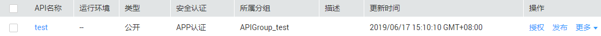

# Token认证<a name="apig-zh-api-180713006"></a>

当您使用Token认证方式完成认证鉴权时，需要获取用户Token并在调用接口时增加“X-Auth-Token”到业务接口请求消息头中。

> **说明：**   
>调用接口有如下两种认证方式，您可以选择其中一种进行认证鉴权。  
>-   **Token认证**：通过Token认证通用请求。  
>-   AK/SK认证：通过AK（Access Key ID）/SK（Secret Access Key）对调用请求内容进行签名认证。  

本节主要从以下几方面介绍Token认证。

-   [调用接口步骤](#section3546598312249)
-   [接口调用示例](#section0458351194216)

## 调用接口步骤<a name="section3546598312249"></a>

1.  发送“POST https://_**IAM的Endpoint**_/v3/auth/tokens”，获取IAM的Endpoint及消息体中的区域名称。

    请参考[地区和终端节点](http://developer.huaweicloud.com/dev/endpoint)

    当服务区域名称为“所有”时，选择IAM“中国华北区1”的Endpoint。

    请求内容示例如下：

    > **说明：**   
    >下面示例代码中的斜体字需要替换为实际内容，详情请参考《统一身份认证服务API参考》。  

    ```
    {
      "auth": {
        "identity": {
          "methods": [
            "password"
          ],
          "password": {
            "user": {
              "name": "username", //登录控制台后，从“我的凭证”页面获取“用户名”
              "password": "password",
              "domain": {
                "name": "domainname" //登录控制台后，从“我的凭证”页面获取“账号名”
              }
            }
          }
        },
        "scope": {
          "project": {
            "id": "0215ef11e49d4743be23dd97a1561e91" //登录控制台后，从“我的凭证”页面获取“项目ID”       
          }
        }
      }
    }
    ```

2.  <a name="li2615608112249"></a>获取Token，请参考《统一身份认证服务API参考》的“[获取用户Token](http://support.huaweicloud.com/api-iam/zh-cn_topic_0057845583.html)”章节。请求响应成功后在响应消息头中包含的“X-Subject-Token”的值即为Token值。

    以下示例为使用Postman工具手工获取Token方案。

    **图 1**  请求示例<a name="fig423411369101"></a>  
    

    **图 2**  从返回消息的Header中获取X-Subject-Token<a name="fig1097673441212"></a>  
    

3.  调用业务接口，在请求消息头中增加“X-Auth-Token”，“X-Auth-Token”的取值为[2](#li2615608112249)中获取的Token。

## 接口调用示例<a name="section0458351194216"></a>

本小节通过调用注册API接口注册一个HTTP类型的API，介绍使用API网关API的基本流程。

1.  获取相关信息。
    -   已获取IAM的Endpoint，具体请参见[地区和终端节点](http://developer.huaweicloud.com/endpoint)。
    -   已获取API网关的Endpoint，具体请参见[地区和终端节点](http://developer.huaweicloud.com/endpoint)。
    -   已获取项目ID，具体请参见[获取项目ID](获取项目ID.md)。

2.  [获取用户Token](http://support.huaweicloud.com/api-iam/zh-cn_topic_0057845583.html)，并设置成环境变量，Token用于后续调用其他接口鉴权。
    1.  <a name="li131902910318"></a>执行以下命令，获取用户Token。

        ```
        curl -X POST https://{iam_endpoint}/v3/auth/tokens -H 'content-type: application/json' -d '{
        	"auth": {
        		"identity": {
        			"methods": [
        				"password"
        			],
        			"password": {
        				"user": {
        				"name": "{user_name}",
        					"domain": {
        						"name": "{user_name}"
        					},
        			"password": "{password}"
        				}
        			}
        		},
        		"scope": {
        			"project": {
        				"id": "{project_id}"
        			}
        		}
        	}
        }' -vk
        ```

        上述命令中，部分参数请参见以下说明进行修改（具体请参考_《统一身份认证服务API参考》_）：

        -   _**\{iam\_endpoint\}**_替换为前提条件中获取的IAM的Endpoint。
        -   _**\{project\_id\}**_替换为前提条件中获取的项目ID。
        -   \{**_user\_name\}_**__和\{_**password\}**_分别替换为连接IAM服务器的用户名和密码。

        响应Header中“X-Subject-Token“的值即为Token：

        ```
        X-Subject-Token:MIIDkgYJKoZIhvcNAQcCoIIDgzCCAxxxxxx38CAQExDTALBglghkgBZQMEAgEwg
        ```

    2.  使用如下命令将token设置为环境变量，方便后续事项。

        **export Token=_\{_**_**X-Subject-Token\}**_

        **X-Subject-Token**即为[2.a](#li131902910318)获取到的token，命令示例如下。

        ```
        export Token=MIIDkgYJKoZIhvcNAQcCoIIDgzCCAxxxxxx38CAQExDTALBglghkgBZQMEAgEwg
        ```


3.  <a name="li068011251502"></a>调用[查询分组列表](查询分组列表.md)接口，查询可注册API的API分组列表。

    查询API分组列表的请求消息样例如下：

    ```
    curl -X GET https://{apig_endpoint}/v1.0/apigw/api-groups -H 'content-type: application/json' -H "x-auth-token: $Token" -vk
    ```

    上述命令中，**_\{apig\_endpoint\}_**替换为API网关的Endpoint。

4.  调用[注册API](注册API.md)接口注册一个HTTP类型API。

    注册API的请求消息样例如下：

    ```
    curl -X POST https://{apig_endpoint}/v1.0/apigw/apis -H 'content-type: application/json' -H "x-auth-token: $Token" -d '{
            "auth_type": "app",
    	"backend_api": {
    		"remark": "web后端API",
    		"req_method": "get",
    		"req_protocol": "https",
    		"req_uri": "/v1.0/apigw/apis",
    		"timeout": 10000,
    		"url_domain": "192.168.1.5",
    		"version": "0.0.1",
    		"vpc_status": 2
    	},
    	"backend_type": "http",
            "group_id": "{group_id}
    	"match_mode": "normal",
    	"name": "查询API列表",
    	"remark": "查询API列表",
    	"req_method": "get",
    	"req_protocol": "https",
    	"req_uri": "/apis",
    	"type": 1,
    	"version": "0.0.1"
    }' -vk
    ```

    上述命令中，部分参数请参见以下说明进行修改（其他参数为自定义参数，请根据[注册API](注册API.md)中的参数解释进行设置）：

    -   **_\{apig\_endpoint\}_**替换为API网关的Endpoint。
    -   **_\{**_group\_id_**\}_**替换为[3](#li068011251502)中查询到的API分组列表中的任一API分组id。

5.  API注册完后，您可以在API网关的管理控制台查看到该API。

    **图 3**  查看API<a name="fig209941138161814"></a>  
    


