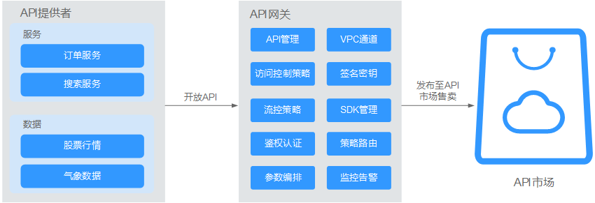
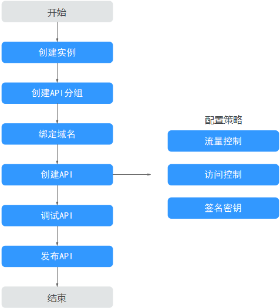
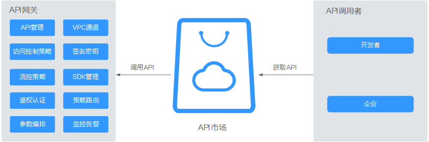
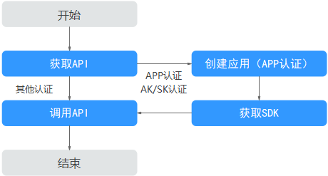

# 简介

API网关（API Gateway）是为您提供高性能、高可用、高安全的API托管服务，帮助您轻松构建、管理和部署任意规模的API。借助API网关的开放API和调用API功能，可以简单、快速、低成本、低风险地实现内部系统集成、业务能力开放及业务能力变现。

-   **开放API**

    企业或开发者通过API网关开放自身的服务与数据，实现业务能力变现。

    **图 1**  API网关服务开放API  
    

    开放API的业务使用流程如下图所示。

    **图 2**  开放API基本流程  
    

    1.  创建实例。

        专享版需要[购买实例](购买专享版实例.md#ZH-CN_TOPIC_0000001188877331)。

        共享版无需购买实例，可直接进入[共享版](进入共享版.md#ZH-CN_TOPIC_0000001188920187)。

    2.  [创建API分组](创建API分组.md#ZH-CN_TOPIC_0000001188877313)

        每个API都归属到某一个API分组下，在创建API前应提前创建API分组。

    3.  [绑定域名](绑定域名.md#ZH-CN_TOPIC_0000001142797438)

        在开放API前，您需要为API分组绑定一个独立域名，供API调用者访问API使用。

        在绑定独立域名前，您可以使用系统为API分配的默认子域名进行API调试，每天最多可以访问默认子域名1000次。

    4.  [创建API](创建API.md#ZH-CN_TOPIC_0000001142797440)

        把已有后端服务封装为标准RESTFul API，并对外开放。

        API创建成功后，您可根据业务需求对API设置访问策略：

        -   [流控控制](流量控制.md#ZH-CN_TOPIC_0000001188877341)

            流量控制可限制单位时间内API的被调用次数，保护后端服务。

        -   [访问控制](访问控制.md#ZH-CN_TOPIC_0000001142797432)

            访问API的IP地址和帐户，您可以通过设置IP地址或帐户的黑白名单来拒绝/允许某个IP地址或帐户访问API。

        -   [签名密钥](签名密钥.md#ZH-CN_TOPIC_0000001142957200)

            签名密钥用于后端服务验证API网关的身份，在API网关请求后端服务时，保障后端服务的安全。

    5.  [调试API](调试API.md#ZH-CN_TOPIC_0000001142957220)

        验证API服务的功能是否正常可用。

    6.  [发布API](发布API.md#ZH-CN_TOPIC_0000001188957141)

        把API发布到环境中，API只有在发布到环境后，才支持被调用。

-   **调用API**

    企业或开发者如何获取并调用他人在API网关开放的API，减少开发时间与成本。

    **图 3**  API网关服务调用API  
    

    调用API的业务使用流程如下图所示。

    **图 4**  调用API基本流程  
    

    1.  [获取API](CallingAPIs.md#zh-cn_topic_0000001129305640_section15668112016810)

        获取API的请求信息，包括访问域名、请求协议、请求方法、请求路径以及认证方式等信息。

    2.  [创建应用](创建应用并获取授权.md#ZH-CN_TOPIC_0000001142957210)

        使用APP认证的API，需要在API网关中创建一个应用，以生成应用ID和密钥对（AppKey、AppSecret）。将创建的应用绑定API后，使用APP认证调用API。

    3.  [获取SDK](SDK.md#ZH-CN_TOPIC_0000001142957214)

        可通过SDK对AK/SK生成签名，并调用API。

    4.  [调用API](CallingAPIs.md#zh-cn_topic_0000001129305640_section14411121782210)

        通过获取API及API访问地址，调用API。根据API使用认证方式的不同，调用API时需要进行不同的认证鉴权操作。

