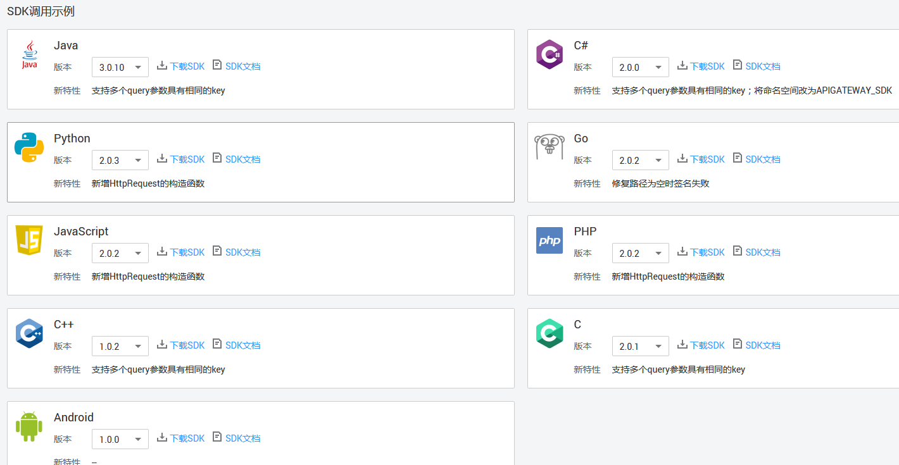

# SDK

API网关开放的API，安全认证方式可选IAM认证、APP认证、自定义认证或无认证。四者的区别以及如何选择，请参考[如何选择认证方式](https://support.huaweicloud.com/devg-apig/apig-dev-180307010.html)。

本操作主要提供APP认证的SDK下载以及文档。

IAM认证请参考[使用IAM认证调用API](https://support.huaweicloud.com/devg-apig/apig-dev-180307010.html)。

## 操作场景

API使用APP认证时，请根据需要下载SDK包和文档，参考文档完成API的调用。

## 操作步骤

1.  登录管理控制台。
2.  在管理控制台左上角单击，选择区域。
3.  单击管理控制台左上角，然后单击“API网关 APIG”。
4.  单击“帮助中心”，进入到帮助中心页面。

    帮助中心页面有一个“SDK使用指引”页签。

5.  在待下载的语言中，单击“下载SDK”，下载SDK包。

    如需查看文档，请单击“SDK文档”。

    

