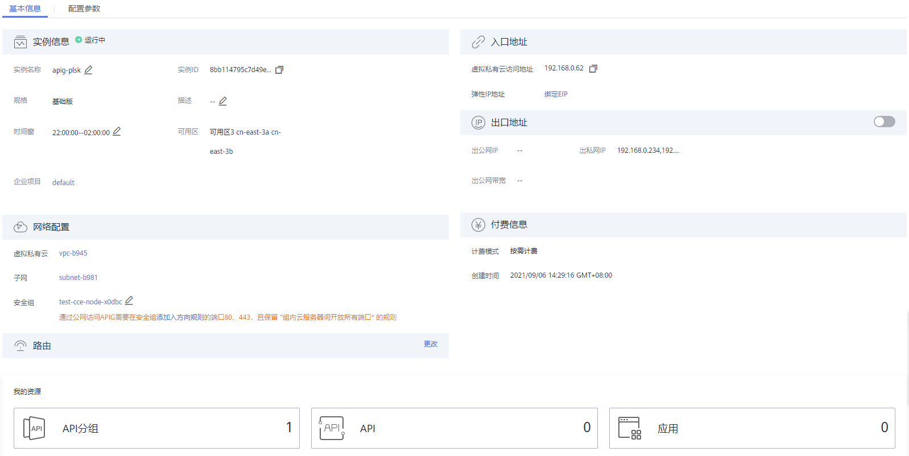

# 修改专享版实例

API网关专享版实例的部分基本信息以及配置参数，可以从控制台修改。

## 修改基本信息

专享版实例创建后，您可能需要调整实例的一些配置，比如调大出公网的带宽，以便支撑更高的API请求流量。

1.  登录管理控制台。
2.  在管理控制台左上角单击，选择区域。
3.  单击管理控制台左上角，然后单击“API网关 APIG”。
4.  在左侧导航单击“专享版”，进入专享版实例列表页，单击“查看控制台”，进入API开发与调用管理页面。
5.  在实例基本信息页签，找到您需要调整的基本信息项并进行修改。

    

    **表 1**  专享版实例基本信息修改

    
    <table><thead align="left"><tr id="zh-cn_topic_0000001128537174_row374916419269"><th class="cellrowborder" valign="top" width="28.33%" id="mcps1.2.3.1.1">
可修改项

    </th>
    <th class="cellrowborder" valign="top" width="71.67%" id="mcps1.2.3.1.2">
说明

    </th>
    </tr>
    </thead>
    <tbody><tr id="zh-cn_topic_0000001128537174_row7749194122619"><td class="cellrowborder" valign="top" width="28.33%" headers="mcps1.2.3.1.1 ">
实例名称

    </td>
    <td class="cellrowborder" valign="top" width="71.67%" headers="mcps1.2.3.1.2 ">
填写实例的名称，根据规划自定义。

    </td>
    </tr>
    <tr id="zh-cn_topic_0000001128537174_row974944172613"><td class="cellrowborder" valign="top" width="28.33%" headers="mcps1.2.3.1.1 ">
描述

    </td>
    <td class="cellrowborder" valign="top" width="71.67%" headers="mcps1.2.3.1.2 ">
填写实例的描述信息。

    </td>
    </tr>
    <tr id="zh-cn_topic_0000001128537174_row14749241132614"><td class="cellrowborder" valign="top" width="28.33%" headers="mcps1.2.3.1.1 ">
时间窗

    </td>
    <td class="cellrowborder" valign="top" width="71.67%" headers="mcps1.2.3.1.2 ">
指允许云服务技术支持对实例进行维护的时间段。如有维护需要，技术支持会提前与您沟通确认。

    
建议选择业务量较少的时间段。

    </td>
    </tr>
    <tr id="zh-cn_topic_0000001128537174_row2749134192617"><td class="cellrowborder" valign="top" width="28.33%" headers="mcps1.2.3.1.1 ">
安全组

    </td>
    <td class="cellrowborder" valign="top" width="71.67%" headers="mcps1.2.3.1.2 ">
安全组用于设置端口访问规则，定义哪些端口允许被外部访问，以及允许访问外部哪些地址与端口。

    
例如，后端服务部署在外部网络，则需要设置相应的安全组规则，允许访问后端服务地址与API调用监听端口。

    
 说明： 
<ul id="zh-cn_topic_0000001128537174_ul11749134111265"><li>更换安全组时，新的安全组须满足专享版实例的前端API调用以及访问后端服务所需出入规则。</li><li>如果开启公网入口，安全组入方向需要放开80（HTTP）和443（HTTPS）端口的访问权限。</li></ul>
    

    </td>
    </tr>
    <tr id="zh-cn_topic_0000001128537174_row87505414261"><td class="cellrowborder" valign="top" width="28.33%" headers="mcps1.2.3.1.1 ">
弹性IP地址

    </td>
    <td class="cellrowborder" valign="top" width="71.67%" headers="mcps1.2.3.1.2 ">
指允许外部服务通过弹性IP地址，调用专享版实例创建的API。开启“公网入口”，需要绑定一个“弹性IP地址”，弹性IP地址另行<a href="https://www.huaweicloud.com/pricing.html#/eip" target="_blank" rel="noopener noreferrer">收费</a>。

    
您需要使用独立域名/子域名访问，使用子域名访问时存在单日访问次数限制。

    
可在创建API分组后，为分组绑定独立域名，独立域名需要解析到专享版实例的弹性IP。

    </td>
    </tr>
    <tr id="zh-cn_topic_0000001128537174_row1375017419266"><td class="cellrowborder" valign="top" width="28.33%" headers="mcps1.2.3.1.1 ">
出口地址

    </td>
    <td class="cellrowborder" valign="top" width="71.67%" headers="mcps1.2.3.1.2 ">
指允许专享版实例API的后端服务部署在外部网络，API网关为实例开启公网出口。公网出口可随时关闭或开启。

    </td>
    </tr>
    <tr id="zh-cn_topic_0000001128537174_row1975094112268"><td class="cellrowborder" valign="top" width="28.33%" headers="mcps1.2.3.1.1 ">
出公网带宽

    </td>
    <td class="cellrowborder" valign="top" width="71.67%" headers="mcps1.2.3.1.2 ">
出公网带宽可配置范围为1~2000Mbit/s，费用按小时计算，以弹性公网IP服务的价格为准。

    </td>
    </tr>
    </tbody>
    </table>

## 配置参数修改

1.  登录管理控制台。
2.  在管理控制台左上角单击，选择区域。
3.  单击管理控制台左上角，然后单击“API网关 APIG”。
4.  在左侧导航单击“专享版”，进入专享版实例列表页，单击“查看控制台”，进入API开发与调用管理页面。
5.  单击“配置参数”页签，找到您需要调整的配置项并进行修改。

    **表 2**  实例配置参数说明

    
    <table><thead align="left"><tr id="zh-cn_topic_0000001128537174_zh-cn_topic_0272531149_row13434501264"><th class="cellrowborder" valign="top" width="33.79%" id="mcps1.2.3.1.1">
参数名

    </th>
    <th class="cellrowborder" valign="top" width="66.21000000000001%" id="mcps1.2.3.1.2">
参数说明

    </th>
    </tr>
    </thead>
    <tbody><tr id="zh-cn_topic_0000001128537174_zh-cn_topic_0272531149_row1043412014263"><td class="cellrowborder" valign="top" width="33.79%" headers="mcps1.2.3.1.1 ">
ratelimit_api_limits

    </td>
    <td class="cellrowborder" valign="top" width="66.21000000000001%" headers="mcps1.2.3.1.2 ">
API全局默认流控值。API未绑定流控策略时，执行此默认流控；API绑定流控策略时，则执行绑定的流控策略。

    </td>
    </tr>
    <tr id="zh-cn_topic_0000001128537174_zh-cn_topic_0272531149_row44347022614"><td class="cellrowborder" valign="top" width="33.79%" headers="mcps1.2.3.1.1 ">
request_body_size

    </td>
    <td class="cellrowborder" valign="top" width="66.21000000000001%" headers="mcps1.2.3.1.2 ">
API请求中允许携带的Body大小上限。

    </td>
    </tr>
    <tr id="zh-cn_topic_0000001128537174_zh-cn_topic_0272531149_row343410152614"><td class="cellrowborder" valign="top" width="33.79%" headers="mcps1.2.3.1.1 ">
backend_timeout

    </td>
    <td class="cellrowborder" valign="top" width="66.21000000000001%" headers="mcps1.2.3.1.2 ">
后端响应超时时间上限，可修改范围为1-600000ms。

    </td>
    </tr>
    <tr id="zh-cn_topic_0000001128537174_zh-cn_topic_0272531149_row24341607266"><td class="cellrowborder" valign="top" width="33.79%" headers="mcps1.2.3.1.1 ">
app_token

    </td>
    <td class="cellrowborder" valign="top" width="66.21000000000001%" headers="mcps1.2.3.1.2 ">
app_token认证方式开关。启用后，可在API请求中使用获取的access_token进行API的调用认证。

    <ul id="zh-cn_topic_0000001128537174_zh-cn_topic_0272531149_ul186017221979"><li>app_token_expire_time：access_token的有效时间，在access_token到期前，需要获取新的access_token。</li><li>refresh_token_expire_time：refresh_token的有效时间。refresh_token用于获取新的access_token。</li><li>app_token_uri：获取access_token的uri。</li><li>app_token_key：access_token的加密key。</li></ul>
    </td>
    </tr>
    <tr id="zh-cn_topic_0000001128537174_zh-cn_topic_0272531149_row74354012618"><td class="cellrowborder" valign="top" width="33.79%" headers="mcps1.2.3.1.1 ">
app_basic

    </td>
    <td class="cellrowborder" valign="top" width="66.21000000000001%" headers="mcps1.2.3.1.2 ">
app_basic认证方式开关。启用后，可在API请求中添加“Authorization”参数，携带应用的Key和Secret（或客户端的AppKey和AppSecret）进行API的调用认证。

    </td>
    </tr>
    <tr id="zh-cn_topic_0000001128537174_zh-cn_topic_0272531149_row343716022613"><td class="cellrowborder" valign="top" width="33.79%" headers="mcps1.2.3.1.1 ">
app_secret

    </td>
    <td class="cellrowborder" valign="top" width="66.21000000000001%" headers="mcps1.2.3.1.2 ">
app_secret认证方式开关。启用后，可在API请求中添加“X-HW-ID”和“X-HW-AppKey”参数，携带应用的Key和Secret（或客户端的AppKey和AppSecret）进行API的调用认证。

    
使用app_secret认证时，需同时关闭app_api_key认证方式。

    </td>
    </tr>
    <tr id="zh-cn_topic_0000001128537174_zh-cn_topic_0272531149_row44371203264"><td class="cellrowborder" valign="top" width="33.79%" headers="mcps1.2.3.1.1 ">
app_route

    </td>
    <td class="cellrowborder" valign="top" width="66.21000000000001%" headers="mcps1.2.3.1.2 ">
支持IP访问开关。启用后，非DEFAULT分组下的API可以使用IP地址调用。

    </td>
    </tr>
    <tr id="zh-cn_topic_0000001128537174_zh-cn_topic_0272531149_row132827312113"><td class="cellrowborder" valign="top" width="33.79%" headers="mcps1.2.3.1.1 ">
backend_client_certificate

    </td>
    <td class="cellrowborder" valign="top" width="66.21000000000001%" headers="mcps1.2.3.1.2 ">
后端双向认证开关。启用后，创建API配置后端服务时，可配置后端双向认证。

    </td>
    </tr>
    <tr id="zh-cn_topic_0000001128537174_zh-cn_topic_0272531149_row1943811032614"><td class="cellrowborder" valign="top" width="33.79%" headers="mcps1.2.3.1.1 ">
ssl_ciphers

    </td>
    <td class="cellrowborder" valign="top" width="66.21000000000001%" headers="mcps1.2.3.1.2 ">
可支持配置的https加密套件，可根据需要选择开启的加密套件。

    </td>
    </tr>
    <tr id="zh-cn_topic_0000001128537174_zh-cn_topic_0272531149_row26651313165613"><td class="cellrowborder" valign="top" width="33.79%" headers="mcps1.2.3.1.1 ">
real_ip_from_xff

    </td>
    <td class="cellrowborder" valign="top" width="66.21000000000001%" headers="mcps1.2.3.1.2 ">
是否使用X-Forwarded-For头中的IP作为ACL、流控的判断依据。

    
xff_index：X-Forwarded-For头中IP的排序序号，值允许为正数、负数、0。

    <ul id="zh-cn_topic_0000001128537174_zh-cn_topic_0272531149_ul1299211574511"><li>xff_index值为0或正数时，获取X-Forwarded-For头中对应索引的IP。</li><li>xff_index值为负数时，按倒序方式从X-Forwarded-For头中获取IP。</li></ul>
    
例如到达API网关的X-Forwarded-For头中依次有IP1，IP2，IP3三个IP地址，xff_index取0时获取IP1，xff_index取1时获取IP2，xff_index取-1时获取IP3，xff_index取-2时获取IP2。

    </td>
    </tr>
    </tbody>
    </table>

