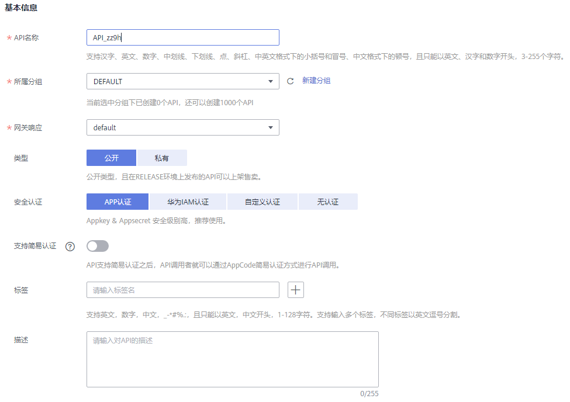
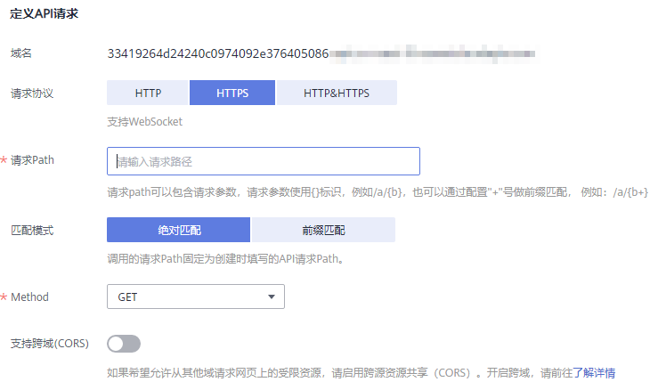
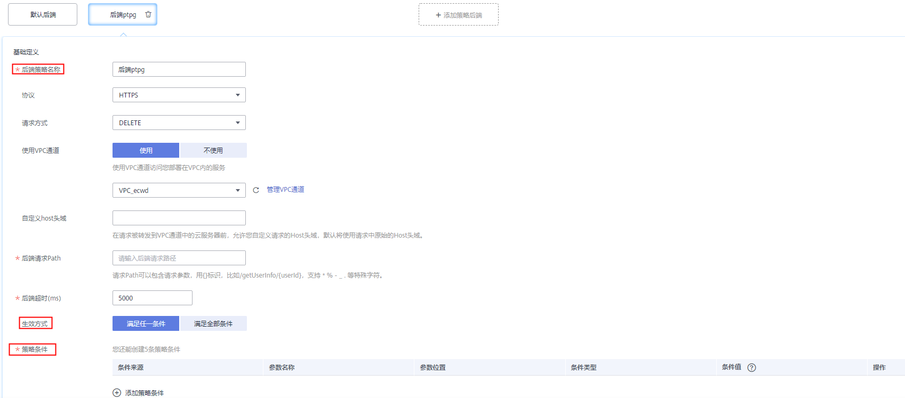
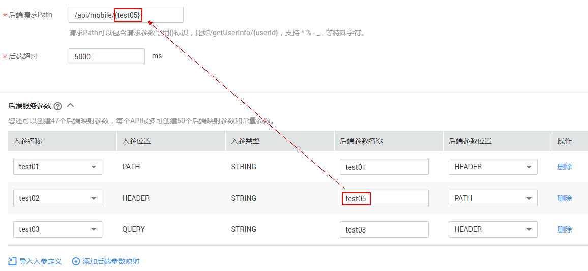
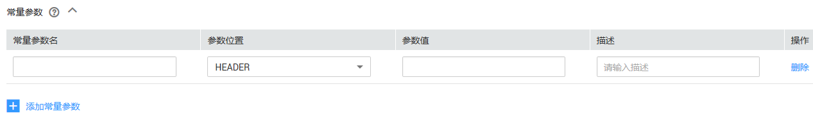
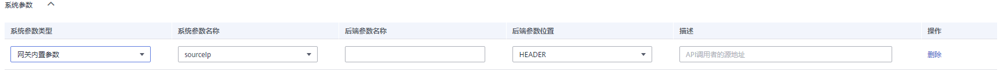

# 创建API<a name="ZH-CN_TOPIC_0000001142797440"></a>

## 操作场景<a name="zh-cn_topic_0000001174416941_zh-cn_topic_0165566289_zh-cn_topic_0080101678_section1731012541118"></a>

API提供者把API接口配置在API网关中，开放后端能力。

创建API主要分为四个步骤：设置基本信息、定义API请求、定义后端服务和定义返回结果。

> **说明：** 
>-   API网关服务基于REST的API架构，API的开放和调用需要遵循RESTful相关规范。
>-   每个用户最多可以创建200个API。

## 前提条件<a name="zh-cn_topic_0000001174416941_zh-cn_topic_0165566289_zh-cn_topic_0080101678_section83110548119"></a>

-   已创建API分组。如果未创建API分组，可在本操作页面中创建API分组。
-   如果后端服务需要使用VPC通道，请先[创建VPC通道](创建VPC通道.md#ZH-CN_TOPIC_0000001188877305)，或在本操作页面中创建VPC通道。

## 设置基本信息<a name="zh-cn_topic_0000001174416941_zh-cn_topic_0165566289_zh-cn_topic_0080101678_section8731554122615"></a>

1.  登录管理控制台。
2.  在管理控制台左上角单击，选择区域。
3.  单击管理控制台左上角，然后单击“API网关 APIG”。
4.  在左侧选择您的API版本，单击并进入到对应版本的API开发与调用管理页面。
    -   “共享版”指直接创建并管理API，如涉及到费用，以API调用次数计费。
    -   “专享版”指在API专享版实例中创建并管理API，如涉及到费用，按实例运行时间计费。

5.  单击“开放API \> API管理”，进入到API列表信息页面。
6.  单击“新建API”，进入“新建API”页面。填写如[表1](#zh-cn_topic_0000001174416941_table1823914143519)所示信息。

    **图 1**  基本信息<a name="zh-cn_topic_0000001174416941_fig15483417425"></a>  
    

    **表 1**  基本信息

    <a name="zh-cn_topic_0000001174416941_table1823914143519"></a>
    <table><thead align="left"><tr id="zh-cn_topic_0000001174416941_row18236174173519"><th class="cellrowborder" valign="top" width="19.99%" id="mcps1.2.3.1.1"><p id="zh-cn_topic_0000001174416941_p22369410355"><a name="zh-cn_topic_0000001174416941_p22369410355"></a><a name="zh-cn_topic_0000001174416941_p22369410355"></a>信息项</p>
    </th>
    <th class="cellrowborder" valign="top" width="80.01%" id="mcps1.2.3.1.2"><p id="zh-cn_topic_0000001174416941_p1423612416355"><a name="zh-cn_topic_0000001174416941_p1423612416355"></a><a name="zh-cn_topic_0000001174416941_p1423612416355"></a>描述</p>
    </th>
    </tr>
    </thead>
    <tbody><tr id="zh-cn_topic_0000001174416941_row122374453515"><td class="cellrowborder" valign="top" width="19.99%" headers="mcps1.2.3.1.1 "><p id="zh-cn_topic_0000001174416941_p72363423518"><a name="zh-cn_topic_0000001174416941_p72363423518"></a><a name="zh-cn_topic_0000001174416941_p72363423518"></a>API名称</p>
    </td>
    <td class="cellrowborder" valign="top" width="80.01%" headers="mcps1.2.3.1.2 "><p id="zh-cn_topic_0000001174416941_p8237104153516"><a name="zh-cn_topic_0000001174416941_p8237104153516"></a><a name="zh-cn_topic_0000001174416941_p8237104153516"></a>API名称，根据规划自定义。建议您按照一定的命名规则填写API名称，方便您快速识别和查找。</p>
    </td>
    </tr>
    <tr id="zh-cn_topic_0000001174416941_row112371747358"><td class="cellrowborder" valign="top" width="19.99%" headers="mcps1.2.3.1.1 "><p id="zh-cn_topic_0000001174416941_p823714419359"><a name="zh-cn_topic_0000001174416941_p823714419359"></a><a name="zh-cn_topic_0000001174416941_p823714419359"></a>所属分组</p>
    </td>
    <td class="cellrowborder" valign="top" width="80.01%" headers="mcps1.2.3.1.2 "><p id="zh-cn_topic_0000001174416941_p3237447356"><a name="zh-cn_topic_0000001174416941_p3237447356"></a><a name="zh-cn_topic_0000001174416941_p3237447356"></a>API所属分组。</p>
    <p id="zh-cn_topic_0000001174416941_p323710411357"><a name="zh-cn_topic_0000001174416941_p323710411357"></a><a name="zh-cn_topic_0000001174416941_p323710411357"></a>如果尚未创建API分组，单击“新建分组”，为API新创建一个分组。</p>
    </td>
    </tr>
    <tr id="zh-cn_topic_0000001174416941_row1523754163518"><td class="cellrowborder" valign="top" width="19.99%" headers="mcps1.2.3.1.1 "><p id="zh-cn_topic_0000001174416941_p5237143353"><a name="zh-cn_topic_0000001174416941_p5237143353"></a><a name="zh-cn_topic_0000001174416941_p5237143353"></a>网关响应</p>
    </td>
    <td class="cellrowborder" valign="top" width="80.01%" headers="mcps1.2.3.1.2 "><p id="zh-cn_topic_0000001174416941_p1923716415353"><a name="zh-cn_topic_0000001174416941_p1923716415353"></a><a name="zh-cn_topic_0000001174416941_p1923716415353"></a>网关响应指API网关未能成功处理API请求，从而产生的错误响应。</p>
    <p id="zh-cn_topic_0000001174416941_p62376415359"><a name="zh-cn_topic_0000001174416941_p62376415359"></a><a name="zh-cn_topic_0000001174416941_p62376415359"></a>API网关提供默认的网关响应（default）。如果您需要自定义响应状态码或网关响应内容，可在API分组管理中<a href="新增网关响应.md#ZH-CN_TOPIC_0000001188877335">新增网关响应</a>，按照您自己的响应内容，符合JSON格式即可。</p>
    </td>
    </tr>
    <tr id="zh-cn_topic_0000001174416941_row18237124183512"><td class="cellrowborder" valign="top" width="19.99%" headers="mcps1.2.3.1.1 "><p id="zh-cn_topic_0000001174416941_p132372443517"><a name="zh-cn_topic_0000001174416941_p132372443517"></a><a name="zh-cn_topic_0000001174416941_p132372443517"></a>类型</p>
    </td>
    <td class="cellrowborder" valign="top" width="80.01%" headers="mcps1.2.3.1.2 "><p id="zh-cn_topic_0000001174416941_p1423719418351"><a name="zh-cn_topic_0000001174416941_p1423719418351"></a><a name="zh-cn_topic_0000001174416941_p1423719418351"></a>API类型：</p>
    <a name="zh-cn_topic_0000001174416941_ul3237548351"></a><a name="zh-cn_topic_0000001174416941_ul3237548351"></a><ul id="zh-cn_topic_0000001174416941_ul3237548351"><li>公开：选择“公开”类型时，API支持上架。</li><li>私有：选择“私有”类型时，当该API所在分组上架时，该API不会上架。</li></ul>
    </td>
    </tr>
    <tr id="zh-cn_topic_0000001174416941_row182386483516"><td class="cellrowborder" valign="top" width="19.99%" headers="mcps1.2.3.1.1 "><p id="zh-cn_topic_0000001174416941_p102378415357"><a name="zh-cn_topic_0000001174416941_p102378415357"></a><a name="zh-cn_topic_0000001174416941_p102378415357"></a>安全认证</p>
    </td>
    <td class="cellrowborder" valign="top" width="80.01%" headers="mcps1.2.3.1.2 "><p id="zh-cn_topic_0000001174416941_p1923713463517"><a name="zh-cn_topic_0000001174416941_p1923713463517"></a><a name="zh-cn_topic_0000001174416941_p1923713463517"></a>API认证方式：</p>
    <a name="zh-cn_topic_0000001174416941_ul1923813410355"></a><a name="zh-cn_topic_0000001174416941_ul1923813410355"></a><ul id="zh-cn_topic_0000001174416941_ul1923813410355"><li>APP认证：表示由API网关服务负责接口请求的安全认证。</li><li>华为IAM认证：表示借助IAM服务进行安全认证。</li><li>自定义认证：用户有自己的认证系统或服务（如使用OAuth认证），可选择“自定义认证”。</li><li>无认证：表示不需要认证。</li></ul>
    <p id="zh-cn_topic_0000001174416941_p223814413519"><a name="zh-cn_topic_0000001174416941_p223814413519"></a><a name="zh-cn_topic_0000001174416941_p223814413519"></a>各种认证方式下的API调用稍有不同，具体请参考<a href="https://support.huaweicloud.com/devg-apig/apig-dev-180307010.html" target="_blank" rel="noopener noreferrer">《开发指南》</a>。</p>
    <p id="zh-cn_topic_0000001174416941_p20238541353"><a name="zh-cn_topic_0000001174416941_p20238541353"></a><a name="zh-cn_topic_0000001174416941_p20238541353"></a>推荐使用APP认证方式。</p>
    <div class="notice" id="zh-cn_topic_0000001174416941_note1823818423520"><a name="zh-cn_topic_0000001174416941_note1823818423520"></a><a name="zh-cn_topic_0000001174416941_note1823818423520"></a><span class="noticetitle"> 须知： </span><div class="noticebody"><a name="zh-cn_topic_0000001174416941_ul72386410355"></a><a name="zh-cn_topic_0000001174416941_ul72386410355"></a><ul id="zh-cn_topic_0000001174416941_ul72386410355"><li>认证方式为华为IAM认证时，任何API网关租户均可以访问此API，可能存在恶意刷流量，导致过量计费的风险。</li><li>认证方式为无认证时，任何公网用户均可以访问此API，可能存在恶意刷流量，导致过量计费的风险。</li><li>认证方式为自定义认证时，需要在函数工作流服务中写一段函数，对接用户自己的认证系统或服务。如果当前Region没有上线函数工作流服务，则不支持自定义认证。</li></ul>
    </div></div>
    </td>
    </tr>
    <tr id="zh-cn_topic_0000001174416941_row132391948354"><td class="cellrowborder" valign="top" width="19.99%" headers="mcps1.2.3.1.1 "><p id="zh-cn_topic_0000001174416941_p923811493510"><a name="zh-cn_topic_0000001174416941_p923811493510"></a><a name="zh-cn_topic_0000001174416941_p923811493510"></a>支持简易认证</p>
    </td>
    <td class="cellrowborder" valign="top" width="80.01%" headers="mcps1.2.3.1.2 "><p id="zh-cn_topic_0000001174416941_p142381444351"><a name="zh-cn_topic_0000001174416941_p142381444351"></a><a name="zh-cn_topic_0000001174416941_p142381444351"></a><strong id="zh-cn_topic_0000001174416941_b1823816453510"><a name="zh-cn_topic_0000001174416941_b1823816453510"></a><a name="zh-cn_topic_0000001174416941_b1823816453510"></a>仅当“安全认证”选择“APP认证”时可配置</strong>。</p>
    <p id="zh-cn_topic_0000001174416941_p102387483511"><a name="zh-cn_topic_0000001174416941_p102387483511"></a><a name="zh-cn_topic_0000001174416941_p102387483511"></a>简易认证指APP认证方式下调用API时，在HTTP请求头部消息增加一个参数X-Apig-AppCode，而不需要对请求内容签名，API网关也仅校验AppCode，不校验请求签名，从而实现快速响应。</p>
    <p id="zh-cn_topic_0000001174416941_p323816412359"><a name="zh-cn_topic_0000001174416941_p323816412359"></a><a name="zh-cn_topic_0000001174416941_p323816412359"></a>注意仅支持HTTPS方式调用，不支持HTTP方式。具体使用请参考<a href="为简易认证添加AppCode.md#ZH-CN_TOPIC_0000001142797436">为简易认证添加AppCode</a>。</p>
    <div class="note" id="zh-cn_topic_0000001174416941_note1823916413512"><a name="zh-cn_topic_0000001174416941_note1823916413512"></a><a name="zh-cn_topic_0000001174416941_note1823916413512"></a><span class="notetitle"> 说明： </span><div class="notebody"><p id="zh-cn_topic_0000001174416941_p13239154203515"><a name="zh-cn_topic_0000001174416941_p13239154203515"></a><a name="zh-cn_topic_0000001174416941_p13239154203515"></a>如果首次创建API未开启简易认证，那么之后开启简易认证，需要重新发布API。请参考<a href="发布API.md#ZH-CN_TOPIC_0000001188957141">发布API</a>发布。</p>
    </div></div>
    </td>
    </tr>
    <tr id="zh-cn_topic_0000001174416941_row4239740357"><td class="cellrowborder" valign="top" width="19.99%" headers="mcps1.2.3.1.1 "><p id="zh-cn_topic_0000001174416941_p1323994183518"><a name="zh-cn_topic_0000001174416941_p1323994183518"></a><a name="zh-cn_topic_0000001174416941_p1323994183518"></a>自定义认证</p>
    </td>
    <td class="cellrowborder" valign="top" width="80.01%" headers="mcps1.2.3.1.2 "><p id="zh-cn_topic_0000001174416941_p19239845350"><a name="zh-cn_topic_0000001174416941_p19239845350"></a><a name="zh-cn_topic_0000001174416941_p19239845350"></a><strong id="zh-cn_topic_0000001174416941_b62397493510"><a name="zh-cn_topic_0000001174416941_b62397493510"></a><a name="zh-cn_topic_0000001174416941_b62397493510"></a>仅当“安全认证”选择“APP认证”或“华为IAM认证”且“支持双重认证”开启时，或者“安全认证”选择“自定义认证”时需要配置</strong>。</p>
    <p id="zh-cn_topic_0000001174416941_p123924113511"><a name="zh-cn_topic_0000001174416941_p123924113511"></a><a name="zh-cn_topic_0000001174416941_p123924113511"></a>自定义认证需要提前创建，可单击右侧的“新建自定义认证”链接创建。</p>
    </td>
    </tr>
    <tr id="zh-cn_topic_0000001174416941_row92395473519"><td class="cellrowborder" valign="top" width="19.99%" headers="mcps1.2.3.1.1 "><p id="zh-cn_topic_0000001174416941_p823934103518"><a name="zh-cn_topic_0000001174416941_p823934103518"></a><a name="zh-cn_topic_0000001174416941_p823934103518"></a>标签</p>
    </td>
    <td class="cellrowborder" valign="top" width="80.01%" headers="mcps1.2.3.1.2 "><p id="zh-cn_topic_0000001174416941_p323954123513"><a name="zh-cn_topic_0000001174416941_p323954123513"></a><a name="zh-cn_topic_0000001174416941_p323954123513"></a>标签主要用于对API添加分类属性，方便在创建了大量API后，快速过滤和查找。</p>
    </td>
    </tr>
    <tr id="zh-cn_topic_0000001174416941_row1239204113513"><td class="cellrowborder" valign="top" width="19.99%" headers="mcps1.2.3.1.1 "><p id="zh-cn_topic_0000001174416941_p182397413355"><a name="zh-cn_topic_0000001174416941_p182397413355"></a><a name="zh-cn_topic_0000001174416941_p182397413355"></a>描述</p>
    </td>
    <td class="cellrowborder" valign="top" width="80.01%" headers="mcps1.2.3.1.2 "><p id="zh-cn_topic_0000001174416941_p16239343356"><a name="zh-cn_topic_0000001174416941_p16239343356"></a><a name="zh-cn_topic_0000001174416941_p16239343356"></a>API的描述。</p>
    </td>
    </tr>
    </tbody>
    </table>

7.  单击“下一步”，进入“定义API请求”页面。

## 定义API请求<a name="zh-cn_topic_0000001174416941_zh-cn_topic_0165566289_zh-cn_topic_0080101678_section79773019167"></a>

1.  在“定义API请求”页面，填写如[表2](#zh-cn_topic_0000001174416941_table583332111375)所示信息。

    **图 2**  定义API请求<a name="zh-cn_topic_0000001174416941_fig104381328184117"></a>  
    

    **表 2**  定义API请求

    <a name="zh-cn_topic_0000001174416941_table583332111375"></a>
    <table><thead align="left"><tr id="zh-cn_topic_0000001174416941_row1683112114371"><th class="cellrowborder" valign="top" width="20%" id="mcps1.2.3.1.1"><p id="zh-cn_topic_0000001174416941_p128311321193716"><a name="zh-cn_topic_0000001174416941_p128311321193716"></a><a name="zh-cn_topic_0000001174416941_p128311321193716"></a>信息项</p>
    </th>
    <th class="cellrowborder" valign="top" width="80%" id="mcps1.2.3.1.2"><p id="zh-cn_topic_0000001174416941_p128311121173714"><a name="zh-cn_topic_0000001174416941_p128311121173714"></a><a name="zh-cn_topic_0000001174416941_p128311121173714"></a>描述</p>
    </th>
    </tr>
    </thead>
    <tbody><tr id="zh-cn_topic_0000001174416941_row17831132183714"><td class="cellrowborder" valign="top" width="20%" headers="mcps1.2.3.1.1 "><p id="zh-cn_topic_0000001174416941_p8831142110374"><a name="zh-cn_topic_0000001174416941_p8831142110374"></a><a name="zh-cn_topic_0000001174416941_p8831142110374"></a>域名</p>
    </td>
    <td class="cellrowborder" valign="top" width="80%" headers="mcps1.2.3.1.2 "><p id="zh-cn_topic_0000001174416941_p9831192115374"><a name="zh-cn_topic_0000001174416941_p9831192115374"></a><a name="zh-cn_topic_0000001174416941_p9831192115374"></a>系统默认分配的一个子域名。</p>
    </td>
    </tr>
    <tr id="zh-cn_topic_0000001174416941_row1383142133710"><td class="cellrowborder" valign="top" width="20%" headers="mcps1.2.3.1.1 "><p id="zh-cn_topic_0000001174416941_p983112183711"><a name="zh-cn_topic_0000001174416941_p983112183711"></a><a name="zh-cn_topic_0000001174416941_p983112183711"></a>请求协议</p>
    </td>
    <td class="cellrowborder" valign="top" width="80%" headers="mcps1.2.3.1.2 "><p id="zh-cn_topic_0000001174416941_p10831162114374"><a name="zh-cn_topic_0000001174416941_p10831162114374"></a><a name="zh-cn_topic_0000001174416941_p10831162114374"></a>分为三种类型：</p>
    <a name="zh-cn_topic_0000001174416941_ul15831142119372"></a><a name="zh-cn_topic_0000001174416941_ul15831142119372"></a><ul id="zh-cn_topic_0000001174416941_ul15831142119372"><li>HTTP</li><li>HTTPS</li><li>HTTP&amp;HTTPS</li></ul>
    <p id="zh-cn_topic_0000001174416941_p58314214373"><a name="zh-cn_topic_0000001174416941_p58314214373"></a><a name="zh-cn_topic_0000001174416941_p58314214373"></a>传输重要或敏感数据时推荐使用HTTPS。</p>
    </td>
    </tr>
    <tr id="zh-cn_topic_0000001174416941_row1383219217372"><td class="cellrowborder" valign="top" width="20%" headers="mcps1.2.3.1.1 "><p id="zh-cn_topic_0000001174416941_p6831102115378"><a name="zh-cn_topic_0000001174416941_p6831102115378"></a><a name="zh-cn_topic_0000001174416941_p6831102115378"></a>请求Path</p>
    </td>
    <td class="cellrowborder" valign="top" width="80%" headers="mcps1.2.3.1.2 "><p id="zh-cn_topic_0000001174416941_p683282143711"><a name="zh-cn_topic_0000001174416941_p683282143711"></a><a name="zh-cn_topic_0000001174416941_p683282143711"></a>接口请求的路径。</p>
    <p id="zh-cn_topic_0000001174416941_p683211218377"><a name="zh-cn_topic_0000001174416941_p683211218377"></a><a name="zh-cn_topic_0000001174416941_p683211218377"></a>格式如：/users/{userId}/projects</p>
    <a name="zh-cn_topic_0000001174416941_ul158321121163714"></a><a name="zh-cn_topic_0000001174416941_ul158321121163714"></a><ul id="zh-cn_topic_0000001174416941_ul158321121163714"><li>{}中的变量为请求参数，表示匹配"/"之间的一整段，不支持匹配"/"之间的一部分，例如/abc{userId}。若匹配模式为绝对匹配，则尾部的请求参数可以添加+号，例如/users/{p+}，其中变量p匹配1或多段"/"之间的部分。</li><li>请求Path中包含请求参数时，必须设置对应的入参定义。</li><li>内容区分大小写。</li></ul>
    </td>
    </tr>
    <tr id="zh-cn_topic_0000001174416941_row1383242117379"><td class="cellrowborder" valign="top" width="20%" headers="mcps1.2.3.1.1 "><p id="zh-cn_topic_0000001174416941_p783222183712"><a name="zh-cn_topic_0000001174416941_p783222183712"></a><a name="zh-cn_topic_0000001174416941_p783222183712"></a>匹配模式</p>
    </td>
    <td class="cellrowborder" valign="top" width="80%" headers="mcps1.2.3.1.2 "><p id="zh-cn_topic_0000001174416941_p383242133715"><a name="zh-cn_topic_0000001174416941_p383242133715"></a><a name="zh-cn_topic_0000001174416941_p383242133715"></a>分为两种模式：</p>
    <a name="zh-cn_topic_0000001174416941_ul20832221183718"></a><a name="zh-cn_topic_0000001174416941_ul20832221183718"></a><ul id="zh-cn_topic_0000001174416941_ul20832221183718"><li>绝对匹配：调用的请求Path固定为创建时填写的API请求Path。</li><li>前缀匹配：调用的请求Path将以创建时填写的API请求Path为前缀，支持接口定义多个不同Path。<p id="zh-cn_topic_0000001174416941_p283272143710"><a name="zh-cn_topic_0000001174416941_p283272143710"></a><a name="zh-cn_topic_0000001174416941_p283272143710"></a>例如，请求路径为/test/AA，使用前缀匹配时，通过/test/AA/CC可以访问，但是通过/test/AACC无法访问。</p>
    </li></ul>
    <div class="note" id="zh-cn_topic_0000001174416941_note183262110374"><a name="zh-cn_topic_0000001174416941_note183262110374"></a><a name="zh-cn_topic_0000001174416941_note183262110374"></a><span class="notetitle"> 说明： </span><div class="notebody"><p id="zh-cn_topic_0000001174416941_p2832221113717"><a name="zh-cn_topic_0000001174416941_p2832221113717"></a><a name="zh-cn_topic_0000001174416941_p2832221113717"></a>使用前缀匹配时，匹配剩余的路径将透传到后端。</p>
    <p id="zh-cn_topic_0000001174416941_p883212116375"><a name="zh-cn_topic_0000001174416941_p883212116375"></a><a name="zh-cn_topic_0000001174416941_p883212116375"></a>例如，使用前缀匹配，前端请求路径定义为/test/，后端请求路径定义为/test2/，通过/test/AA/CC访问API，则后端收到的请求url为/test2/AA/CC。</p>
    </div></div>
    </td>
    </tr>
    <tr id="zh-cn_topic_0000001174416941_row483252143713"><td class="cellrowborder" valign="top" width="20%" headers="mcps1.2.3.1.1 "><p id="zh-cn_topic_0000001174416941_p983212119379"><a name="zh-cn_topic_0000001174416941_p983212119379"></a><a name="zh-cn_topic_0000001174416941_p983212119379"></a>Method</p>
    </td>
    <td class="cellrowborder" valign="top" width="80%" headers="mcps1.2.3.1.2 "><p id="zh-cn_topic_0000001174416941_p108321217378"><a name="zh-cn_topic_0000001174416941_p108321217378"></a><a name="zh-cn_topic_0000001174416941_p108321217378"></a>接口调用方式：GET、POST、DELETE、PUT、PATCH、HEAD、OPTIONS、ANY</p>
    <a name="zh-cn_topic_0000001174416941_ul9832192117371"></a><a name="zh-cn_topic_0000001174416941_ul9832192117371"></a><ul id="zh-cn_topic_0000001174416941_ul9832192117371"><li>其中ANY表示该API支持任意请求方法。</li><li>当“Method”为“POST”/“PUT”/“PATCH”/“ANY”时，您可以在“请求体内容描述”中增加对于请求体的描述信息。</li></ul>
    </td>
    </tr>
    <tr id="zh-cn_topic_0000001174416941_row1483312218373"><td class="cellrowborder" valign="top" width="20%" headers="mcps1.2.3.1.1 "><p id="zh-cn_topic_0000001174416941_p1583262116372"><a name="zh-cn_topic_0000001174416941_p1583262116372"></a><a name="zh-cn_topic_0000001174416941_p1583262116372"></a>支持CORS</p>
    </td>
    <td class="cellrowborder" valign="top" width="80%" headers="mcps1.2.3.1.2 "><p id="zh-cn_topic_0000001174416941_p3832521183720"><a name="zh-cn_topic_0000001174416941_p3832521183720"></a><a name="zh-cn_topic_0000001174416941_p3832521183720"></a>是否开启跨域访问CORS（cross-origin resource sharing）。</p>
    <p id="zh-cn_topic_0000001174416941_p58327210377"><a name="zh-cn_topic_0000001174416941_p58327210377"></a><a name="zh-cn_topic_0000001174416941_p58327210377"></a>CORS允许浏览器向跨域服务器，发出XMLHttpRequest请求，从而克服了AJAX只能同源使用的限制。</p>
    <p id="zh-cn_topic_0000001174416941_p08323211373"><a name="zh-cn_topic_0000001174416941_p08323211373"></a><a name="zh-cn_topic_0000001174416941_p08323211373"></a>CORS请求分为两类：</p>
    <a name="zh-cn_topic_0000001174416941_ul68325214375"></a><a name="zh-cn_topic_0000001174416941_ul68325214375"></a><ul id="zh-cn_topic_0000001174416941_ul68325214375"><li>简单请求：头信息之中，增加一个Origin字段。</li><li>非简单请求：在正式通信之前，增加一次HTTP查询请求。</li></ul>
    <p id="zh-cn_topic_0000001174416941_p6833192123717"><a name="zh-cn_topic_0000001174416941_p6833192123717"></a><a name="zh-cn_topic_0000001174416941_p6833192123717"></a>开启CORS（非简单请求）时，您需要单独创建一个“Method”为“OPTIONS”的API，具体步骤请参见<a href="开启跨域访问.md#ZH-CN_TOPIC_0000001142797434">开启跨域访问</a>。</p>
    </td>
    </tr>
    </tbody>
    </table>

2.  （可选）设置入参定义。

    入参定义是指您调用API时，需要传入的参数的说明。

    1.  单击“添加入参定义”，弹出“添加入参定义”对话框。
    2.  输入如[表3](#zh-cn_topic_0000001174416941_zh-cn_topic_0165566289_zh-cn_topic_0080101678_table87021501869)所示信息。

        **表 3**  入参定义

        <a name="zh-cn_topic_0000001174416941_zh-cn_topic_0165566289_zh-cn_topic_0080101678_table87021501869"></a>
        <table><thead align="left"><tr id="zh-cn_topic_0000001174416941_zh-cn_topic_0165566289_zh-cn_topic_0080101678_row15700808618"><th class="cellrowborder" valign="top" width="20.04%" id="mcps1.2.3.1.1"><p id="zh-cn_topic_0000001174416941_zh-cn_topic_0165566289_zh-cn_topic_0080101678_p4700601963"><a name="zh-cn_topic_0000001174416941_zh-cn_topic_0165566289_zh-cn_topic_0080101678_p4700601963"></a><a name="zh-cn_topic_0000001174416941_zh-cn_topic_0165566289_zh-cn_topic_0080101678_p4700601963"></a>信息项</p>
        </th>
        <th class="cellrowborder" valign="top" width="79.96%" id="mcps1.2.3.1.2"><p id="zh-cn_topic_0000001174416941_zh-cn_topic_0165566289_zh-cn_topic_0080101678_p1670020769"><a name="zh-cn_topic_0000001174416941_zh-cn_topic_0165566289_zh-cn_topic_0080101678_p1670020769"></a><a name="zh-cn_topic_0000001174416941_zh-cn_topic_0165566289_zh-cn_topic_0080101678_p1670020769"></a>描述</p>
        </th>
        </tr>
        </thead>
        <tbody><tr id="zh-cn_topic_0000001174416941_zh-cn_topic_0165566289_zh-cn_topic_0080101678_row470020016611"><td class="cellrowborder" valign="top" width="20.04%" headers="mcps1.2.3.1.1 "><p id="zh-cn_topic_0000001174416941_zh-cn_topic_0165566289_zh-cn_topic_0080101678_p13700502613"><a name="zh-cn_topic_0000001174416941_zh-cn_topic_0165566289_zh-cn_topic_0080101678_p13700502613"></a><a name="zh-cn_topic_0000001174416941_zh-cn_topic_0165566289_zh-cn_topic_0080101678_p13700502613"></a>参数名</p>
        </td>
        <td class="cellrowborder" valign="top" width="79.96%" headers="mcps1.2.3.1.2 "><p id="zh-cn_topic_0000001174416941_zh-cn_topic_0165566289_zh-cn_topic_0080101678_p97001503618"><a name="zh-cn_topic_0000001174416941_zh-cn_topic_0165566289_zh-cn_topic_0080101678_p97001503618"></a><a name="zh-cn_topic_0000001174416941_zh-cn_topic_0165566289_zh-cn_topic_0080101678_p97001503618"></a>参数的名称，如果参数在“PATH”位置，那么参数名称需要和“请求Path”中的名称相同。</p>
        <div class="note" id="zh-cn_topic_0000001174416941_zh-cn_topic_0165566289_zh-cn_topic_0080101678_note1086540637"><a name="zh-cn_topic_0000001174416941_zh-cn_topic_0165566289_zh-cn_topic_0080101678_note1086540637"></a><a name="zh-cn_topic_0000001174416941_zh-cn_topic_0165566289_zh-cn_topic_0080101678_note1086540637"></a><span class="notetitle"> 说明： </span><div class="notebody"><a name="zh-cn_topic_0000001174416941_zh-cn_topic_0165566289_zh-cn_topic_0080101678_ul7763461339"></a><a name="zh-cn_topic_0000001174416941_zh-cn_topic_0165566289_zh-cn_topic_0080101678_ul7763461339"></a><ul id="zh-cn_topic_0000001174416941_zh-cn_topic_0165566289_zh-cn_topic_0080101678_ul7763461339"><li>参数名不能是x-apig- 、x-sdk-开头，不区分大小写。</li><li>参数名不能是x-stage，不区分大小写。</li><li>参数位置为HEADER时，参数名不能是“Authorization”和“X-Auth-Token”，不区分大小写，也不支持下划线。</li></ul>
        </div></div>
        </td>
        </tr>
        <tr id="zh-cn_topic_0000001174416941_zh-cn_topic_0165566289_zh-cn_topic_0080101678_row1470020017612"><td class="cellrowborder" valign="top" width="20.04%" headers="mcps1.2.3.1.1 "><p id="zh-cn_topic_0000001174416941_zh-cn_topic_0165566289_zh-cn_topic_0080101678_p18700204613"><a name="zh-cn_topic_0000001174416941_zh-cn_topic_0165566289_zh-cn_topic_0080101678_p18700204613"></a><a name="zh-cn_topic_0000001174416941_zh-cn_topic_0165566289_zh-cn_topic_0080101678_p18700204613"></a>参数位置</p>
        </td>
        <td class="cellrowborder" valign="top" width="79.96%" headers="mcps1.2.3.1.2 "><p id="zh-cn_topic_0000001174416941_zh-cn_topic_0165566289_zh-cn_topic_0080101678_p15700401369"><a name="zh-cn_topic_0000001174416941_zh-cn_topic_0165566289_zh-cn_topic_0080101678_p15700401369"></a><a name="zh-cn_topic_0000001174416941_zh-cn_topic_0165566289_zh-cn_topic_0080101678_p15700401369"></a>选择参数在请求中的位置。参数位置有如下三种：PATH、HEADER、QUERY。</p>
        <div class="note" id="zh-cn_topic_0000001174416941_zh-cn_topic_0165566289_zh-cn_topic_0080101678_note144417461417"><a name="zh-cn_topic_0000001174416941_zh-cn_topic_0165566289_zh-cn_topic_0080101678_note144417461417"></a><a name="zh-cn_topic_0000001174416941_zh-cn_topic_0165566289_zh-cn_topic_0080101678_note144417461417"></a><span class="notetitle"> 说明： </span><div class="notebody"><p id="zh-cn_topic_0000001174416941_zh-cn_topic_0165566289_zh-cn_topic_0080101678_p2799144553711"><a name="zh-cn_topic_0000001174416941_zh-cn_topic_0165566289_zh-cn_topic_0080101678_p2799144553711"></a><a name="zh-cn_topic_0000001174416941_zh-cn_topic_0165566289_zh-cn_topic_0080101678_p2799144553711"></a>当您定义了PATH中的参数时，该参数需要在“请求Path”中同步定义。</p>
        </div></div>
        </td>
        </tr>
        <tr id="zh-cn_topic_0000001174416941_zh-cn_topic_0165566289_zh-cn_topic_0080101678_row19700601611"><td class="cellrowborder" valign="top" width="20.04%" headers="mcps1.2.3.1.1 "><p id="zh-cn_topic_0000001174416941_zh-cn_topic_0165566289_zh-cn_topic_0080101678_p7700170167"><a name="zh-cn_topic_0000001174416941_zh-cn_topic_0165566289_zh-cn_topic_0080101678_p7700170167"></a><a name="zh-cn_topic_0000001174416941_zh-cn_topic_0165566289_zh-cn_topic_0080101678_p7700170167"></a>类型</p>
        </td>
        <td class="cellrowborder" valign="top" width="79.96%" headers="mcps1.2.3.1.2 "><p id="zh-cn_topic_0000001174416941_zh-cn_topic_0165566289_zh-cn_topic_0080101678_p13700140765"><a name="zh-cn_topic_0000001174416941_zh-cn_topic_0165566289_zh-cn_topic_0080101678_p13700140765"></a><a name="zh-cn_topic_0000001174416941_zh-cn_topic_0165566289_zh-cn_topic_0080101678_p13700140765"></a>字段的类型，包含String和Number。</p>
        <div class="note" id="zh-cn_topic_0000001174416941_zh-cn_topic_0165566289_zh-cn_topic_0080101678_note5517171984916"><a name="zh-cn_topic_0000001174416941_zh-cn_topic_0165566289_zh-cn_topic_0080101678_note5517171984916"></a><a name="zh-cn_topic_0000001174416941_zh-cn_topic_0165566289_zh-cn_topic_0080101678_note5517171984916"></a><span class="notetitle"> 说明： </span><div class="notebody"><p id="zh-cn_topic_0000001174416941_zh-cn_topic_0165566289_zh-cn_topic_0080101678_p12517121914493"><a name="zh-cn_topic_0000001174416941_zh-cn_topic_0165566289_zh-cn_topic_0080101678_p12517121914493"></a><a name="zh-cn_topic_0000001174416941_zh-cn_topic_0165566289_zh-cn_topic_0080101678_p12517121914493"></a>入参如果为boolean，请选择String。</p>
        </div></div>
        </td>
        </tr>
        <tr id="zh-cn_topic_0000001174416941_zh-cn_topic_0165566289_zh-cn_topic_0080101678_row5700204611"><td class="cellrowborder" valign="top" width="20.04%" headers="mcps1.2.3.1.1 "><p id="zh-cn_topic_0000001174416941_zh-cn_topic_0165566289_zh-cn_topic_0080101678_p27001201369"><a name="zh-cn_topic_0000001174416941_zh-cn_topic_0165566289_zh-cn_topic_0080101678_p27001201369"></a><a name="zh-cn_topic_0000001174416941_zh-cn_topic_0165566289_zh-cn_topic_0080101678_p27001201369"></a>必填</p>
        </td>
        <td class="cellrowborder" valign="top" width="79.96%" headers="mcps1.2.3.1.2 "><p id="zh-cn_topic_0000001174416941_zh-cn_topic_0165566289_zh-cn_topic_0080101678_p117001201765"><a name="zh-cn_topic_0000001174416941_zh-cn_topic_0165566289_zh-cn_topic_0080101678_p117001201765"></a><a name="zh-cn_topic_0000001174416941_zh-cn_topic_0165566289_zh-cn_topic_0080101678_p117001201765"></a>请求API时，此参数是否为必填。如果选择“是”，API网关将校验请求中是否包含此参数，如果不包含，则拒绝该请求。</p>
        </td>
        </tr>
        <tr id="zh-cn_topic_0000001174416941_zh-cn_topic_0165566289_row44461536125211"><td class="cellrowborder" valign="top" width="20.04%" headers="mcps1.2.3.1.1 "><p id="zh-cn_topic_0000001174416941_zh-cn_topic_0165566289_p044673612526"><a name="zh-cn_topic_0000001174416941_zh-cn_topic_0165566289_p044673612526"></a><a name="zh-cn_topic_0000001174416941_zh-cn_topic_0165566289_p044673612526"></a>透传</p>
        </td>
        <td class="cellrowborder" valign="top" width="79.96%" headers="mcps1.2.3.1.2 "><p id="zh-cn_topic_0000001174416941_zh-cn_topic_0165566289_p10446836175212"><a name="zh-cn_topic_0000001174416941_zh-cn_topic_0165566289_p10446836175212"></a><a name="zh-cn_topic_0000001174416941_zh-cn_topic_0165566289_p10446836175212"></a>请求参数是否透传到后端服务。</p>
        </td>
        </tr>
        <tr id="zh-cn_topic_0000001174416941_zh-cn_topic_0165566289_zh-cn_topic_0080101678_row27021401062"><td class="cellrowborder" valign="top" width="20.04%" headers="mcps1.2.3.1.1 "><p id="zh-cn_topic_0000001174416941_zh-cn_topic_0165566289_zh-cn_topic_0080101678_p4702150860"><a name="zh-cn_topic_0000001174416941_zh-cn_topic_0165566289_zh-cn_topic_0080101678_p4702150860"></a><a name="zh-cn_topic_0000001174416941_zh-cn_topic_0165566289_zh-cn_topic_0080101678_p4702150860"></a>默认值</p>
        </td>
        <td class="cellrowborder" valign="top" width="79.96%" headers="mcps1.2.3.1.2 "><p id="zh-cn_topic_0000001174416941_zh-cn_topic_0165566289_zh-cn_topic_0080101678_p157023014616"><a name="zh-cn_topic_0000001174416941_zh-cn_topic_0165566289_zh-cn_topic_0080101678_p157023014616"></a><a name="zh-cn_topic_0000001174416941_zh-cn_topic_0165566289_zh-cn_topic_0080101678_p157023014616"></a>“必填”为“否”时，默认值生效。请求中不包含此参数时，API网关自动增加默认值发送给后端服务。</p>
        </td>
        </tr>
        <tr id="zh-cn_topic_0000001174416941_zh-cn_topic_0165566289_row163281049175214"><td class="cellrowborder" valign="top" width="20.04%" headers="mcps1.2.3.1.1 "><p id="zh-cn_topic_0000001174416941_zh-cn_topic_0165566289_p133281549115217"><a name="zh-cn_topic_0000001174416941_zh-cn_topic_0165566289_p133281549115217"></a><a name="zh-cn_topic_0000001174416941_zh-cn_topic_0165566289_p133281549115217"></a>枚举</p>
        </td>
        <td class="cellrowborder" valign="top" width="79.96%" headers="mcps1.2.3.1.2 "><p id="zh-cn_topic_0000001174416941_zh-cn_topic_0165566289_p14328249155220"><a name="zh-cn_topic_0000001174416941_zh-cn_topic_0165566289_p14328249155220"></a><a name="zh-cn_topic_0000001174416941_zh-cn_topic_0165566289_p14328249155220"></a>请求参数的枚举值，请求参数的值只能从枚举值中选择，多个枚举值间用英文逗号隔开。</p>
        </td>
        </tr>
        <tr id="zh-cn_topic_0000001174416941_zh-cn_topic_0165566289_zh-cn_topic_0080101678_row1462419113355"><td class="cellrowborder" valign="top" width="20.04%" headers="mcps1.2.3.1.1 "><p id="zh-cn_topic_0000001174416941_zh-cn_topic_0165566289_zh-cn_topic_0080101678_p76259173515"><a name="zh-cn_topic_0000001174416941_zh-cn_topic_0165566289_zh-cn_topic_0080101678_p76259173515"></a><a name="zh-cn_topic_0000001174416941_zh-cn_topic_0165566289_zh-cn_topic_0080101678_p76259173515"></a>最小长度</p>
        </td>
        <td class="cellrowborder" valign="top" width="79.96%" headers="mcps1.2.3.1.2 "><p id="zh-cn_topic_0000001174416941_zh-cn_topic_0165566289_zh-cn_topic_0080101678_p17625417356"><a name="zh-cn_topic_0000001174416941_zh-cn_topic_0165566289_zh-cn_topic_0080101678_p17625417356"></a><a name="zh-cn_topic_0000001174416941_zh-cn_topic_0165566289_zh-cn_topic_0080101678_p17625417356"></a>参数值的最小长度，仅允许输入数字。</p>
        </td>
        </tr>
        <tr id="zh-cn_topic_0000001174416941_zh-cn_topic_0165566289_zh-cn_topic_0080101678_row197852113512"><td class="cellrowborder" valign="top" width="20.04%" headers="mcps1.2.3.1.1 "><p id="zh-cn_topic_0000001174416941_zh-cn_topic_0165566289_zh-cn_topic_0080101678_p1478511116358"><a name="zh-cn_topic_0000001174416941_zh-cn_topic_0165566289_zh-cn_topic_0080101678_p1478511116358"></a><a name="zh-cn_topic_0000001174416941_zh-cn_topic_0165566289_zh-cn_topic_0080101678_p1478511116358"></a>最大长度</p>
        </td>
        <td class="cellrowborder" valign="top" width="79.96%" headers="mcps1.2.3.1.2 "><p id="zh-cn_topic_0000001174416941_zh-cn_topic_0165566289_zh-cn_topic_0080101678_p1774615555352"><a name="zh-cn_topic_0000001174416941_zh-cn_topic_0165566289_zh-cn_topic_0080101678_p1774615555352"></a><a name="zh-cn_topic_0000001174416941_zh-cn_topic_0165566289_zh-cn_topic_0080101678_p1774615555352"></a>参数值的最大长度，仅允许输入数字。</p>
        </td>
        </tr>
        <tr id="zh-cn_topic_0000001174416941_zh-cn_topic_0165566289_zh-cn_topic_0080101678_row147021201266"><td class="cellrowborder" valign="top" width="20.04%" headers="mcps1.2.3.1.1 "><p id="zh-cn_topic_0000001174416941_zh-cn_topic_0165566289_zh-cn_topic_0080101678_p170219015612"><a name="zh-cn_topic_0000001174416941_zh-cn_topic_0165566289_zh-cn_topic_0080101678_p170219015612"></a><a name="zh-cn_topic_0000001174416941_zh-cn_topic_0165566289_zh-cn_topic_0080101678_p170219015612"></a>示例</p>
        </td>
        <td class="cellrowborder" valign="top" width="79.96%" headers="mcps1.2.3.1.2 "><p id="zh-cn_topic_0000001174416941_zh-cn_topic_0165566289_zh-cn_topic_0080101678_p67027016618"><a name="zh-cn_topic_0000001174416941_zh-cn_topic_0165566289_zh-cn_topic_0080101678_p67027016618"></a><a name="zh-cn_topic_0000001174416941_zh-cn_topic_0165566289_zh-cn_topic_0080101678_p67027016618"></a>参数值的填写示例。</p>
        </td>
        </tr>
        <tr id="zh-cn_topic_0000001174416941_zh-cn_topic_0165566289_zh-cn_topic_0080101678_row10702701367"><td class="cellrowborder" valign="top" width="20.04%" headers="mcps1.2.3.1.1 "><p id="zh-cn_topic_0000001174416941_zh-cn_topic_0165566289_zh-cn_topic_0080101678_p5702005611"><a name="zh-cn_topic_0000001174416941_zh-cn_topic_0165566289_zh-cn_topic_0080101678_p5702005611"></a><a name="zh-cn_topic_0000001174416941_zh-cn_topic_0165566289_zh-cn_topic_0080101678_p5702005611"></a>描述</p>
        </td>
        <td class="cellrowborder" valign="top" width="79.96%" headers="mcps1.2.3.1.2 "><p id="zh-cn_topic_0000001174416941_zh-cn_topic_0165566289_zh-cn_topic_0080101678_p15702100169"><a name="zh-cn_topic_0000001174416941_zh-cn_topic_0165566289_zh-cn_topic_0080101678_p15702100169"></a><a name="zh-cn_topic_0000001174416941_zh-cn_topic_0165566289_zh-cn_topic_0080101678_p15702100169"></a>对于此参数的描述。</p>
        </td>
        </tr>
        </tbody>
        </table>

    3.  单击“确定”，完成入参定义的设置。

3.  单击“下一步”，进入“定义后端服务”页面。

## 定义后端服务<a name="zh-cn_topic_0000001174416941_zh-cn_topic_0165566289_zh-cn_topic_0080101678_section16484051169"></a>

API网关支持定义多个策略后端，即满足一定条件后转发给指定的API后端服务，用以满足不同的调用场景。例如为了区分普通调用与特殊调用，可以定义一个“策略后端”，通过调用方的源IP地址，为特殊调用方分配专用的后端服务。

除了定义一个默认的API后端服务，一个API共可以定义5个策略后端。

1.  定义默认后端。

    添加策略后端前必须定义一个默认后端，当不满足任何一个策略后端的API请求，都将转发到默认的API后端。

    在“定义后端服务”页面，选择API后端服务类型。

    后端服务类型参数描述见[表4](#zh-cn_topic_0000001174416941_zh-cn_topic_0165566289_zh-cn_topic_0080101678_table19365277271)、[表5](#zh-cn_topic_0000001174416941_zh-cn_topic_0165566289_zh-cn_topic_0080101678_table1094282351716)、[表6](#zh-cn_topic_0000001174416941_zh-cn_topic_0165566289_zh-cn_topic_0080101678_table192561504182)。

    **表 4**  HTTP/HTTPS类型定义后端服务

    <a name="zh-cn_topic_0000001174416941_zh-cn_topic_0165566289_zh-cn_topic_0080101678_table19365277271"></a>
    <table><thead align="left"><tr id="zh-cn_topic_0000001174416941_zh-cn_topic_0165566289_zh-cn_topic_0080101678_row113612717272"><th class="cellrowborder" valign="top" width="20%" id="mcps1.2.3.1.1"><p id="zh-cn_topic_0000001174416941_zh-cn_topic_0165566289_zh-cn_topic_0080101678_p1236527142713"><a name="zh-cn_topic_0000001174416941_zh-cn_topic_0165566289_zh-cn_topic_0080101678_p1236527142713"></a><a name="zh-cn_topic_0000001174416941_zh-cn_topic_0165566289_zh-cn_topic_0080101678_p1236527142713"></a>服务参数</p>
    </th>
    <th class="cellrowborder" valign="top" width="80%" id="mcps1.2.3.1.2"><p id="zh-cn_topic_0000001174416941_zh-cn_topic_0165566289_zh-cn_topic_0080101678_p9361927132717"><a name="zh-cn_topic_0000001174416941_zh-cn_topic_0165566289_zh-cn_topic_0080101678_p9361927132717"></a><a name="zh-cn_topic_0000001174416941_zh-cn_topic_0165566289_zh-cn_topic_0080101678_p9361927132717"></a>参数说明</p>
    </th>
    </tr>
    </thead>
    <tbody><tr id="zh-cn_topic_0000001174416941_zh-cn_topic_0165566289_zh-cn_topic_0080101678_row73602710275"><td class="cellrowborder" valign="top" width="20%" headers="mcps1.2.3.1.1 "><p id="zh-cn_topic_0000001174416941_zh-cn_topic_0165566289_zh-cn_topic_0080101678_p436122720273"><a name="zh-cn_topic_0000001174416941_zh-cn_topic_0165566289_zh-cn_topic_0080101678_p436122720273"></a><a name="zh-cn_topic_0000001174416941_zh-cn_topic_0165566289_zh-cn_topic_0080101678_p436122720273"></a>协议</p>
    </td>
    <td class="cellrowborder" valign="top" width="80%" headers="mcps1.2.3.1.2 "><p id="zh-cn_topic_0000001174416941_zh-cn_topic_0165566289_zh-cn_topic_0080101678_p1736327172718"><a name="zh-cn_topic_0000001174416941_zh-cn_topic_0165566289_zh-cn_topic_0080101678_p1736327172718"></a><a name="zh-cn_topic_0000001174416941_zh-cn_topic_0165566289_zh-cn_topic_0080101678_p1736327172718"></a>HTTP或HTTPS，定义的后端服务协议须与用户的后端业务协议保持一致。</p>
    <div class="note" id="zh-cn_topic_0000001174416941_zh-cn_topic_0165566289_zh-cn_topic_0080101678_note10254542173111"><a name="zh-cn_topic_0000001174416941_zh-cn_topic_0165566289_zh-cn_topic_0080101678_note10254542173111"></a><a name="zh-cn_topic_0000001174416941_zh-cn_topic_0165566289_zh-cn_topic_0080101678_note10254542173111"></a><span class="notetitle"> 说明： </span><div class="notebody"><a name="zh-cn_topic_0000001174416941_ul186744348514"></a><a name="zh-cn_topic_0000001174416941_ul186744348514"></a><ul id="zh-cn_topic_0000001174416941_ul186744348514"><li>支持WebSocket通信。</li><li>传输重要或敏感数据时推荐使用HTTPS。</li></ul>
    </div></div>
    </td>
    </tr>
    <tr id="zh-cn_topic_0000001174416941_zh-cn_topic_0165566289_zh-cn_topic_0080101678_row136132714270"><td class="cellrowborder" valign="top" width="20%" headers="mcps1.2.3.1.1 "><p id="zh-cn_topic_0000001174416941_zh-cn_topic_0165566289_zh-cn_topic_0080101678_p4373274271"><a name="zh-cn_topic_0000001174416941_zh-cn_topic_0165566289_zh-cn_topic_0080101678_p4373274271"></a><a name="zh-cn_topic_0000001174416941_zh-cn_topic_0165566289_zh-cn_topic_0080101678_p4373274271"></a>请求方式</p>
    </td>
    <td class="cellrowborder" valign="top" width="80%" headers="mcps1.2.3.1.2 "><p id="zh-cn_topic_0000001174416941_zh-cn_topic_0165566289_zh-cn_topic_0080101678_p1637727122712"><a name="zh-cn_topic_0000001174416941_zh-cn_topic_0165566289_zh-cn_topic_0080101678_p1637727122712"></a><a name="zh-cn_topic_0000001174416941_zh-cn_topic_0165566289_zh-cn_topic_0080101678_p1637727122712"></a>接口调用方式，包括GET、POST、DELETE、PUT、PATCH、HEAD、OPTIONS、ANY。</p>
    <p id="zh-cn_topic_0000001174416941_zh-cn_topic_0165566289_zh-cn_topic_0080101678_p195711941328"><a name="zh-cn_topic_0000001174416941_zh-cn_topic_0165566289_zh-cn_topic_0080101678_p195711941328"></a><a name="zh-cn_topic_0000001174416941_zh-cn_topic_0165566289_zh-cn_topic_0080101678_p195711941328"></a>其中ANY表示该API支持任意请求方法。</p>
    </td>
    </tr>
    <tr id="zh-cn_topic_0000001174416941_zh-cn_topic_0165566289_zh-cn_topic_0080101678_row1037627142710"><td class="cellrowborder" valign="top" width="20%" headers="mcps1.2.3.1.1 "><p id="zh-cn_topic_0000001174416941_zh-cn_topic_0165566289_zh-cn_topic_0080101678_p1537102716276"><a name="zh-cn_topic_0000001174416941_zh-cn_topic_0165566289_zh-cn_topic_0080101678_p1537102716276"></a><a name="zh-cn_topic_0000001174416941_zh-cn_topic_0165566289_zh-cn_topic_0080101678_p1537102716276"></a>使用VPC通道</p>
    </td>
    <td class="cellrowborder" valign="top" width="80%" headers="mcps1.2.3.1.2 "><p id="zh-cn_topic_0000001174416941_zh-cn_topic_0165566289_zh-cn_topic_0080101678_p10560125819313"><a name="zh-cn_topic_0000001174416941_zh-cn_topic_0165566289_zh-cn_topic_0080101678_p10560125819313"></a><a name="zh-cn_topic_0000001174416941_zh-cn_topic_0165566289_zh-cn_topic_0080101678_p10560125819313"></a>是否使用VPC通道访问后端服务。</p>
    <a name="zh-cn_topic_0000001174416941_zh-cn_topic_0165566289_ul172209923714"></a><a name="zh-cn_topic_0000001174416941_zh-cn_topic_0165566289_ul172209923714"></a><ul id="zh-cn_topic_0000001174416941_zh-cn_topic_0165566289_ul172209923714"><li><strong id="zh-cn_topic_0000001174416941_zh-cn_topic_0165566289_b6827154250"><a name="zh-cn_topic_0000001174416941_zh-cn_topic_0165566289_b6827154250"></a><a name="zh-cn_topic_0000001174416941_zh-cn_topic_0165566289_b6827154250"></a>若使用VPC通道，选择已创建的VPC通道名称。</strong><div class="note" id="zh-cn_topic_0000001174416941_zh-cn_topic_0165566289_note126881748651"><a name="zh-cn_topic_0000001174416941_zh-cn_topic_0165566289_note126881748651"></a><a name="zh-cn_topic_0000001174416941_zh-cn_topic_0165566289_note126881748651"></a><span class="notetitle"> 说明： </span><div class="notebody"><a name="zh-cn_topic_0000001174416941_zh-cn_topic_0165566289_ul72211791373"></a><a name="zh-cn_topic_0000001174416941_zh-cn_topic_0165566289_ul72211791373"></a><ul id="zh-cn_topic_0000001174416941_zh-cn_topic_0165566289_ul72211791373"><li>VPC通道中，云服务器的安全组必须允许100.125.0.0/16网段访问，否则将导致健康检查失败及业务不通。</li></ul>
    </div></div>
    </li><li><strong id="zh-cn_topic_0000001174416941_zh-cn_topic_0165566289_b104514913368"><a name="zh-cn_topic_0000001174416941_zh-cn_topic_0165566289_b104514913368"></a><a name="zh-cn_topic_0000001174416941_zh-cn_topic_0165566289_b104514913368"></a>若不使用VPC通道，需要设置后端服务地址。</strong><p id="zh-cn_topic_0000001174416941_zh-cn_topic_0165566289_p093721518373"><a name="zh-cn_topic_0000001174416941_zh-cn_topic_0165566289_p093721518373"></a><a name="zh-cn_topic_0000001174416941_zh-cn_topic_0165566289_p093721518373"></a>格式：“主机:端口”，主机为IP地址/域名，未指定端口时，HTTP协议默认使用80端口，HTTPS协议默认使用443端口。</p>
    <p id="zh-cn_topic_0000001174416941_zh-cn_topic_0165566289_p19106131763712"><a name="zh-cn_topic_0000001174416941_zh-cn_topic_0165566289_p19106131763712"></a><a name="zh-cn_topic_0000001174416941_zh-cn_topic_0165566289_p19106131763712"></a>端口范围：1 ~ 65535。</p>
    <p id="zh-cn_topic_0000001174416941_zh-cn_topic_0165566289_p03025188371"><a name="zh-cn_topic_0000001174416941_zh-cn_topic_0165566289_p03025188371"></a><a name="zh-cn_topic_0000001174416941_zh-cn_topic_0165566289_p03025188371"></a>如果需要创建变量标识，则填写“#变量名#”，如#ipaddress#。支持创建多个变量标识，如#ipaddress##test#。</p>
    </li></ul>
    </td>
    </tr>
    <tr id="zh-cn_topic_0000001174416941_zh-cn_topic_0165566289_zh-cn_topic_0080101678_row885711935416"><td class="cellrowborder" valign="top" width="20%" headers="mcps1.2.3.1.1 "><p id="zh-cn_topic_0000001174416941_zh-cn_topic_0165566289_zh-cn_topic_0080101678_p98571790546"><a name="zh-cn_topic_0000001174416941_zh-cn_topic_0165566289_zh-cn_topic_0080101678_p98571790546"></a><a name="zh-cn_topic_0000001174416941_zh-cn_topic_0165566289_zh-cn_topic_0080101678_p98571790546"></a>自定义host头域（可选）</p>
    </td>
    <td class="cellrowborder" valign="top" width="80%" headers="mcps1.2.3.1.2 "><p id="zh-cn_topic_0000001174416941_zh-cn_topic_0165566289_p57314585516"><a name="zh-cn_topic_0000001174416941_zh-cn_topic_0165566289_p57314585516"></a><a name="zh-cn_topic_0000001174416941_zh-cn_topic_0165566289_p57314585516"></a><strong id="zh-cn_topic_0000001174416941_zh-cn_topic_0165566289_b146314105516"><a name="zh-cn_topic_0000001174416941_zh-cn_topic_0165566289_b146314105516"></a><a name="zh-cn_topic_0000001174416941_zh-cn_topic_0165566289_b146314105516"></a>仅当“使用VPC通道”选择“使用”时可配置</strong>。</p>
    <p id="zh-cn_topic_0000001174416941_zh-cn_topic_0165566289_zh-cn_topic_0080101678_p38575911546"><a name="zh-cn_topic_0000001174416941_zh-cn_topic_0165566289_zh-cn_topic_0080101678_p38575911546"></a><a name="zh-cn_topic_0000001174416941_zh-cn_topic_0165566289_zh-cn_topic_0080101678_p38575911546"></a>在请求被发送到VPC通道中主机前，允许您自定义请求的Host头域，默认将使用请求中原始的Host头域。</p>
    </td>
    </tr>
    <tr id="zh-cn_topic_0000001174416941_zh-cn_topic_0165566289_zh-cn_topic_0080101678_row17493203292814"><td class="cellrowborder" valign="top" width="20%" headers="mcps1.2.3.1.1 "><p id="zh-cn_topic_0000001174416941_zh-cn_topic_0165566289_zh-cn_topic_0080101678_p1849333212812"><a name="zh-cn_topic_0000001174416941_zh-cn_topic_0165566289_zh-cn_topic_0080101678_p1849333212812"></a><a name="zh-cn_topic_0000001174416941_zh-cn_topic_0165566289_zh-cn_topic_0080101678_p1849333212812"></a>后端请求Path</p>
    </td>
    <td class="cellrowborder" valign="top" width="80%" headers="mcps1.2.3.1.2 "><p id="zh-cn_topic_0000001174416941_zh-cn_topic_0165566289_zh-cn_topic_0080101678_p2049313323280"><a name="zh-cn_topic_0000001174416941_zh-cn_topic_0165566289_zh-cn_topic_0080101678_p2049313323280"></a><a name="zh-cn_topic_0000001174416941_zh-cn_topic_0165566289_zh-cn_topic_0080101678_p2049313323280"></a>后端服务的路径，即服务的uri，可以包含路径参数，以{路径参数}形式表示，比如/getUserInfo/{userId}。</p>
    <p id="zh-cn_topic_0000001174416941_zh-cn_topic_0165566289_zh-cn_topic_0080101678_p8776113994318"><a name="zh-cn_topic_0000001174416941_zh-cn_topic_0165566289_zh-cn_topic_0080101678_p8776113994318"></a><a name="zh-cn_topic_0000001174416941_zh-cn_topic_0165566289_zh-cn_topic_0080101678_p8776113994318"></a>如果请求路径中含有环境变量，则使用#变量名#的方式将环境变量定义到请求路径中，如/#path#。支持创建多个环境变量，如/#path##request#。</p>
    </td>
    </tr>
    <tr id="zh-cn_topic_0000001174416941_zh-cn_topic_0165566289_zh-cn_topic_0080101678_row19741816153115"><td class="cellrowborder" valign="top" width="20%" headers="mcps1.2.3.1.1 "><p id="zh-cn_topic_0000001174416941_zh-cn_topic_0165566289_zh-cn_topic_0080101678_p0373278279"><a name="zh-cn_topic_0000001174416941_zh-cn_topic_0165566289_zh-cn_topic_0080101678_p0373278279"></a><a name="zh-cn_topic_0000001174416941_zh-cn_topic_0165566289_zh-cn_topic_0080101678_p0373278279"></a>后端超时</p>
    </td>
    <td class="cellrowborder" valign="top" width="80%" headers="mcps1.2.3.1.2 "><p id="zh-cn_topic_0000001174416941_zh-cn_topic_0165566289_zh-cn_topic_0080101678_p73712772713"><a name="zh-cn_topic_0000001174416941_zh-cn_topic_0165566289_zh-cn_topic_0080101678_p73712772713"></a><a name="zh-cn_topic_0000001174416941_zh-cn_topic_0165566289_zh-cn_topic_0080101678_p73712772713"></a>后端服务请求的超时时间。</p>
    <p id="zh-cn_topic_0000001174416941_zh-cn_topic_0165566289_zh-cn_topic_0080101678_p161427173394"><a name="zh-cn_topic_0000001174416941_zh-cn_topic_0165566289_zh-cn_topic_0080101678_p161427173394"></a><a name="zh-cn_topic_0000001174416941_zh-cn_topic_0165566289_zh-cn_topic_0080101678_p161427173394"></a>如果在API调试过程中，遇到后端响应超时之类的错误，请适当调大后端超时时间，以便排查原因。</p>
    <div class="note" id="zh-cn_topic_0000001174416941_zh-cn_topic_0165566289_note205631237541"><a name="zh-cn_topic_0000001174416941_zh-cn_topic_0165566289_note205631237541"></a><a name="zh-cn_topic_0000001174416941_zh-cn_topic_0165566289_note205631237541"></a><span class="notetitle"> 说明： </span><div class="notebody"><p id="zh-cn_topic_0000001174416941_zh-cn_topic_0165566289_p165651537442"><a name="zh-cn_topic_0000001174416941_zh-cn_topic_0165566289_p165651537442"></a><a name="zh-cn_topic_0000001174416941_zh-cn_topic_0165566289_p165651537442"></a>专享版可以在实例<a href="修改专享版实例.md#zh-cn_topic_0000001128537174_zh-cn_topic_0272531149_section12828154014100">配置参数</a>中修改超时时间上限，可修改范围为1-600000ms。</p>
    </div></div>
    </td>
    </tr>
    <tr id="zh-cn_topic_0000001174416941_zh-cn_topic_0165566289_zh-cn_topic_0080101678_row357928103319"><td class="cellrowborder" valign="top" width="20%" headers="mcps1.2.3.1.1 "><p id="zh-cn_topic_0000001174416941_zh-cn_topic_0165566289_zh-cn_topic_0080101678_p6580188143315"><a name="zh-cn_topic_0000001174416941_zh-cn_topic_0165566289_zh-cn_topic_0080101678_p6580188143315"></a><a name="zh-cn_topic_0000001174416941_zh-cn_topic_0165566289_zh-cn_topic_0080101678_p6580188143315"></a>双向认证</p>
    </td>
    <td class="cellrowborder" valign="top" width="80%" headers="mcps1.2.3.1.2 "><p id="zh-cn_topic_0000001174416941_zh-cn_topic_0165566289_zh-cn_topic_0080101678_p1465311734310"><a name="zh-cn_topic_0000001174416941_zh-cn_topic_0165566289_zh-cn_topic_0080101678_p1465311734310"></a><a name="zh-cn_topic_0000001174416941_zh-cn_topic_0165566289_zh-cn_topic_0080101678_p1465311734310"></a>指HTTPS的双向认证，开启后，API网关将认证API后端服务。双向认证所需的证书配置说明，请参考<a href="修改专享版实例.md#zh-cn_topic_0000001128537174_zh-cn_topic_0272531149_section12828154014100">配置参数</a>。</p>
    <div class="note" id="zh-cn_topic_0000001174416941_zh-cn_topic_0165566289_zh-cn_topic_0080101678_note132011364311"><a name="zh-cn_topic_0000001174416941_zh-cn_topic_0165566289_zh-cn_topic_0080101678_note132011364311"></a><a name="zh-cn_topic_0000001174416941_zh-cn_topic_0165566289_zh-cn_topic_0080101678_note132011364311"></a><span class="notetitle"> 说明： </span><div class="notebody"><p id="zh-cn_topic_0000001174416941_zh-cn_topic_0165566289_p2596172663917"><a name="zh-cn_topic_0000001174416941_zh-cn_topic_0165566289_p2596172663917"></a><a name="zh-cn_topic_0000001174416941_zh-cn_topic_0165566289_p2596172663917"></a>仅专享版实例支持双向认证功能。</p>
    <p id="zh-cn_topic_0000001174416941_zh-cn_topic_0165566289_zh-cn_topic_0080101678_p478737144714"><a name="zh-cn_topic_0000001174416941_zh-cn_topic_0165566289_zh-cn_topic_0080101678_p478737144714"></a><a name="zh-cn_topic_0000001174416941_zh-cn_topic_0165566289_zh-cn_topic_0080101678_p478737144714"></a>仅部分region支持双向认证功能。</p>
    </div></div>
    </td>
    </tr>
    <tr id="zh-cn_topic_0000001174416941_zh-cn_topic_0165566289_zh-cn_topic_0080101678_row937327162710"><td class="cellrowborder" valign="top" width="20%" headers="mcps1.2.3.1.1 "><p id="zh-cn_topic_0000001174416941_zh-cn_topic_0165566289_zh-cn_topic_0080101678_p0873162514313"><a name="zh-cn_topic_0000001174416941_zh-cn_topic_0165566289_zh-cn_topic_0080101678_p0873162514313"></a><a name="zh-cn_topic_0000001174416941_zh-cn_topic_0165566289_zh-cn_topic_0080101678_p0873162514313"></a>后端认证</p>
    </td>
    <td class="cellrowborder" valign="top" width="80%" headers="mcps1.2.3.1.2 "><p id="zh-cn_topic_0000001174416941_zh-cn_topic_0165566289_zh-cn_topic_0080101678_p18725256315"><a name="zh-cn_topic_0000001174416941_zh-cn_topic_0165566289_zh-cn_topic_0080101678_p18725256315"></a><a name="zh-cn_topic_0000001174416941_zh-cn_topic_0165566289_zh-cn_topic_0080101678_p18725256315"></a>当您的后端服务需要对API调用增加自己的认证，则需要开启后端认证。</p>
    <p id="zh-cn_topic_0000001174416941_zh-cn_topic_0165566289_zh-cn_topic_0080101678_p1732511154517"><a name="zh-cn_topic_0000001174416941_zh-cn_topic_0165566289_zh-cn_topic_0080101678_p1732511154517"></a><a name="zh-cn_topic_0000001174416941_zh-cn_topic_0165566289_zh-cn_topic_0080101678_p1732511154517"></a>后端认证需要先添加一个<a href="创建自定义认证.md#ZH-CN_TOPIC_0000001188877339">自定义认证</a>，自定义认证通过函数工作流服务实现，在函数工作流服务中编写一个函数，实现您的认证鉴权流程，或者使用函数调用您的统一鉴权服务。</p>
    <div class="note" id="zh-cn_topic_0000001174416941_zh-cn_topic_0165566289_zh-cn_topic_0080101678_note773934361915"><a name="zh-cn_topic_0000001174416941_zh-cn_topic_0165566289_zh-cn_topic_0080101678_note773934361915"></a><a name="zh-cn_topic_0000001174416941_zh-cn_topic_0165566289_zh-cn_topic_0080101678_note773934361915"></a><span class="notetitle"> 说明： </span><div class="notebody"><p id="zh-cn_topic_0000001174416941_zh-cn_topic_0165566289_zh-cn_topic_0080101678_p973984381913"><a name="zh-cn_topic_0000001174416941_zh-cn_topic_0165566289_zh-cn_topic_0080101678_p973984381913"></a><a name="zh-cn_topic_0000001174416941_zh-cn_topic_0165566289_zh-cn_topic_0080101678_p973984381913"></a>后端认证依赖函数工作流服务，此功能仅在部分区域开放。</p>
    </div></div>
    </td>
    </tr>
    </tbody>
    </table>

    **表 5**  FunctionGraph类型定义后端服务

    <a name="zh-cn_topic_0000001174416941_zh-cn_topic_0165566289_zh-cn_topic_0080101678_table1094282351716"></a>
    <table><thead align="left"><tr id="zh-cn_topic_0000001174416941_zh-cn_topic_0165566289_zh-cn_topic_0080101678_row11942162381717"><th class="cellrowborder" valign="top" width="20%" id="mcps1.2.3.1.1"><p id="zh-cn_topic_0000001174416941_zh-cn_topic_0165566289_zh-cn_topic_0080101678_p1873819508179"><a name="zh-cn_topic_0000001174416941_zh-cn_topic_0165566289_zh-cn_topic_0080101678_p1873819508179"></a><a name="zh-cn_topic_0000001174416941_zh-cn_topic_0165566289_zh-cn_topic_0080101678_p1873819508179"></a>服务参数</p>
    </th>
    <th class="cellrowborder" valign="top" width="80%" id="mcps1.2.3.1.2"><p id="zh-cn_topic_0000001174416941_zh-cn_topic_0165566289_zh-cn_topic_0080101678_p57384503178"><a name="zh-cn_topic_0000001174416941_zh-cn_topic_0165566289_zh-cn_topic_0080101678_p57384503178"></a><a name="zh-cn_topic_0000001174416941_zh-cn_topic_0165566289_zh-cn_topic_0080101678_p57384503178"></a>参数说明</p>
    </th>
    </tr>
    </thead>
    <tbody><tr id="zh-cn_topic_0000001174416941_zh-cn_topic_0165566289_zh-cn_topic_0080101678_row794252317176"><td class="cellrowborder" valign="top" width="20%" headers="mcps1.2.3.1.1 "><p id="zh-cn_topic_0000001174416941_zh-cn_topic_0165566289_zh-cn_topic_0080101678_p25981341121718"><a name="zh-cn_topic_0000001174416941_zh-cn_topic_0165566289_zh-cn_topic_0080101678_p25981341121718"></a><a name="zh-cn_topic_0000001174416941_zh-cn_topic_0165566289_zh-cn_topic_0080101678_p25981341121718"></a>FunctionURN</p>
    </td>
    <td class="cellrowborder" valign="top" width="80%" headers="mcps1.2.3.1.2 "><p id="zh-cn_topic_0000001174416941_zh-cn_topic_0165566289_zh-cn_topic_0080101678_p12598241131719"><a name="zh-cn_topic_0000001174416941_zh-cn_topic_0165566289_zh-cn_topic_0080101678_p12598241131719"></a><a name="zh-cn_topic_0000001174416941_zh-cn_topic_0165566289_zh-cn_topic_0080101678_p12598241131719"></a>函数请求唯一标识。</p>
    <p id="zh-cn_topic_0000001174416941_zh-cn_topic_0165566289_zh-cn_topic_0080101678_p55981341191713"><a name="zh-cn_topic_0000001174416941_zh-cn_topic_0165566289_zh-cn_topic_0080101678_p55981341191713"></a><a name="zh-cn_topic_0000001174416941_zh-cn_topic_0165566289_zh-cn_topic_0080101678_p55981341191713"></a>单击“添加”，添加所需的FunctionURN。</p>
    </td>
    </tr>
    <tr id="zh-cn_topic_0000001174416941_zh-cn_topic_0165566289_zh-cn_topic_0080101678_row294292361713"><td class="cellrowborder" valign="top" width="20%" headers="mcps1.2.3.1.1 "><p id="zh-cn_topic_0000001174416941_zh-cn_topic_0165566289_zh-cn_topic_0080101678_p959814161717"><a name="zh-cn_topic_0000001174416941_zh-cn_topic_0165566289_zh-cn_topic_0080101678_p959814161717"></a><a name="zh-cn_topic_0000001174416941_zh-cn_topic_0165566289_zh-cn_topic_0080101678_p959814161717"></a>版本</p>
    </td>
    <td class="cellrowborder" valign="top" width="80%" headers="mcps1.2.3.1.2 "><p id="zh-cn_topic_0000001174416941_zh-cn_topic_0165566289_zh-cn_topic_0080101678_p14598641161718"><a name="zh-cn_topic_0000001174416941_zh-cn_topic_0165566289_zh-cn_topic_0080101678_p14598641161718"></a><a name="zh-cn_topic_0000001174416941_zh-cn_topic_0165566289_zh-cn_topic_0080101678_p14598641161718"></a>函数的版本。</p>
    </td>
    </tr>
    <tr id="zh-cn_topic_0000001174416941_zh-cn_topic_0165566289_zh-cn_topic_0080101678_row294242311718"><td class="cellrowborder" valign="top" width="20%" headers="mcps1.2.3.1.1 "><p id="zh-cn_topic_0000001174416941_zh-cn_topic_0165566289_zh-cn_topic_0080101678_p3598194119176"><a name="zh-cn_topic_0000001174416941_zh-cn_topic_0165566289_zh-cn_topic_0080101678_p3598194119176"></a><a name="zh-cn_topic_0000001174416941_zh-cn_topic_0165566289_zh-cn_topic_0080101678_p3598194119176"></a>调用类型</p>
    </td>
    <td class="cellrowborder" valign="top" width="80%" headers="mcps1.2.3.1.2 "><a name="zh-cn_topic_0000001174416941_zh-cn_topic_0165566289_zh-cn_topic_0080101678_ul4598104113171"></a><a name="zh-cn_topic_0000001174416941_zh-cn_topic_0165566289_zh-cn_topic_0080101678_ul4598104113171"></a><ul id="zh-cn_topic_0000001174416941_zh-cn_topic_0165566289_zh-cn_topic_0080101678_ul4598104113171"><li>Synchronous：同步调用。指后端函数工作流服务收到调用请求后立即执行并返回调用结果，客户端发送请求后同步等待，收到后端响应后关闭连接。</li><li>Asynchronous：异步调用。客户端不关注请求调用的结果，服务端收到请求后将请求排队，排队成功后请求就返回，服务端在空闲的情况下会逐个处理排队的请求。</li></ul>
    </td>
    </tr>
    <tr id="zh-cn_topic_0000001174416941_zh-cn_topic_0165566289_zh-cn_topic_0080101678_row7942423121712"><td class="cellrowborder" valign="top" width="20%" headers="mcps1.2.3.1.1 "><p id="zh-cn_topic_0000001174416941_zh-cn_topic_0165566289_zh-cn_topic_0080101678_p11599124111719"><a name="zh-cn_topic_0000001174416941_zh-cn_topic_0165566289_zh-cn_topic_0080101678_p11599124111719"></a><a name="zh-cn_topic_0000001174416941_zh-cn_topic_0165566289_zh-cn_topic_0080101678_p11599124111719"></a>后端超时</p>
    </td>
    <td class="cellrowborder" valign="top" width="80%" headers="mcps1.2.3.1.2 "><p id="zh-cn_topic_0000001174416941_zh-cn_topic_0165566289_p12949710123716"><a name="zh-cn_topic_0000001174416941_zh-cn_topic_0165566289_p12949710123716"></a><a name="zh-cn_topic_0000001174416941_zh-cn_topic_0165566289_p12949710123716"></a>参考<a href="#zh-cn_topic_0000001174416941_zh-cn_topic_0165566289_zh-cn_topic_0080101678_table19365277271">表4</a>中的后端超时。</p>
    </td>
    </tr>
    <tr id="zh-cn_topic_0000001174416941_zh-cn_topic_0165566289_row1811104471515"><td class="cellrowborder" valign="top" width="20%" headers="mcps1.2.3.1.1 "><p id="zh-cn_topic_0000001174416941_zh-cn_topic_0165566289_p9241165291516"><a name="zh-cn_topic_0000001174416941_zh-cn_topic_0165566289_p9241165291516"></a><a name="zh-cn_topic_0000001174416941_zh-cn_topic_0165566289_p9241165291516"></a>后端认证</p>
    </td>
    <td class="cellrowborder" valign="top" width="80%" headers="mcps1.2.3.1.2 "><p id="zh-cn_topic_0000001174416941_zh-cn_topic_0165566289_p121111444131517"><a name="zh-cn_topic_0000001174416941_zh-cn_topic_0165566289_p121111444131517"></a><a name="zh-cn_topic_0000001174416941_zh-cn_topic_0165566289_p121111444131517"></a>参考<a href="#zh-cn_topic_0000001174416941_zh-cn_topic_0165566289_zh-cn_topic_0080101678_table19365277271">表4</a>中的后端认证。</p>
    </td>
    </tr>
    </tbody>
    </table>

    **表 6**  Mock类型定义后端服务

    <a name="zh-cn_topic_0000001174416941_zh-cn_topic_0165566289_zh-cn_topic_0080101678_table192561504182"></a>
    <table><thead align="left"><tr id="zh-cn_topic_0000001174416941_zh-cn_topic_0165566289_zh-cn_topic_0080101678_row192565010183"><th class="cellrowborder" valign="top" width="20%" id="mcps1.2.3.1.1"><p id="zh-cn_topic_0000001174416941_zh-cn_topic_0165566289_zh-cn_topic_0080101678_p1358903101811"><a name="zh-cn_topic_0000001174416941_zh-cn_topic_0165566289_zh-cn_topic_0080101678_p1358903101811"></a><a name="zh-cn_topic_0000001174416941_zh-cn_topic_0165566289_zh-cn_topic_0080101678_p1358903101811"></a>服务参数</p>
    </th>
    <th class="cellrowborder" valign="top" width="80%" id="mcps1.2.3.1.2"><p id="zh-cn_topic_0000001174416941_zh-cn_topic_0165566289_zh-cn_topic_0080101678_p958943101813"><a name="zh-cn_topic_0000001174416941_zh-cn_topic_0165566289_zh-cn_topic_0080101678_p958943101813"></a><a name="zh-cn_topic_0000001174416941_zh-cn_topic_0165566289_zh-cn_topic_0080101678_p958943101813"></a>参数说明</p>
    </th>
    </tr>
    </thead>
    <tbody><tr id="zh-cn_topic_0000001174416941_zh-cn_topic_0165566289_row1011210160359"><td class="cellrowborder" valign="top" width="20%" headers="mcps1.2.3.1.1 "><p id="zh-cn_topic_0000001174416941_zh-cn_topic_0165566289_p1311351683510"><a name="zh-cn_topic_0000001174416941_zh-cn_topic_0165566289_p1311351683510"></a><a name="zh-cn_topic_0000001174416941_zh-cn_topic_0165566289_p1311351683510"></a>Mock状态码</p>
    </td>
    <td class="cellrowborder" valign="top" width="80%" headers="mcps1.2.3.1.2 "><p id="zh-cn_topic_0000001174416941_zh-cn_topic_0165566289_p181131616153512"><a name="zh-cn_topic_0000001174416941_zh-cn_topic_0165566289_p181131616153512"></a><a name="zh-cn_topic_0000001174416941_zh-cn_topic_0165566289_p181131616153512"></a>需升级高版本SHUBAO组件后，方可设置。</p>
    </td>
    </tr>
    <tr id="zh-cn_topic_0000001174416941_zh-cn_topic_0165566289_zh-cn_topic_0080101678_row112561304183"><td class="cellrowborder" valign="top" width="20%" headers="mcps1.2.3.1.1 "><p id="zh-cn_topic_0000001174416941_zh-cn_topic_0165566289_zh-cn_topic_0080101678_p120569187"><a name="zh-cn_topic_0000001174416941_zh-cn_topic_0165566289_zh-cn_topic_0080101678_p120569187"></a><a name="zh-cn_topic_0000001174416941_zh-cn_topic_0165566289_zh-cn_topic_0080101678_p120569187"></a>Mock返回结果</p>
    </td>
    <td class="cellrowborder" valign="top" width="80%" headers="mcps1.2.3.1.2 "><p id="zh-cn_topic_0000001174416941_zh-cn_topic_0165566289_zh-cn_topic_0080101678_p62046131815"><a name="zh-cn_topic_0000001174416941_zh-cn_topic_0165566289_zh-cn_topic_0080101678_p62046131815"></a><a name="zh-cn_topic_0000001174416941_zh-cn_topic_0165566289_zh-cn_topic_0080101678_p62046131815"></a>Mock一般用于开发调试验证。在项目初始阶段，后端服务没有搭建好API联调环境，可以使用Mock模式，将预期结果固定返回给API调用方，方便调用方进行项目开发。</p>
    </td>
    </tr>
    <tr id="zh-cn_topic_0000001174416941_zh-cn_topic_0165566289_row19817429101611"><td class="cellrowborder" valign="top" width="20%" headers="mcps1.2.3.1.1 "><p id="zh-cn_topic_0000001174416941_zh-cn_topic_0165566289_p8528640111618"><a name="zh-cn_topic_0000001174416941_zh-cn_topic_0165566289_p8528640111618"></a><a name="zh-cn_topic_0000001174416941_zh-cn_topic_0165566289_p8528640111618"></a>后端认证</p>
    </td>
    <td class="cellrowborder" valign="top" width="80%" headers="mcps1.2.3.1.2 "><p id="zh-cn_topic_0000001174416941_zh-cn_topic_0165566289_p552815407166"><a name="zh-cn_topic_0000001174416941_zh-cn_topic_0165566289_p552815407166"></a><a name="zh-cn_topic_0000001174416941_zh-cn_topic_0165566289_p552815407166"></a>参考<a href="#zh-cn_topic_0000001174416941_zh-cn_topic_0165566289_zh-cn_topic_0080101678_table19365277271">表4</a>中的后端认证。</p>
    </td>
    </tr>
    </tbody>
    </table>

    > **说明：** 
    >-   如果“后端请求Path”中设置了环境变量，在API调试页面将无法调试API。
    >-   如果“后端请求Path”中设置了环境变量，则必须在待发布环境上配置变量名和变量值，否则变量无法赋值，API将无法正常调用。
    >-   环境变量名严格区分大小写。

2.  （可选）添加后端策略。

    添加多个后端策略后，通过不同的策略条件，请求被转发到不同的后端服务中。

    1.  单击“添加后端策略”。
    2.  策略后端增加的参数，具体如[表7](#zh-cn_topic_0000001174416941_table176102510397)所示，其他参数说明参见[表4](#zh-cn_topic_0000001174416941_zh-cn_topic_0165566289_zh-cn_topic_0080101678_table19365277271)。

        **图 3**  添加后端策略<a name="zh-cn_topic_0000001174416941_fig1510719531402"></a>  
        

        **表 7**  后端策略参数

        <a name="zh-cn_topic_0000001174416941_table176102510397"></a>
        <table><thead align="left"><tr id="zh-cn_topic_0000001174416941_row275162517395"><th class="cellrowborder" valign="top" width="20%" id="mcps1.2.3.1.1"><p id="zh-cn_topic_0000001174416941_p10759253397"><a name="zh-cn_topic_0000001174416941_p10759253397"></a><a name="zh-cn_topic_0000001174416941_p10759253397"></a>信息项</p>
        </th>
        <th class="cellrowborder" valign="top" width="80%" id="mcps1.2.3.1.2"><p id="zh-cn_topic_0000001174416941_p8750255396"><a name="zh-cn_topic_0000001174416941_p8750255396"></a><a name="zh-cn_topic_0000001174416941_p8750255396"></a>描述</p>
        </th>
        </tr>
        </thead>
        <tbody><tr id="zh-cn_topic_0000001174416941_row1875122517394"><td class="cellrowborder" valign="top" width="20%" headers="mcps1.2.3.1.1 "><p id="zh-cn_topic_0000001174416941_p2751255392"><a name="zh-cn_topic_0000001174416941_p2751255392"></a><a name="zh-cn_topic_0000001174416941_p2751255392"></a>后端策略名称</p>
        </td>
        <td class="cellrowborder" valign="top" width="80%" headers="mcps1.2.3.1.2 "><p id="zh-cn_topic_0000001174416941_p3752259394"><a name="zh-cn_topic_0000001174416941_p3752259394"></a><a name="zh-cn_topic_0000001174416941_p3752259394"></a>您自定义的名称，用于识别不同的后端策略。</p>
        </td>
        </tr>
        <tr id="zh-cn_topic_0000001174416941_row1376162503913"><td class="cellrowborder" valign="top" width="20%" headers="mcps1.2.3.1.1 "><p id="zh-cn_topic_0000001174416941_p127511253392"><a name="zh-cn_topic_0000001174416941_p127511253392"></a><a name="zh-cn_topic_0000001174416941_p127511253392"></a>生效方式</p>
        </td>
        <td class="cellrowborder" valign="top" width="80%" headers="mcps1.2.3.1.2 "><a name="zh-cn_topic_0000001174416941_ul157692512390"></a><a name="zh-cn_topic_0000001174416941_ul157692512390"></a><ul id="zh-cn_topic_0000001174416941_ul157692512390"><li>满足任一条件：只要满足策略条件中的任意一项，此后端策略就可以生效。</li><li>满足全部条件：只有满足所有的策略条件，此后端策略才生效。</li></ul>
        </td>
        </tr>
        <tr id="zh-cn_topic_0000001174416941_row07652593913"><td class="cellrowborder" valign="top" width="20%" headers="mcps1.2.3.1.1 "><p id="zh-cn_topic_0000001174416941_p47652517391"><a name="zh-cn_topic_0000001174416941_p47652517391"></a><a name="zh-cn_topic_0000001174416941_p47652517391"></a>策略条件</p>
        </td>
        <td class="cellrowborder" valign="top" width="80%" headers="mcps1.2.3.1.2 "><p id="zh-cn_topic_0000001174416941_p137602520398"><a name="zh-cn_topic_0000001174416941_p137602520398"></a><a name="zh-cn_topic_0000001174416941_p137602520398"></a>使后端策略生效的条件，具体如<a href="#zh-cn_topic_0000001174416941_table14781725193912">表8</a>所示。</p>
        </td>
        </tr>
        </tbody>
        </table>

        **表 8**  策略条件

        <a name="zh-cn_topic_0000001174416941_table14781725193912"></a>
        <table><thead align="left"><tr id="zh-cn_topic_0000001174416941_row376142516392"><th class="cellrowborder" valign="top" width="19.11%" id="mcps1.2.3.1.1"><p id="zh-cn_topic_0000001174416941_p57692515390"><a name="zh-cn_topic_0000001174416941_p57692515390"></a><a name="zh-cn_topic_0000001174416941_p57692515390"></a>信息项</p>
        </th>
        <th class="cellrowborder" valign="top" width="80.89%" id="mcps1.2.3.1.2"><p id="zh-cn_topic_0000001174416941_p187682510399"><a name="zh-cn_topic_0000001174416941_p187682510399"></a><a name="zh-cn_topic_0000001174416941_p187682510399"></a>描述</p>
        </th>
        </tr>
        </thead>
        <tbody><tr id="zh-cn_topic_0000001174416941_row777142573915"><td class="cellrowborder" valign="top" width="19.11%" headers="mcps1.2.3.1.1 "><p id="zh-cn_topic_0000001174416941_p87682517399"><a name="zh-cn_topic_0000001174416941_p87682517399"></a><a name="zh-cn_topic_0000001174416941_p87682517399"></a>条件来源</p>
        </td>
        <td class="cellrowborder" valign="top" width="80.89%" headers="mcps1.2.3.1.2 "><a name="zh-cn_topic_0000001174416941_ul47610258396"></a><a name="zh-cn_topic_0000001174416941_ul47610258396"></a><ul id="zh-cn_topic_0000001174416941_ul47610258396"><li>源地址：以访问API的请求地址作为策略条件来源。</li><li>请求入参：以请求入参参数作为策略条件来源。</li><li>系统参数：以系统参数作为策略条件来源。系统参数指API网关处理API请求时的系统运行时参数信息。</li></ul>
        <div class="notice" id="zh-cn_topic_0000001174416941_note7761725193913"><a name="zh-cn_topic_0000001174416941_note7761725193913"></a><a name="zh-cn_topic_0000001174416941_note7761725193913"></a><span class="noticetitle"> 须知： </span><div class="noticebody"><p id="zh-cn_topic_0000001174416941_p8766256392"><a name="zh-cn_topic_0000001174416941_p8766256392"></a><a name="zh-cn_topic_0000001174416941_p8766256392"></a>选择“请求入参”作为策略条件时，入参需要在API前端请求中配置好，如在Header中添加一个参数。</p>
        <p id="zh-cn_topic_0000001174416941_p1762251393"><a name="zh-cn_topic_0000001174416941_p1762251393"></a><a name="zh-cn_topic_0000001174416941_p1762251393"></a>仅专享版支持系统参数，如果未展示参数信息请联系技术支持升级实例。</p>
        </div></div>
        </td>
        </tr>
        <tr id="zh-cn_topic_0000001174416941_row9771625163918"><td class="cellrowborder" valign="top" width="19.11%" headers="mcps1.2.3.1.1 "><p id="zh-cn_topic_0000001174416941_p5771925143918"><a name="zh-cn_topic_0000001174416941_p5771925143918"></a><a name="zh-cn_topic_0000001174416941_p5771925143918"></a>参数名称</p>
        </td>
        <td class="cellrowborder" valign="top" width="80.89%" headers="mcps1.2.3.1.2 "><a name="zh-cn_topic_0000001174416941_ul137762512395"></a><a name="zh-cn_topic_0000001174416941_ul137762512395"></a><ul id="zh-cn_topic_0000001174416941_ul137762512395"><li>当“条件来源”为“请求入参”时，需要设置。选择已创建的入参参数名称。</li><li>当“条件来源”为“系统参数”时，需要选择参数名称。<a name="zh-cn_topic_0000001174416941_ul1877202514399"></a><a name="zh-cn_topic_0000001174416941_ul1877202514399"></a><ul id="zh-cn_topic_0000001174416941_ul1877202514399"><li>reqPath：请求URI，如“/a/b/c”。</li><li>reqMethod：请求方法，如“GET”。</li></ul>
        </li></ul>
        </td>
        </tr>
        <tr id="zh-cn_topic_0000001174416941_row877112513915"><td class="cellrowborder" valign="top" width="19.11%" headers="mcps1.2.3.1.1 "><p id="zh-cn_topic_0000001174416941_p107752516395"><a name="zh-cn_topic_0000001174416941_p107752516395"></a><a name="zh-cn_topic_0000001174416941_p107752516395"></a>参数位置</p>
        </td>
        <td class="cellrowborder" valign="top" width="80.89%" headers="mcps1.2.3.1.2 "><p id="zh-cn_topic_0000001174416941_p19772251399"><a name="zh-cn_topic_0000001174416941_p19772251399"></a><a name="zh-cn_topic_0000001174416941_p19772251399"></a>仅在“条件来源”为“请求入参”时，展示请求入参的参数位置。</p>
        </td>
        </tr>
        <tr id="zh-cn_topic_0000001174416941_row11772025173917"><td class="cellrowborder" valign="top" width="19.11%" headers="mcps1.2.3.1.1 "><p id="zh-cn_topic_0000001174416941_p167711259399"><a name="zh-cn_topic_0000001174416941_p167711259399"></a><a name="zh-cn_topic_0000001174416941_p167711259399"></a>条件类型</p>
        </td>
        <td class="cellrowborder" valign="top" width="80.89%" headers="mcps1.2.3.1.2 "><p id="zh-cn_topic_0000001174416941_p87712583919"><a name="zh-cn_topic_0000001174416941_p87712583919"></a><a name="zh-cn_topic_0000001174416941_p87712583919"></a>仅在“条件来源”为“请求入参”和“系统参数”时，需要设置。</p>
        <a name="zh-cn_topic_0000001174416941_ul147712519397"></a><a name="zh-cn_topic_0000001174416941_ul147712519397"></a><ul id="zh-cn_topic_0000001174416941_ul147712519397"><li>相等：请求参数值必须为输入值时，条件成立。</li><li>枚举：请求参数值只需要和枚举值中任何一个值相同，条件成立。</li><li>匹配：请求参数值只需要和正则表达式中任何一个值相同，条件成立。</li></ul>
        <div class="note" id="zh-cn_topic_0000001174416941_note1977625133910"><a name="zh-cn_topic_0000001174416941_note1977625133910"></a><a name="zh-cn_topic_0000001174416941_note1977625133910"></a><span class="notetitle"> 说明： </span><div class="notebody"><p id="zh-cn_topic_0000001174416941_p97713252394"><a name="zh-cn_topic_0000001174416941_p97713252394"></a><a name="zh-cn_topic_0000001174416941_p97713252394"></a>当“条件来源”为“系统参数”并且“参数名称”为“Method”时，“条件类型”仅支持选择相等或枚举。</p>
        </div></div>
        </td>
        </tr>
        <tr id="zh-cn_topic_0000001174416941_row197832519396"><td class="cellrowborder" valign="top" width="19.11%" headers="mcps1.2.3.1.1 "><p id="zh-cn_topic_0000001174416941_p1577112516393"><a name="zh-cn_topic_0000001174416941_p1577112516393"></a><a name="zh-cn_topic_0000001174416941_p1577112516393"></a>条件值</p>
        </td>
        <td class="cellrowborder" valign="top" width="80.89%" headers="mcps1.2.3.1.2 "><a name="zh-cn_topic_0000001174416941_ul19785257394"></a><a name="zh-cn_topic_0000001174416941_ul19785257394"></a><ul id="zh-cn_topic_0000001174416941_ul19785257394"><li>“条件类型”为“相等”时，输入一个值。</li><li>“条件类型”为“枚举”时，输入多个值，以英文逗号隔开。</li><li>“条件类型”为“匹配”时，输入一个范围，例如：[0-5]。</li><li>“条件来源”为“源地址”时，输入一个或多个IP地址，以英文逗号隔开。</li></ul>
        </td>
        </tr>
        </tbody>
        </table>

3.  （可选）配置后端服务参数。

    将调用API时传入的参数映射到后端服务对应的位置。

    1.  在“后端服务参数”右侧单击，通过以下任意一种方法配置后端服务参数。
        -   单击“导入入参定义”，系统自动添加已创建的所有入参参数。
        -   单击“添加后端参数映射”，按照需求添加您所需要的后端参数映射。

    2.  根据后端服务实际的参数名称和参数位置修改映射关系，如[图4](#zh-cn_topic_0000001174416941_zh-cn_topic_0165566289_zh-cn_topic_0080101678_fig138502167331)所示。

        **图 4**  配置后端服务参数<a name="zh-cn_topic_0000001174416941_zh-cn_topic_0165566289_zh-cn_topic_0080101678_fig138502167331"></a>  
        

        1.  参数在“PATH”位置，那么参数名称需要和“后端请求Path”中的名称相同。
        2.  调用API的请求参数名称、位置可以与后端参数名称、位置不同。

            > **说明：** 
            >-   参数名不能是x-apig- 、x-sdk-开头，不区分大小写。
            >-   参数名不能是x-stage，不区分大小写。
            >-   参数位置为HEADER时，参数名不区分大小写，也不支持下划线。

        3.  如上图，test01和test03在调用API时分别配置于PATH和QUERY位置，后端服务通过映射，将在HEADER位置接收test01和test03的值。test02在调用API时配置于HEADER位置，后端服务通过映射，将在PATH位置以参数名test05来接收test02的值。

            例如，test01为abc，test02为def，test03为xyz。

            调用API请求：

            ```
            curl -ik -H 'test02:def' -X GET https://www.example01.com/v1.0/abc?test03=xyz
            ```

            后端服务请求：

            ```
            curl -ik -H 'test01:abc' -H 'test03:xyz' -X GET https://www.example02.com/v1.0/def
            ```


4.  （可选）设置常量参数。

    如果后端服务需要接收API调用者不可见的常量，可以通过设置常量参数来实现。API网关在请求后端服务时，将常量参数增加到指定请求位置，并将请求发送给后端服务。

    1.  在“常量参数”右边单击，显示常量参数列表。
    2.  单击“添加常量参数”，输入如[表9](#zh-cn_topic_0000001174416941_zh-cn_topic_0165566289_zh-cn_topic_0080101678_table1835918141595)所示信息。

        **图 5**  添加常量参数<a name="zh-cn_topic_0000001174416941_zh-cn_topic_0165566289_zh-cn_topic_0080101678_fig49610214320"></a>  
        

        **表 9**  常量参数

        <a name="zh-cn_topic_0000001174416941_zh-cn_topic_0165566289_zh-cn_topic_0080101678_table1835918141595"></a>
        <table><thead align="left"><tr id="zh-cn_topic_0000001174416941_zh-cn_topic_0165566289_zh-cn_topic_0080101678_row43581714193"><th class="cellrowborder" valign="top" width="20%" id="mcps1.2.3.1.1"><p id="zh-cn_topic_0000001174416941_zh-cn_topic_0165566289_zh-cn_topic_0080101678_p163583143913"><a name="zh-cn_topic_0000001174416941_zh-cn_topic_0165566289_zh-cn_topic_0080101678_p163583143913"></a><a name="zh-cn_topic_0000001174416941_zh-cn_topic_0165566289_zh-cn_topic_0080101678_p163583143913"></a>信息项</p>
        </th>
        <th class="cellrowborder" valign="top" width="80%" id="mcps1.2.3.1.2"><p id="zh-cn_topic_0000001174416941_zh-cn_topic_0165566289_zh-cn_topic_0080101678_p335881412912"><a name="zh-cn_topic_0000001174416941_zh-cn_topic_0165566289_zh-cn_topic_0080101678_p335881412912"></a><a name="zh-cn_topic_0000001174416941_zh-cn_topic_0165566289_zh-cn_topic_0080101678_p335881412912"></a>描述</p>
        </th>
        </tr>
        </thead>
        <tbody><tr id="zh-cn_topic_0000001174416941_zh-cn_topic_0165566289_zh-cn_topic_0080101678_row535818141391"><td class="cellrowborder" valign="top" width="20%" headers="mcps1.2.3.1.1 "><p id="zh-cn_topic_0000001174416941_zh-cn_topic_0165566289_zh-cn_topic_0080101678_p635816141094"><a name="zh-cn_topic_0000001174416941_zh-cn_topic_0165566289_zh-cn_topic_0080101678_p635816141094"></a><a name="zh-cn_topic_0000001174416941_zh-cn_topic_0165566289_zh-cn_topic_0080101678_p635816141094"></a>常量参数名</p>
        </td>
        <td class="cellrowborder" valign="top" width="80%" headers="mcps1.2.3.1.2 "><p id="zh-cn_topic_0000001174416941_zh-cn_topic_0165566289_zh-cn_topic_0080101678_p193581148918"><a name="zh-cn_topic_0000001174416941_zh-cn_topic_0165566289_zh-cn_topic_0080101678_p193581148918"></a><a name="zh-cn_topic_0000001174416941_zh-cn_topic_0165566289_zh-cn_topic_0080101678_p193581148918"></a>常量参数的名称，如果参数在“PATH”位置，那么参数名称需要和“后端请求Path”中的名称相同。</p>
        <div class="note" id="zh-cn_topic_0000001174416941_zh-cn_topic_0165566289_zh-cn_topic_0080101678_note162561812012"><a name="zh-cn_topic_0000001174416941_zh-cn_topic_0165566289_zh-cn_topic_0080101678_note162561812012"></a><a name="zh-cn_topic_0000001174416941_zh-cn_topic_0165566289_zh-cn_topic_0080101678_note162561812012"></a><span class="notetitle"> 说明： </span><div class="notebody"><a name="zh-cn_topic_0000001174416941_zh-cn_topic_0165566289_zh-cn_topic_0080101678_ul192516181203"></a><a name="zh-cn_topic_0000001174416941_zh-cn_topic_0165566289_zh-cn_topic_0080101678_ul192516181203"></a><ul id="zh-cn_topic_0000001174416941_zh-cn_topic_0165566289_zh-cn_topic_0080101678_ul192516181203"><li>参数名不能是x-apig- 、x-sdk-开头，不区分大小写。</li><li>参数名不能是x-stage，不区分大小写。</li><li>参数位置为HEADER时，参数名不区分大小写，也不支持下划线。</li></ul>
        </div></div>
        </td>
        </tr>
        <tr id="zh-cn_topic_0000001174416941_zh-cn_topic_0165566289_zh-cn_topic_0080101678_row135851411919"><td class="cellrowborder" valign="top" width="20%" headers="mcps1.2.3.1.1 "><p id="zh-cn_topic_0000001174416941_zh-cn_topic_0165566289_zh-cn_topic_0080101678_p153589140914"><a name="zh-cn_topic_0000001174416941_zh-cn_topic_0165566289_zh-cn_topic_0080101678_p153589140914"></a><a name="zh-cn_topic_0000001174416941_zh-cn_topic_0165566289_zh-cn_topic_0080101678_p153589140914"></a>参数位置</p>
        </td>
        <td class="cellrowborder" valign="top" width="80%" headers="mcps1.2.3.1.2 "><p id="zh-cn_topic_0000001174416941_zh-cn_topic_0165566289_zh-cn_topic_0080101678_p435810141397"><a name="zh-cn_topic_0000001174416941_zh-cn_topic_0165566289_zh-cn_topic_0080101678_p435810141397"></a><a name="zh-cn_topic_0000001174416941_zh-cn_topic_0165566289_zh-cn_topic_0080101678_p435810141397"></a>选择参数在请求中的位置。</p>
        <p id="zh-cn_topic_0000001174416941_zh-cn_topic_0165566289_zh-cn_topic_0080101678_p1935811141599"><a name="zh-cn_topic_0000001174416941_zh-cn_topic_0165566289_zh-cn_topic_0080101678_p1935811141599"></a><a name="zh-cn_topic_0000001174416941_zh-cn_topic_0165566289_zh-cn_topic_0080101678_p1935811141599"></a>参数位置有如下三种：PATH、QUERY、HEADER</p>
        </td>
        </tr>
        <tr id="zh-cn_topic_0000001174416941_zh-cn_topic_0165566289_zh-cn_topic_0080101678_row1935841420916"><td class="cellrowborder" valign="top" width="20%" headers="mcps1.2.3.1.1 "><p id="zh-cn_topic_0000001174416941_zh-cn_topic_0165566289_zh-cn_topic_0080101678_p133581614392"><a name="zh-cn_topic_0000001174416941_zh-cn_topic_0165566289_zh-cn_topic_0080101678_p133581614392"></a><a name="zh-cn_topic_0000001174416941_zh-cn_topic_0165566289_zh-cn_topic_0080101678_p133581614392"></a>参数值</p>
        </td>
        <td class="cellrowborder" valign="top" width="80%" headers="mcps1.2.3.1.2 "><p id="zh-cn_topic_0000001174416941_zh-cn_topic_0165566289_zh-cn_topic_0080101678_p83581914693"><a name="zh-cn_topic_0000001174416941_zh-cn_topic_0165566289_zh-cn_topic_0080101678_p83581914693"></a><a name="zh-cn_topic_0000001174416941_zh-cn_topic_0165566289_zh-cn_topic_0080101678_p83581914693"></a>输入参数的值。</p>
        </td>
        </tr>
        <tr id="zh-cn_topic_0000001174416941_zh-cn_topic_0165566289_zh-cn_topic_0080101678_row12358131417915"><td class="cellrowborder" valign="top" width="20%" headers="mcps1.2.3.1.1 "><p id="zh-cn_topic_0000001174416941_zh-cn_topic_0165566289_zh-cn_topic_0080101678_p123586141299"><a name="zh-cn_topic_0000001174416941_zh-cn_topic_0165566289_zh-cn_topic_0080101678_p123586141299"></a><a name="zh-cn_topic_0000001174416941_zh-cn_topic_0165566289_zh-cn_topic_0080101678_p123586141299"></a>描述</p>
        </td>
        <td class="cellrowborder" valign="top" width="80%" headers="mcps1.2.3.1.2 "><p id="zh-cn_topic_0000001174416941_zh-cn_topic_0165566289_zh-cn_topic_0080101678_p1135818143910"><a name="zh-cn_topic_0000001174416941_zh-cn_topic_0165566289_zh-cn_topic_0080101678_p1135818143910"></a><a name="zh-cn_topic_0000001174416941_zh-cn_topic_0165566289_zh-cn_topic_0080101678_p1135818143910"></a>对于此常量参数的描述。</p>
        </td>
        </tr>
        </tbody>
        </table>

        > **说明：** 
        >-   API网关将包含常量参数的请求发送给后端服务前，会对特殊参数值进行百分号编码，请确保后端服务支持百分号编码。例如，参数值**\[apig\]**，在百分号编码后变为**%5Bapig%5D**。
        >-   “PATH”位置的参数值会对如下字符进行百分号编码：ASCII码为0到31的字符、?、\>、<、/、%、\#、"、\[、\\、\]、^、\`、\{、|、\}、空白符、ASCII码为127到255的字符。
        >-   “QUERY”位置的参数值会对如下字符进行百分号编码：ASCII码为0到31的字符、\>、=、<、+、&、%、\#、"、\[、\\、\]、^、\`、\{、|、\}、空白符、ASCII码为127到255的字符。


5.  （可选）设置系统参数。

    系统参数指API网关服务处理API请求时的系统运行时参数信息，包括网关内置参数、前端认证参数、后端认证参数等，API的后端服务获取到这些信息，可以用于做一些辅助性的访问控制或提供自定义认证能力。

    1.  在“系统参数”右边单击，显示系统参数列表。
    2.  单击“添加系统参数”，输入如[表10](#zh-cn_topic_0000001174416941_table334491012408)所示信息。

        **图 6**  添加系统参数<a name="zh-cn_topic_0000001174416941_fig16786135754216"></a>  
        

        **表 10**  系统参数

        <a name="zh-cn_topic_0000001174416941_table334491012408"></a>
        <table><thead align="left"><tr id="zh-cn_topic_0000001174416941_row834291016404"><th class="cellrowborder" valign="top" width="20%" id="mcps1.2.3.1.1"><p id="zh-cn_topic_0000001174416941_p03421106403"><a name="zh-cn_topic_0000001174416941_p03421106403"></a><a name="zh-cn_topic_0000001174416941_p03421106403"></a>信息项</p>
        </th>
        <th class="cellrowborder" valign="top" width="80%" id="mcps1.2.3.1.2"><p id="zh-cn_topic_0000001174416941_p7342151017408"><a name="zh-cn_topic_0000001174416941_p7342151017408"></a><a name="zh-cn_topic_0000001174416941_p7342151017408"></a>描述</p>
        </th>
        </tr>
        </thead>
        <tbody><tr id="zh-cn_topic_0000001174416941_row16343710114011"><td class="cellrowborder" valign="top" width="20%" headers="mcps1.2.3.1.1 "><p id="zh-cn_topic_0000001174416941_p93431610194018"><a name="zh-cn_topic_0000001174416941_p93431610194018"></a><a name="zh-cn_topic_0000001174416941_p93431610194018"></a>系统参数类型</p>
        </td>
        <td class="cellrowborder" valign="top" width="80%" headers="mcps1.2.3.1.2 "><a name="zh-cn_topic_0000001174416941_ul1134321010402"></a><a name="zh-cn_topic_0000001174416941_ul1134321010402"></a><ul id="zh-cn_topic_0000001174416941_ul1134321010402"><li>网关内置参数：API网关支持配置的参数。</li><li>前端认证参数：前端自定义认证返回结果中的参数。在基本信息中，使用“自定义认证”后，才可以选择此参数类型。</li><li>后端认证参数：后端自定义认证返回结果中的参数。在定义后端服务中，开启“后端认证”后，才可以选择此参数类型。</li></ul>
        </td>
        </tr>
        <tr id="zh-cn_topic_0000001174416941_row234371017404"><td class="cellrowborder" valign="top" width="20%" headers="mcps1.2.3.1.1 "><p id="zh-cn_topic_0000001174416941_p17343141034010"><a name="zh-cn_topic_0000001174416941_p17343141034010"></a><a name="zh-cn_topic_0000001174416941_p17343141034010"></a>系统参数名称</p>
        </td>
        <td class="cellrowborder" valign="top" width="80%" headers="mcps1.2.3.1.2 "><a name="zh-cn_topic_0000001174416941_ul16343191018404"></a><a name="zh-cn_topic_0000001174416941_ul16343191018404"></a><ul id="zh-cn_topic_0000001174416941_ul16343191018404"><li>“系统参数类型”为“网关内置参数”时，支持选择如下参数：sourceIp（API调用的源地址）、stage（API调用的环境名称）、apiId（API调用的API ID）、appId（API调用的APP ID）、requestId（当次API调用生成的请求ID）。</li><li>“系统参数类型”为“前端认证参数”/“后端认证参数”时，此参数名称必须和自定义认证函数返回结果中的参数名称一致。<p id="zh-cn_topic_0000001174416941_p19343210144016"><a name="zh-cn_topic_0000001174416941_p19343210144016"></a><a name="zh-cn_topic_0000001174416941_p19343210144016"></a>自定义认证函数的编写以及返回结果参数的获取方法，请参考<a href="https://support.huaweicloud.com/zh-cn/devg-apig/apic-ug-190521108.html" target="_blank" rel="noopener noreferrer">API网关开发指南</a>。</p>
        </li></ul>
        </td>
        </tr>
        <tr id="zh-cn_topic_0000001174416941_row19344310144010"><td class="cellrowborder" valign="top" width="20%" headers="mcps1.2.3.1.1 "><p id="zh-cn_topic_0000001174416941_p1343101084013"><a name="zh-cn_topic_0000001174416941_p1343101084013"></a><a name="zh-cn_topic_0000001174416941_p1343101084013"></a>后端参数名称</p>
        </td>
        <td class="cellrowborder" valign="top" width="80%" headers="mcps1.2.3.1.2 "><p id="zh-cn_topic_0000001174416941_p234311103409"><a name="zh-cn_topic_0000001174416941_p234311103409"></a><a name="zh-cn_topic_0000001174416941_p234311103409"></a>将系统参数映射到后端参数中。设置需要映射的后端参数名称。</p>
        <div class="note" id="zh-cn_topic_0000001174416941_note734461012404"><a name="zh-cn_topic_0000001174416941_note734461012404"></a><a name="zh-cn_topic_0000001174416941_note734461012404"></a><span class="notetitle"> 说明： </span><div class="notebody"><a name="zh-cn_topic_0000001174416941_ul8344141074010"></a><a name="zh-cn_topic_0000001174416941_ul8344141074010"></a><ul id="zh-cn_topic_0000001174416941_ul8344141074010"><li>参数名不能为x-apig- 、x-sdk-开头，不区分大小写。</li><li>参数名不能是x-stage，不区分大小写。</li><li>参数位置为HEADER时，参数名不支持下划线且名称重复时不区分大小写。</li></ul>
        </div></div>
        </td>
        </tr>
        <tr id="zh-cn_topic_0000001174416941_row934411103403"><td class="cellrowborder" valign="top" width="20%" headers="mcps1.2.3.1.1 "><p id="zh-cn_topic_0000001174416941_p1634421024010"><a name="zh-cn_topic_0000001174416941_p1634421024010"></a><a name="zh-cn_topic_0000001174416941_p1634421024010"></a>后端参数位置</p>
        </td>
        <td class="cellrowborder" valign="top" width="80%" headers="mcps1.2.3.1.2 "><p id="zh-cn_topic_0000001174416941_p934411105406"><a name="zh-cn_topic_0000001174416941_p934411105406"></a><a name="zh-cn_topic_0000001174416941_p934411105406"></a>设置需要映射的后端参数位置。</p>
        </td>
        </tr>
        <tr id="zh-cn_topic_0000001174416941_row12344181017403"><td class="cellrowborder" valign="top" width="20%" headers="mcps1.2.3.1.1 "><p id="zh-cn_topic_0000001174416941_p1734421044017"><a name="zh-cn_topic_0000001174416941_p1734421044017"></a><a name="zh-cn_topic_0000001174416941_p1734421044017"></a>描述</p>
        </td>
        <td class="cellrowborder" valign="top" width="80%" headers="mcps1.2.3.1.2 "><p id="zh-cn_topic_0000001174416941_p434441084016"><a name="zh-cn_topic_0000001174416941_p434441084016"></a><a name="zh-cn_topic_0000001174416941_p434441084016"></a>对于此系统参数的描述。</p>
        </td>
        </tr>
        </tbody>
        </table>

6.  单击“下一步”，进入“返回结果基础定义”页面。

## 定义返回结果<a name="zh-cn_topic_0000001174416941_zh-cn_topic_0165566289_zh-cn_topic_0080101678_section14735012301"></a>

1.  在“返回结果基础定义”页面，填写如[表11](#zh-cn_topic_0000001174416941_zh-cn_topic_0165566289_zh-cn_topic_0080101678_table744813380582)所示信息。

    **表 11**  定义返回结果

    <a name="zh-cn_topic_0000001174416941_zh-cn_topic_0165566289_zh-cn_topic_0080101678_table744813380582"></a>
    <table><thead align="left"><tr id="zh-cn_topic_0000001174416941_zh-cn_topic_0165566289_zh-cn_topic_0080101678_row134496380581"><th class="cellrowborder" valign="top" width="28.999999999999996%" id="mcps1.2.3.1.1"><p id="zh-cn_topic_0000001174416941_zh-cn_topic_0165566289_zh-cn_topic_0080101678_p13631445105915"><a name="zh-cn_topic_0000001174416941_zh-cn_topic_0165566289_zh-cn_topic_0080101678_p13631445105915"></a><a name="zh-cn_topic_0000001174416941_zh-cn_topic_0165566289_zh-cn_topic_0080101678_p13631445105915"></a>信息项</p>
    </th>
    <th class="cellrowborder" valign="top" width="71%" id="mcps1.2.3.1.2"><p id="zh-cn_topic_0000001174416941_zh-cn_topic_0165566289_zh-cn_topic_0080101678_p126342455591"><a name="zh-cn_topic_0000001174416941_zh-cn_topic_0165566289_zh-cn_topic_0080101678_p126342455591"></a><a name="zh-cn_topic_0000001174416941_zh-cn_topic_0165566289_zh-cn_topic_0080101678_p126342455591"></a>描述</p>
    </th>
    </tr>
    </thead>
    <tbody><tr id="zh-cn_topic_0000001174416941_zh-cn_topic_0165566289_zh-cn_topic_0080101678_row19449113814581"><td class="cellrowborder" valign="top" width="28.999999999999996%" headers="mcps1.2.3.1.1 "><p id="zh-cn_topic_0000001174416941_zh-cn_topic_0165566289_zh-cn_topic_0080101678_p044973820581"><a name="zh-cn_topic_0000001174416941_zh-cn_topic_0165566289_zh-cn_topic_0080101678_p044973820581"></a><a name="zh-cn_topic_0000001174416941_zh-cn_topic_0165566289_zh-cn_topic_0080101678_p044973820581"></a>成功响应示例</p>
    </td>
    <td class="cellrowborder" valign="top" width="71%" headers="mcps1.2.3.1.2 "><p id="zh-cn_topic_0000001174416941_zh-cn_topic_0165566289_zh-cn_topic_0080101678_p24491738195810"><a name="zh-cn_topic_0000001174416941_zh-cn_topic_0165566289_zh-cn_topic_0080101678_p24491738195810"></a><a name="zh-cn_topic_0000001174416941_zh-cn_topic_0165566289_zh-cn_topic_0080101678_p24491738195810"></a>成功调用API时，返回的响应信息示例。</p>
    </td>
    </tr>
    <tr id="zh-cn_topic_0000001174416941_zh-cn_topic_0165566289_zh-cn_topic_0080101678_row20449143825819"><td class="cellrowborder" valign="top" width="28.999999999999996%" headers="mcps1.2.3.1.1 "><p id="zh-cn_topic_0000001174416941_zh-cn_topic_0165566289_zh-cn_topic_0080101678_p6449153816588"><a name="zh-cn_topic_0000001174416941_zh-cn_topic_0165566289_zh-cn_topic_0080101678_p6449153816588"></a><a name="zh-cn_topic_0000001174416941_zh-cn_topic_0165566289_zh-cn_topic_0080101678_p6449153816588"></a>失败响应示例</p>
    </td>
    <td class="cellrowborder" valign="top" width="71%" headers="mcps1.2.3.1.2 "><p id="zh-cn_topic_0000001174416941_zh-cn_topic_0165566289_zh-cn_topic_0080101678_p5449123817582"><a name="zh-cn_topic_0000001174416941_zh-cn_topic_0165566289_zh-cn_topic_0080101678_p5449123817582"></a><a name="zh-cn_topic_0000001174416941_zh-cn_topic_0165566289_zh-cn_topic_0080101678_p5449123817582"></a>调用API失败时，返回的响应信息示例。</p>
    </td>
    </tr>
    </tbody>
    </table>

2.  单击“完成”，完成API的创建。

    API创建完成后，在API列表页面单击API名称，查看API详细信息。


## 使用API方式创建API<a name="zh-cn_topic_0000001174416941_zh-cn_topic_0165566289_zh-cn_topic_0080101678_section7546754133419"></a>

您还可以使用API的方式创建API，具体操作请查看以下链接。

[注册API](https://support.huaweicloud.com/api-apig/CreateApiV2.html)

## 创建API相关的FAQ<a name="zh-cn_topic_0000001174416941_zh-cn_topic_0165566289_zh-cn_topic_0080101678_section587115111915"></a>

[API网关是否支持多后端节点方案？](https://support.huaweicloud.com/apig_faq/apig-faq-180606012.html)

[如何选择认证方式？](https://support.huaweicloud.com/devg-apig/apig-dev-180307010.html)

[为什么后端服务调用失败？](https://support.huaweicloud.com/apig_faq/apig_0087908599.html)

[在API网关中创建完成API，调用时报“No backend available”错误，怎么解决？](https://support.huaweicloud.com/apig_faq/apig-faq-181016018.html)

[使用JavaScript调用API，报\{error\_msg: "The API does not exist or has not been published in an environment",…\}错误，怎么解决？](https://support.huaweicloud.com/apig_faq/apig-faq-181016020.html)

## 创建API的最佳实践<a name="zh-cn_topic_0000001174416941_zh-cn_topic_0165566289_zh-cn_topic_0080101678_section75307401351"></a>

[基于API网关的电话号码归属地查询](https://support.huaweicloud.com/bestpractice-apig/apig-bp-180606001.html)

## 后续操作<a name="zh-cn_topic_0000001174416941_zh-cn_topic_0165566289_zh-cn_topic_0080101678_section1679143819506"></a>

您创建完API后，通过[调试API](调试API.md#ZH-CN_TOPIC_0000001142957220)，验证服务是否正常。

