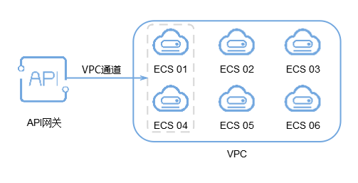
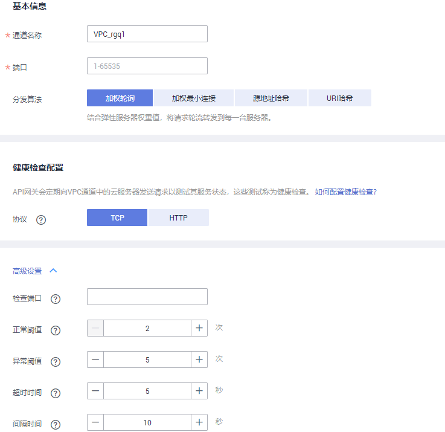

# 创建VPC通道

## 操作场景

VPC通道主要用于将部署在VPC内的服务通过API网关开放给外部访问，它的优势在于使用VPC的内部子网通信，网络时延更低，同时VPC通道具有负载均衡功能，从而实现后端服务的负载均衡。

创建VPC通道后，在创建API，且后端服务类型为HTTP/HTTPS时，后端服务地址可以直接使用已创建的VPC通道。每个用户最多创建30个VPC通道。

例如，VPC中包含6台ECS，已创建一条VPC通道，其中ECS 01和ECS 04已添加到VPC通道中，此时API网关通过VPC通道可以直接访问VPC中的ECS 01和ECS 04。

**图 1**  通过API网关访问VPC通道中的ECS  

> **说明：** 
>API网关专享版的VPC通道支持私网ELB，共享版的VPC通道不支持私网ELB。

## 前提条件

已创建云服务器。

## 创建快速通道

1.  登录管理控制台。
2.  在管理控制台左上角单击，选择区域。
3.  单击管理控制台左上角，然后单击“API网关 APIG”。
4.  在左侧选择您的API版本，单击并进入到对应版本的API开发与调用管理页面。
    -   “共享版”指直接创建并管理API，如涉及到费用，以API调用次数计费。
    -   “专享版”指在API专享版实例中创建并管理API，如涉及到费用，按实例运行时间计费。

5.  单击“开放API \> VPC通道”，进入到VPC通道列表页面。
6.  单击“创建快速通道”，进入“新建VPC通道”页面，填写如[表1](#zh-cn_topic_0000001174497027_zh-cn_topic_0108871915_table1110161851716)所示信息。

    **图 2**  创建快速通道  
    

    **表 1**  VPC通道配置

    
    <table><thead align="left"><tr id="zh-cn_topic_0000001174497027_zh-cn_topic_0108871915_row11118189178"><th class="cellrowborder" valign="top" width="20%" id="mcps1.2.3.1.1">
信息项

    </th>
    <th class="cellrowborder" valign="top" width="80%" id="mcps1.2.3.1.2">
描述

    </th>
    </tr>
    </thead>
    <tbody><tr id="zh-cn_topic_0000001174497027_zh-cn_topic_0108871915_row6111191851715"><td class="cellrowborder" valign="top" width="20%" headers="mcps1.2.3.1.1 ">
通道名称

    </td>
    <td class="cellrowborder" valign="top" width="80%" headers="mcps1.2.3.1.2 ">
自定义VPC通道名称，用于识别不同的VPC通道。

    </td>
    </tr>
    <tr id="zh-cn_topic_0000001174497027_zh-cn_topic_0108871915_row18111101816173"><td class="cellrowborder" valign="top" width="20%" headers="mcps1.2.3.1.1 ">
端口

    </td>
    <td class="cellrowborder" valign="top" width="80%" headers="mcps1.2.3.1.2 ">
VPC通道中主机的端口号，即用户的后端业务端口号。

    
取值为1 ~ 65535。

    </td>
    </tr>
    <tr id="zh-cn_topic_0000001174497027_zh-cn_topic_0108871915_row1083115216507"><td class="cellrowborder" valign="top" width="20%" headers="mcps1.2.3.1.1 ">
成员类型

    </td>
    <td class="cellrowborder" valign="top" width="80%" headers="mcps1.2.3.1.2 ">
选择负载通道中的服务器成员类型。成员类型在负载通道创建后将不能修改。

    <ul id="zh-cn_topic_0000001174497027_zh-cn_topic_0108871915_ul1387152518542"><li>实例：通过选择弹性云服务器的方式添加负载通道成员。</li><li>IP地址：通过填写IP地址的方式添加负载通道成员。</li></ul>
    
仅专享版API网关支持选择不同的方式。

    </td>
    </tr>
    <tr id="zh-cn_topic_0000001174497027_zh-cn_topic_0108871915_row311112189175"><td class="cellrowborder" valign="top" width="20%" headers="mcps1.2.3.1.1 ">
分发算法

    </td>
    <td class="cellrowborder" valign="top" width="80%" headers="mcps1.2.3.1.2 ">
通过分发算法确定请求被发送到哪台主机。

    
分发算法包含如下几种：

    <ul id="zh-cn_topic_0000001174497027_zh-cn_topic_0108871915_ul24918264502"><li>加权轮询</li><li>加权最少连接</li><li>源地址哈希</li><li>URI哈希</li></ul>
    </td>
    </tr>
    <tr id="zh-cn_topic_0000001174497027_zh-cn_topic_0108871915_row131116181170"><td class="cellrowborder" valign="top" width="20%" headers="mcps1.2.3.1.1 ">
协议

    </td>
    <td class="cellrowborder" valign="top" width="80%" headers="mcps1.2.3.1.2 ">
使用以下协议，对VPC中主机执行健康检查。

    <ul id="zh-cn_topic_0000001174497027_zh-cn_topic_0108871915_ul19904951155719"><li>TCP</li><li>HTTP</li><li>HTTPS</li></ul>
    
默认为TCP协议。

    </td>
    </tr>
    <tr id="zh-cn_topic_0000001174497027_zh-cn_topic_0108871915_row18456130124815"><td class="cellrowborder" valign="top" width="20%" headers="mcps1.2.3.1.1 ">
路径

    </td>
    <td class="cellrowborder" valign="top" width="80%" headers="mcps1.2.3.1.2 ">
健康检查时的目标路径。

    
仅在协议不为“TCP”时，需要设置。

    </td>
    </tr>
    <tr id="zh-cn_topic_0000001174497027_zh-cn_topic_0108871915_row311151817174"><td class="cellrowborder" valign="top" width="20%" headers="mcps1.2.3.1.1 ">
检查端口

    </td>
    <td class="cellrowborder" valign="top" width="80%" headers="mcps1.2.3.1.2 ">
健康检查的目标端口。

    
缺省时为VPC中主机的端口号。

    </td>
    </tr>
    <tr id="zh-cn_topic_0000001174497027_zh-cn_topic_0108871915_row1611281881717"><td class="cellrowborder" valign="top" width="20%" headers="mcps1.2.3.1.1 ">
正常阈值

    </td>
    <td class="cellrowborder" valign="top" width="80%" headers="mcps1.2.3.1.2 ">
判定VPC通道中主机正常的依据为：连续检查<em id="zh-cn_topic_0000001174497027_zh-cn_topic_0108871915_i421224922811">x</em>成功，x为您设置的正常阈值。

    
取值为2 ~ 10。缺省时为2。

    </td>
    </tr>
    <tr id="zh-cn_topic_0000001174497027_zh-cn_topic_0108871915_row1852365410195"><td class="cellrowborder" valign="top" width="20%" headers="mcps1.2.3.1.1 ">
异常阈值

    </td>
    <td class="cellrowborder" valign="top" width="80%" headers="mcps1.2.3.1.2 ">
判定VPC通道中主机异常的依据为：连续检查<em id="zh-cn_topic_0000001174497027_zh-cn_topic_0108871915_i37296135294">x失败</em>，x为您设置的异常阈值。

    
取值为2 ~ 10。缺省时为5。

    </td>
    </tr>
    <tr id="zh-cn_topic_0000001174497027_zh-cn_topic_0108871915_row9935144112016"><td class="cellrowborder" valign="top" width="20%" headers="mcps1.2.3.1.1 ">
超时时间

    </td>
    <td class="cellrowborder" valign="top" width="80%" headers="mcps1.2.3.1.2 ">
检查期间，无响应的时间，单位为秒。

    
取值为2 ~ 30。缺省时为5。

    </td>
    </tr>
    <tr id="zh-cn_topic_0000001174497027_zh-cn_topic_0108871915_row12537112014201"><td class="cellrowborder" valign="top" width="20%" headers="mcps1.2.3.1.1 ">
间隔时间

    </td>
    <td class="cellrowborder" valign="top" width="80%" headers="mcps1.2.3.1.2 ">
连续两次检查的间隔时间，单位为秒。

    
取值为5 ~ 300。缺省时为10。

    </td>
    </tr>
    <tr id="zh-cn_topic_0000001174497027_zh-cn_topic_0108871915_row154521040174814"><td class="cellrowborder" valign="top" width="20%" headers="mcps1.2.3.1.1 ">
HTTP响应码

    </td>
    <td class="cellrowborder" valign="top" width="80%" headers="mcps1.2.3.1.2 ">
检查目标HTTP响应时，判断成功使用的HTTP响应码。

    
仅在协议不为“TCP”时，需要设置。

    </td>
    </tr>
    </tbody>
    </table>

7.  单击“下一步”，进入“添加云服务器”页面。
8.  单击“添加云服务器”，弹出“添加云服务器”对话框。
9.  勾选需要添加的云服务器，单击“添加”。

    > **说明：** 
    >待添加的云服务器的安全组必须允许100.125.0.0/16网段访问，否则将导致健康检查失败及业务不通。

10. 单击“完成”，完成快速通道的创建。

## 使用API方式创建VPC通道

您还可以使用API的方式创建VPC通道，具体操作请查看以下链接。

[创建VPC通道](https://support.huaweicloud.com/api-apig/CreateVpcChannelV2.html)

## 后续操作

[创建API](创建API.md#ZH-CN_TOPIC_0000001142797440)，将部署在VPC中的后端服务开放API，从而实现后端服务的负载均衡。

