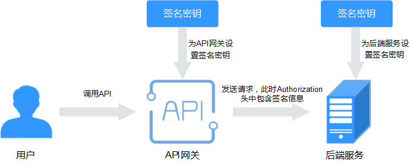
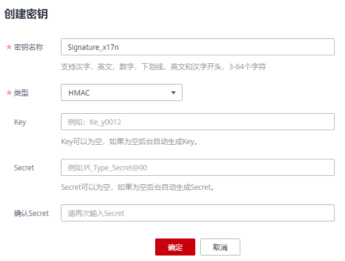

# 创建并使用签名密钥

## 操作场景

签名密钥用于后端服务验证API网关的身份，在API网关请求后端服务时，保障后端服务的安全。

签名密钥是由一对Key和Secret组成，签名密钥需要绑定到API才能生效。当签名密钥绑定API后，API网关向后端服务发送此API的请求时，会增加相应的签名信息，此时需要后端服务依照同样方式进行签名，通过比对签名结果和API网关传过来的Authorization头中签名是否一致来校验API的合法性。

> **说明：** 
>-   每个用户最多创建30个签名密钥。
>-   同一个环境中一个API只能被一个签名密钥绑定，一个签名密钥可以绑定多个API。

## 使用流程

1.  在控制台创建签名密钥。
2.  将新创建的签名密钥绑定API。
3.  API网关将签名后的请求发送到后端服务，此时Authorization头中包含签名信息。后端服务通过不同的开发语言（例如Java、Go、Python、JavaScript、C\#、PHP、C++、C、Android等）进行签名，比对签名结果和API网关传过来的Authorization头中签名是否一致来校验API的合法性。

**图 1**  签名密钥流程图  

## 创建签名密钥

1.  登录管理控制台。
2.  在管理控制台左上角单击，选择区域。
3.  单击管理控制台左上角，然后单击“API网关 APIG”。
4.  在左侧选择您的API版本，单击并进入到对应版本的API开发与调用管理页面。
    -   “共享版”指直接创建并管理API，如涉及到费用，以API调用次数计费。
    -   “专享版”指在API专享版实例中创建并管理API，如涉及到费用，按实例运行时间计费。

5.  单击“开放API \> 签名密钥”，进入签名密钥管理信息页面。
6.  单击“创建密钥”，弹出“创建密钥”对话框。
7.  填写如[表1](#zh-cn_topic_0000001174416911_table1983417509557)所示信息。

    

    **表 1**  密钥信息

    
    <table><thead align="left"><tr id="zh-cn_topic_0000001174416911_row9833350145510"><th class="cellrowborder" valign="top" width="20%" id="mcps1.2.3.1.1">
信息项

    </th>
    <th class="cellrowborder" valign="top" width="80%" id="mcps1.2.3.1.2">
描述

    </th>
    </tr>
    </thead>
    <tbody><tr id="zh-cn_topic_0000001174416911_row1833115015554"><td class="cellrowborder" valign="top" width="20%" headers="mcps1.2.3.1.1 ">
密钥名称

    </td>
    <td class="cellrowborder" valign="top" width="80%" headers="mcps1.2.3.1.2 ">
自定义名称，用于识别不同的密钥。

    </td>
    </tr>
    <tr id="zh-cn_topic_0000001174416911_row18331250195519"><td class="cellrowborder" valign="top" width="20%" headers="mcps1.2.3.1.1 ">
类型

    </td>
    <td class="cellrowborder" valign="top" width="80%" headers="mcps1.2.3.1.2 ">
专享版支持选择签名密钥的认证类型，可选择“hmac”和“basic”。

    </td>
    </tr>
    <tr id="zh-cn_topic_0000001174416911_row6833145025518"><td class="cellrowborder" valign="top" width="20%" headers="mcps1.2.3.1.1 ">
Key

    </td>
    <td class="cellrowborder" valign="top" width="80%" headers="mcps1.2.3.1.2 ">
与“Secret”配合使用，表示签名密钥对。

    <ul id="zh-cn_topic_0000001174416911_ul15833135020557"><li>hmac：填写hmac认证所使用密钥对的Key。</li><li>basic：填写basic认证所使用的用户名。</li></ul>
    </td>
    </tr>
    <tr id="zh-cn_topic_0000001174416911_row2833205065519"><td class="cellrowborder" valign="top" width="20%" headers="mcps1.2.3.1.1 ">
Secret

    </td>
    <td class="cellrowborder" valign="top" width="80%" headers="mcps1.2.3.1.2 ">
与“Key”配合使用，表示签名密钥对。

    <ul id="zh-cn_topic_0000001174416911_ul6833105035520"><li>hmac：填写hmac认证所使用密钥对的Secret。</li><li>basic：填写basic认证所使用的密码。</li></ul>
    </td>
    </tr>
    <tr id="zh-cn_topic_0000001174416911_row1383413506551"><td class="cellrowborder" valign="top" width="20%" headers="mcps1.2.3.1.1 ">
确认Secret

    </td>
    <td class="cellrowborder" valign="top" width="80%" headers="mcps1.2.3.1.2 ">
填写与Secret一致的值。

    </td>
    </tr>
    </tbody>
    </table>

8.  单击“确定”，完成密钥的创建。

## 绑定API

1.  单击“开放API \> 签名密钥”，进入签名密钥管理信息页面。
2.  通过以下任意一种方法，查看签名密钥已绑定API列表页面。
    -   在待绑定API的密钥所在行，单击“绑定API”，进入“签名密钥绑定API”页面。
    -   单击待绑定API的密钥名称，进入密钥详情页面。

3.  单击“绑定API”，弹出“绑定API”对话框。
4.  选择“API分组”、“环境”以及“API名称”，筛选所需的API。
5.  勾选API，单击“绑定”，完成密钥绑定API。

    > **说明：** 
    >在签名密钥绑定API后，如果API不再需要此密钥，单击“解除”，解除绑定。

## 验证签名结果

参考[签名算法](https://support.huaweicloud.com/devg-apig/apig-dev-180307037.html#)对后端服务进行签名，比对签名结果和API网关传过来的Authorization头中签名是否一致来校验API的合法性。

## 使用API方式创建签名密钥

您还可以使用API的方式创建签名密钥，具体操作请查看以下链接。

[创建签名密钥](https://support.huaweicloud.com/api-apig/CreateSignatureKeyV2.html)

