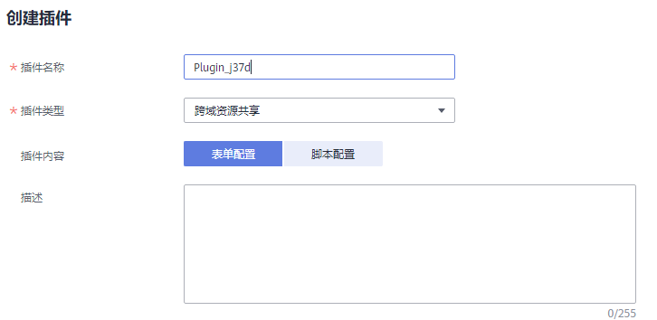

# 创建插件

API网关专享版支持通过插件的方式，为API提供灵活的扩展能力。

## 前提条件

-   一个API只能绑定一个相同类型的插件。
-   插件和API本身相互独立，只有为API绑定插件后，插件才对API生效。为API绑定插件时需指定发布环境，插件只对指定环境上的API生效。
-   插件的绑定、解绑、更新会实时生效，不需要重新发布API。
-   API的下线操作不影响插件的绑定关系，再次发布后仍然会带有下线前绑定的插件。
-   如果插件与API有绑定关系，则插件无法执行删除操作。

## 创建插件

1.  登录管理控制台。
2.  在管理控制台左上角单击，选择区域。
3.  单击管理控制台左上角，然后单击“API网关 APIG”。
4.  在左侧导航单击“专享版”，进入专享版实例列表页，单击“查看控制台”，进入API开发与调用管理页面。
5.  单击“开放API \> 插件”，进入到插件列表页面。
6.  单击“创建插件”。

    在创建插件弹窗中配置插件信息。

    

    **表 1**  插件配置

    
    <table><thead align="left"><tr id="zh-cn_topic_0000001128537164_zh-cn_topic_0000001151883501_row1029013278486"><th class="cellrowborder" valign="top" width="30%" id="mcps1.2.3.1.1">
参数

    </th>
    <th class="cellrowborder" valign="top" width="70%" id="mcps1.2.3.1.2">
配置说明

    </th>
    </tr>
    </thead>
    <tbody><tr id="zh-cn_topic_0000001128537164_zh-cn_topic_0000001151883501_row162901327184819"><td class="cellrowborder" valign="top" width="30%" headers="mcps1.2.3.1.1 ">
插件名称

    </td>
    <td class="cellrowborder" valign="top" width="70%" headers="mcps1.2.3.1.2 ">
填写插件的名称，根据规划自定义。建议您按照一定的命名规则填写插件名称，方便您快速识别和查找。

    </td>
    </tr>
    <tr id="zh-cn_topic_0000001128537164_zh-cn_topic_0000001151883501_row10290927134813"><td class="cellrowborder" valign="top" width="30%" headers="mcps1.2.3.1.1 ">
插件类型

    </td>
    <td class="cellrowborder" valign="top" width="70%" headers="mcps1.2.3.1.2 ">
选择插件的类型，不同类型的插件提供不同扩展能力。

    <ul id="zh-cn_topic_0000001128537164_ul147161659193110"><li><strong id="zh-cn_topic_0000001128537164_b04281515324">跨域资源共享</strong>：为API的跨域访问提供指定预检请求头和响应头、自动创建跨域预检请求API的能力。</li><li><strong id="zh-cn_topic_0000001128537164_b12529110163210">HTTP响应头管理插件</strong>：可以自定义HTTP响应头，在返回的API响应中指定配置的响应头。</li></ul>
    </td>
    </tr>
    <tr id="zh-cn_topic_0000001128537164_zh-cn_topic_0000001151883501_row182901827164816"><td class="cellrowborder" valign="top" width="30%" headers="mcps1.2.3.1.1 ">
插件内容

    </td>
    <td class="cellrowborder" valign="top" width="70%" headers="mcps1.2.3.1.2 ">
插件的配置内容，支持表单配置和脚本配置两种方式。

    
根据不同的插件类型，插件内容的配置不同：

    <ul id="zh-cn_topic_0000001128537164_zh-cn_topic_0000001151883501_ul48331418474"><li><a href="跨域资源共享插件.md#ZH-CN_TOPIC_0000001188957133">跨域资源共享插件</a></li><li><a href="HTTP响应头管理插件.md#ZH-CN_TOPIC_0000001142797430">HTTP响应头管理插件</a></li></ul>
    </td>
    </tr>
    <tr id="zh-cn_topic_0000001128537164_zh-cn_topic_0000001151883501_row1629062774820"><td class="cellrowborder" valign="top" width="30%" headers="mcps1.2.3.1.1 ">
描述

    </td>
    <td class="cellrowborder" valign="top" width="70%" headers="mcps1.2.3.1.2 ">
填写插件的描述信息。

    </td>
    </tr>
    </tbody>
    </table>

7.  单击“确定”，创建插件。

    插件创建后，您还需要[为API绑定插件](#zh-cn_topic_0000001128537164_zh-cn_topic_0000001151883501_section020918935713)，才能使插件对API生效。

## 为API绑定插件

1.  在左侧的导航栏选择“开发API \> API管理”。
2.  在API列表中，单击要绑定插件的API名称，进入API详情页面。
3.  在“插件”页签下，单击“绑定插件”。
4.  在绑定插件弹窗中，选择要绑定插件的“环境”和“插件类型”，然后选中要绑定的插件。
5.  单击“确定”，完成API与插件的绑定。

