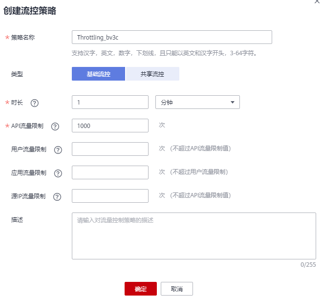
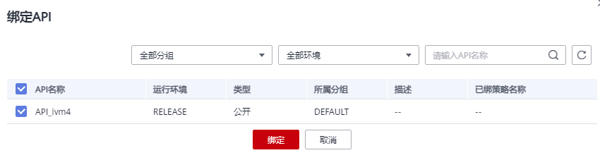

# 创建流控策略

## 操作场景

流量控制可限制单位时间内API的被调用次数，保护后端服务。

为了提供持续稳定的服务，您可以通过创建流控策略，针对部分API进行流量控制。

流控策略和API本身是相互独立的，只有将流控策略绑定API后，流控策略才对绑定的API生效。

> **说明：** 
>-   每个用户最多可创建30个流控策略。
>-   同一个环境中，一个API只能被一个流控策略绑定，但一个流控策略可以绑定多个API。
>-   若API未绑定流控策略，则系统默认流控限制为200次/秒。

## 前提条件

需要绑定的[API已发布](发布API.md#ZH-CN_TOPIC_0000001188957141)。

## 创建流控策略

1.  登录管理控制台。
2.  在管理控制台左上角单击，选择区域。
3.  单击管理控制台左上角，然后单击“API网关 APIG”。
4.  在左侧选择您的API版本，单击并进入到对应版本的API开发与调用管理页面。
    -   “共享版”指直接创建并管理API，如涉及到费用，以API调用次数计费。
    -   “专享版”指在API专享版实例中创建并管理API，如涉及到费用，按实例运行时间计费。

5.  选择“开放API \> 流量控制”，进入到流量控制信息页面。
6.  单击“创建流控策略”，弹出“创建流控策略”对话框。输入如[表1](#zh-cn_topic_0000001174496999_table1496031175119)所示信息。

    

    **表 1**  流控策略信息

    
    <table><thead align="left"><tr id="zh-cn_topic_0000001174496999_row59587116512"><th class="cellrowborder" valign="top" width="20%" id="mcps1.2.3.1.1">
信息项

    </th>
    <th class="cellrowborder" valign="top" width="80%" id="mcps1.2.3.1.2">
描述

    </th>
    </tr>
    </thead>
    <tbody><tr id="zh-cn_topic_0000001174496999_row495831117515"><td class="cellrowborder" valign="top" width="20%" headers="mcps1.2.3.1.1 ">
策略名称

    </td>
    <td class="cellrowborder" valign="top" width="80%" headers="mcps1.2.3.1.2 ">
API流控策略名称。

    </td>
    </tr>
    <tr id="zh-cn_topic_0000001174496999_row695851165120"><td class="cellrowborder" valign="top" width="20%" headers="mcps1.2.3.1.1 ">
类型

    </td>
    <td class="cellrowborder" valign="top" width="80%" headers="mcps1.2.3.1.2 ">
分“基础流控”和“共享流控”两类。

    <ul id="zh-cn_topic_0000001174496999_ul2095891110515"><li>基础流控针对单个API进行流量统计和控制；</li><li>共享流控针对绑定了该策略的所有API进行总流量统计和控制。</li></ul>
    </td>
    </tr>
    <tr id="zh-cn_topic_0000001174496999_row12959161125112"><td class="cellrowborder" valign="top" width="20%" headers="mcps1.2.3.1.1 ">
时长

    </td>
    <td class="cellrowborder" valign="top" width="80%" headers="mcps1.2.3.1.2 ">
流量限制的时长。

    <ul id="zh-cn_topic_0000001174496999_ul9959211115115"><li>与“API流量限制”配合使用，表示单位时间内的单个API请求次数上限。</li><li>与“用户流量限制”配合使用，表示单位时间内的单个用户请求次数上限。</li><li>与“应用流量限制”配合使用，表示单位时间内的单个APP请求次数上限。</li><li>与“源IP流量限制”配合使用，表示单位时间内的单个IP地址请求次数上限。</li></ul>
    </td>
    </tr>
    <tr id="zh-cn_topic_0000001174496999_row18959181113511"><td class="cellrowborder" valign="top" width="20%" headers="mcps1.2.3.1.1 ">
API流量限制

    </td>
    <td class="cellrowborder" valign="top" width="80%" headers="mcps1.2.3.1.2 ">
单个API被调用次数上限。

    
与“时长”配合使用，表示单位时间内的单个API请求次数上限。

    </td>
    </tr>
    <tr id="zh-cn_topic_0000001174496999_row1695951105120"><td class="cellrowborder" valign="top" width="20%" headers="mcps1.2.3.1.1 ">
用户流量限制

    </td>
    <td class="cellrowborder" valign="top" width="80%" headers="mcps1.2.3.1.2 ">
单个用户调用API次数上限，<strong id="zh-cn_topic_0000001174496999_b220120338314">仅适用于API的安全认证方式为IAM认证时</strong>。

    <ul id="zh-cn_topic_0000001174496999_ul1095971112511"><li>不超过“API流量限制”。</li><li>与“时长”配合使用，表示单位时间内的单个用户请求次数上限。</li><li>如果主帐号下有多个子用户访问API，按主帐号累计的调用次数进行限制。</li></ul>
    </td>
    </tr>
    <tr id="zh-cn_topic_0000001174496999_row59591511115118"><td class="cellrowborder" valign="top" width="20%" headers="mcps1.2.3.1.1 ">
应用流量限制

    </td>
    <td class="cellrowborder" valign="top" width="80%" headers="mcps1.2.3.1.2 ">
单个应用调用API次数上限，<strong id="zh-cn_topic_0000001174496999_b1436214286314">仅适用于API的安全认证方式为APP认证时</strong>。

    <ul id="zh-cn_topic_0000001174496999_ul16959711155116"><li>不超过“用户流量限制”。</li><li>与“时长”配合使用，表示单位时间内的单个应用请求次数上限。</li></ul>
    </td>
    </tr>
    <tr id="zh-cn_topic_0000001174496999_row199601113518"><td class="cellrowborder" valign="top" width="20%" headers="mcps1.2.3.1.1 ">
源IP流量限制

    </td>
    <td class="cellrowborder" valign="top" width="80%" headers="mcps1.2.3.1.2 ">
单个IP地址调用API次数上限。

    <ul id="zh-cn_topic_0000001174496999_ul10960201195112"><li>不超过“API流量限制”。</li><li>与“时长”配合使用，表示单位时间内的单个IP地址请求次数上限。</li></ul>
    </td>
    </tr>
    <tr id="zh-cn_topic_0000001174496999_row1296081195113"><td class="cellrowborder" valign="top" width="20%" headers="mcps1.2.3.1.1 ">
描述

    </td>
    <td class="cellrowborder" valign="top" width="80%" headers="mcps1.2.3.1.2 ">
关于控制策略的描述。

    </td>
    </tr>
    </tbody>
    </table>

7.  单击“确定”，完成流量控制策略的创建。

    创建成功后，流量控制页面增加显示新创建的策略。您可以将相关API绑定到该策略，以实现流量控制。

## 绑定API

1.  在“流量控制”页面，通过以下任意一种方法，进入“绑定API”页面。
    -   在待绑定的流量控制策略所在行，单击“绑定API”，进入已绑定API列表页面。单击“绑定API”。
    -   单击策略名称，进入策略详情页面。在“绑定的API列表”页签中单击“绑定API”。

2.  选择“API分组”、“环境”以及“API名称”，筛选所需的API。
3.  勾选API，单击“绑定”，完成API绑定策略。

    **图 1**  绑定API  
    

    > **说明：** 
    >在流控策略绑定API后，如果API不需要调用此策略，单击“解除”，解除绑定。如果需要批量解绑API，则勾选待解绑的API，单击“解除”。最多同时解绑1000个API。

## 使用API方式创建流控策略、绑定API和解除绑定

您还可以使用API的方式创建流控策略、绑定API和解除绑定，具体操作请查看以下链接。

[创建流控策略](https://support.huaweicloud.com/api-apig/CreateRequestThrottlingPolicyV2.html)

[绑定流控策略](https://support.huaweicloud.com/api-apig/AssociateRequestThrottlingPolicyV2.html)

[解除绑定](https://support.huaweicloud.com/api-apig/DisassociateRequestThrottlingPolicyV2.html)

## 后续操作

-   如果某个应用希望受流量策略控制，可以通过对该策略增加特殊应用实现，具体参考[添加特殊应用或租户](添加特殊应用或租户.md#ZH-CN_TOPIC_0000001142957198)。增加特殊应用后，此应用的应用流量限制受增加特殊应用时设置的阈值限制，API流量限制和用户流量限制受策略限制。
-   如果某个租户希望受流量策略控制，可以通过对该策略增加特殊租户实现，具体参考[添加特殊应用或租户](添加特殊应用或租户.md#ZH-CN_TOPIC_0000001142957198)。增加特殊租户后，此租户的用户流量限制受增加特殊租户时设置的阈值限制，API流量限制和应用流量限制受策略限制。

