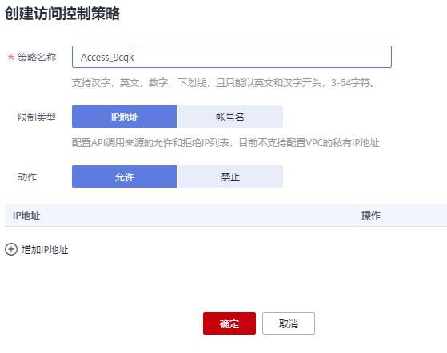

# 创建访问控制策略

## 操作场景

访问控制策略是API网关提供的API安全防护组件之一，主要用来控制访问API的IP地址和帐户，您可以通过设置IP地址或帐户的黑白名单来拒绝/允许某个IP地址或帐户访问API。

访问控制策略和API本身是相互独立的，只有将访问控制策略绑定API后，访问控制策略才对绑定的API生效。

> **说明：** 
>-   每个用户最多可以创建100个访问控制策略。
>-   同一个环境中一个API只能被一个访问控制策略绑定，一个访问控制策略可以绑定多个API。

## 创建访问控制策略

1.  登录管理控制台。
2.  在管理控制台左上角单击，选择区域。
3.  单击管理控制台左上角，然后单击“API网关 APIG”。
4.  在左侧选择您的API版本，单击并进入到对应版本的API开发与调用管理页面。
    -   “共享版”指直接创建并管理API，如涉及到费用，以API调用次数计费。
    -   “专享版”指在API专享版实例中创建并管理API，如涉及到费用，按实例运行时间计费。

5.  选择“开放API \> 访问控制”，进入访问控制策略列表页面。
6.  单击“创建访问控制策略”，弹出“创建访问控制策略”对话框。
7.  输入[表1](#zh-cn_topic_0000001174416937_table56117818541)如所示信息。

    

    **表 1**  访问控制策略信息

    
    <table><thead align="left"><tr id="zh-cn_topic_0000001174416937_row561011812546"><th class="cellrowborder" valign="top" width="18.23%" id="mcps1.2.3.1.1">
信息项

    </th>
    <th class="cellrowborder" valign="top" width="81.77%" id="mcps1.2.3.1.2">
描述

    </th>
    </tr>
    </thead>
    <tbody><tr id="zh-cn_topic_0000001174416937_row961017811542"><td class="cellrowborder" valign="top" width="18.23%" headers="mcps1.2.3.1.1 ">
策略名称

    </td>
    <td class="cellrowborder" valign="top" width="81.77%" headers="mcps1.2.3.1.2 ">
访问控制策略的名称。

    </td>
    </tr>
    <tr id="zh-cn_topic_0000001174416937_row5610118205410"><td class="cellrowborder" valign="top" width="18.23%" headers="mcps1.2.3.1.1 ">
限制类型

    </td>
    <td class="cellrowborder" valign="top" width="81.77%" headers="mcps1.2.3.1.2 ">
控制访问API的类型。

    <ul id="zh-cn_topic_0000001174416937_ul1261013817546"><li>IP地址：允许/禁止访问API的IP地址。</li><li>帐号名：允许/禁止访问API的帐号名。</li></ul>
    </td>
    </tr>
    <tr id="zh-cn_topic_0000001174416937_row1661115805413"><td class="cellrowborder" valign="top" width="18.23%" headers="mcps1.2.3.1.1 ">
动作

    </td>
    <td class="cellrowborder" valign="top" width="81.77%" headers="mcps1.2.3.1.2 ">
包括“允许”和“禁止”。

    
和“限制类型”配合使用，允许/禁止访问API的IP地址/帐号名。

    </td>
    </tr>
    <tr id="zh-cn_topic_0000001174416937_row561168165414"><td class="cellrowborder" valign="top" width="18.23%" headers="mcps1.2.3.1.1 ">
IP地址

    </td>
    <td class="cellrowborder" valign="top" width="81.77%" headers="mcps1.2.3.1.2 ">
输入需要允许或者禁止访问API的IP地址，或IP地址范围。

    
仅在“限制类型”为“IP地址”时，需要设置。

    
 说明： 

允许或禁止访问的IP地址条数，分别可以配置最多100条。

    

    </td>
    </tr>
    <tr id="zh-cn_topic_0000001174416937_row6611286549"><td class="cellrowborder" valign="top" width="18.23%" headers="mcps1.2.3.1.1 ">
帐号名

    </td>
    <td class="cellrowborder" valign="top" width="81.77%" headers="mcps1.2.3.1.2 ">
输入需要允许或者禁止访问API的IAM帐号，<strong id="zh-cn_topic_0000001174416937_b1215414168322">仅适用于API的安全认证方式为IAM认证时</strong>。

    
仅在“限制类型”为“帐号名”时，需要设置。支持输入多个账户名，以英文“,”隔开，如aaa,bbb。

    
 说明： 

仅支持IAM帐号维度的访问控制，不能对单个IAM用户进行访问控制。

    

    </td>
    </tr>
    </tbody>
    </table>

8.  单击“确定”，完成访问控制策略的创建。您可以将相关API绑定到该策略，以实现访问控制。

## 绑定API

1.  在“访问控制”页面，通过以下任意一种方法，进入“绑定API”页面。
    -   在待绑定的访问控制策略所在行，单击“绑定API”，进入已绑定API列表页面。单击“绑定API”。
    -   单击策略名称，进入策略详情页面。单击“绑定API”。

2.  选择“API分组”、“环境”以及“API名称”，筛选所需的API。
3.  勾选API，单击“绑定”，完成API绑定策略。

    > **说明：** 
    >在访问控制策略绑定API后，如果API不需要调用此策略，单击“解除”，解除绑定。如果需要批量解绑API，则勾选待解绑的API，单击“解除”。最多同时解绑1000个API。

