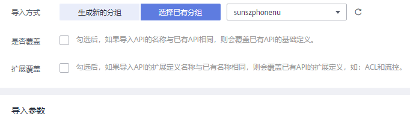
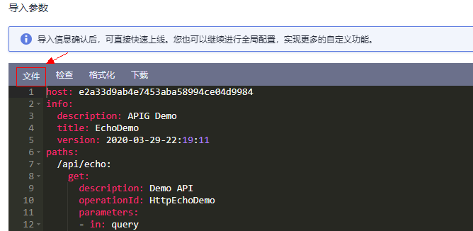
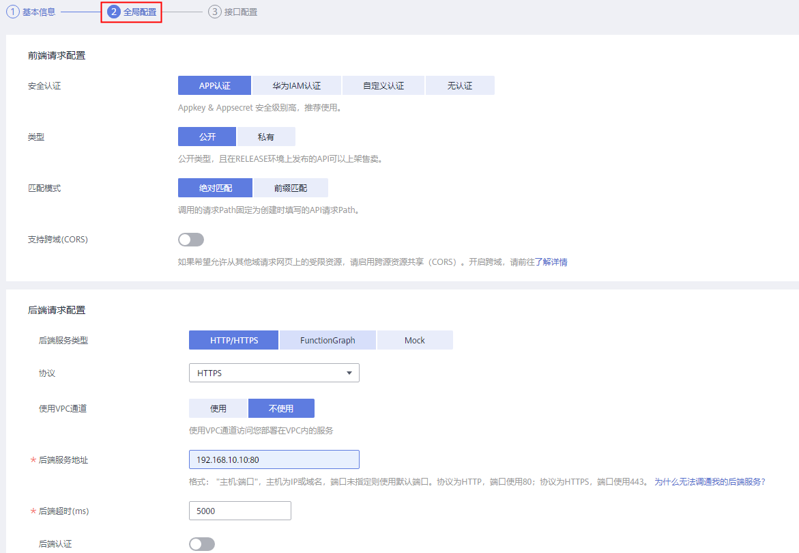
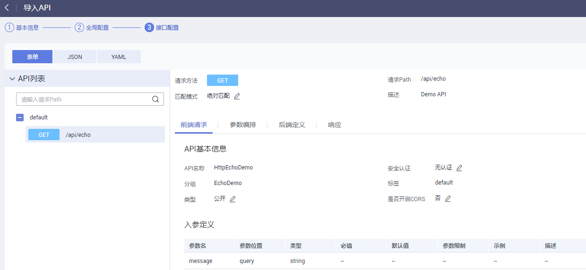

# 导入API

## 操作场景

Swagger是基于OpenAPI规范构建的开源工具，可以帮助您设计、构建、记录以及使用Rest API。API网关支持导入Swagger 2.0定义的API到已有的API分组或新的API分组。

导入API支持单个API导入和批量API导入，主要取决于Swagger文件中包含的API数量。

## 前提条件

-   已获取待导入API的Swagger文件，导入前您需要在API定义中补全API网关的[Swagger扩展定义](https://support.huaweicloud.com/devg-apig/apig-dev-181109073.html)。
-   API分组和API的配额满足需求。

## 操作步骤

1.  登录管理控制台。
2.  在管理控制台左上角单击，选择区域。
3.  单击管理控制台左上角，然后单击“API网关 APIG”。
4.  在左侧选择您的API版本，单击并进入到对应版本的API开发与调用管理页面。
    -   “共享版”指直接创建并管理API，如涉及到费用，以API调用次数计费。
    -   “专享版”指在API专享版实例中创建并管理API，如涉及到费用，按实例运行时间计费。

5.  单击“开放API \> API管理”，进入到API管理信息页面。
6.  单击“导入API”，进入“导入API”界面。
7.  选择如[表1](#zh-cn_topic_0000001174497033_zh-cn_topic_0137035339_table11284181112369)所示参数。

    **图 1**  导入API  
    

    **表 1**  导入API

    
    <table><thead align="left"><tr id="zh-cn_topic_0000001174497033_zh-cn_topic_0137035339_row6284151113368"><th class="cellrowborder" valign="top" width="20%" id="mcps1.2.3.1.1">
参数名称

    </th>
    <th class="cellrowborder" valign="top" width="80%" id="mcps1.2.3.1.2">
说明

    </th>
    </tr>
    </thead>
    <tbody><tr id="zh-cn_topic_0000001174497033_zh-cn_topic_0137035339_row14286311173619"><td class="cellrowborder" valign="top" width="20%" headers="mcps1.2.3.1.1 ">
导入方式

    </td>
    <td class="cellrowborder" valign="top" width="80%" headers="mcps1.2.3.1.2 ">
导入方式包含以下2种：

    <ul id="zh-cn_topic_0000001174497033_zh-cn_topic_0137035339_ul17716192483810"><li>导入到新的分组：将API定义导入到一个新的分组，导入过程中系统会自动创建一个新的API分组，并将导入的API归属到该分组。</li><li>导入到已有分组：将API定义导入到一个已有的分组，导入过程中不会删除分组中已有的API，只是将新增的API导入分组。</li></ul>
    </td>
    </tr>
    <tr id="zh-cn_topic_0000001174497033_zh-cn_topic_0137035339_row3286101118369"><td class="cellrowborder" valign="top" width="20%" headers="mcps1.2.3.1.1 ">
API分组

    </td>
    <td class="cellrowborder" valign="top" width="80%" headers="mcps1.2.3.1.2 ">
仅在选择“导入到已有分组”时，需要选择API分组。

    </td>
    </tr>
    <tr id="zh-cn_topic_0000001174497033_zh-cn_topic_0137035339_row7286711183611"><td class="cellrowborder" valign="top" width="20%" headers="mcps1.2.3.1.1 ">
是否覆盖

    </td>
    <td class="cellrowborder" valign="top" width="80%" headers="mcps1.2.3.1.2 ">
勾选后，当导入的API名称与已有的API名称冲突时，导入的API会覆盖已有的API。

    
仅在选择“导入到已有分组”时，需要选择是否覆盖。

    </td>
    </tr>
    <tr id="zh-cn_topic_0000001174497033_zh-cn_topic_0137035339_row1729912415209"><td class="cellrowborder" valign="top" width="20%" headers="mcps1.2.3.1.1 ">
扩展覆盖

    </td>
    <td class="cellrowborder" valign="top" width="80%" headers="mcps1.2.3.1.2 ">
当导入API扩展信息（ACL，流控）与已有的API扩展信息冲突时，会覆盖已有API扩展信息。

    </td>
    </tr>
    </tbody>
    </table>

8.  单击“导入参数”下方的“文件”，选择待导入的API文件。

    支持yaml和json两种文件格式的API导入，界面可预览待导入API内容。

    **图 2**  导入参数  
    

9.  （可选）修改待导入API的全局配置。

    您可以修改全局配置，如前后端的请求配置，也可以修改具体的接口配置。

    **图 3**  修改全局配置  
    

    **图 4**  修改接口配置  
    

10. 单击“快速上线”，完成API导入。

    > **说明：** 
    >导入的API不会自动发布到环境，需要您手动发布。

## 后续操作

将导入成功的API[发布到环境](发布API.md#ZH-CN_TOPIC_0000001188957141)中，以便API调用者调用。

