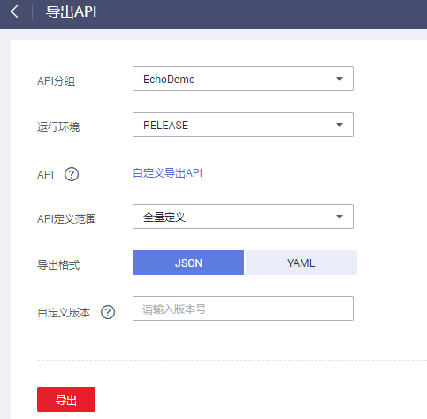

# 导出API

## 操作场景

导出JSON或YAML格式的API。API网关支持单个API导出和批量API导出。

> **说明：** 
>云市场购买的API不支持导出。

## 前提条件

已创建API分组和API。

## 操作步骤

1.  登录管理控制台。
2.  在管理控制台左上角单击，选择区域。
3.  单击管理控制台左上角，然后单击“API网关 APIG”。
4.  在左侧选择您的API版本，单击并进入到对应版本的API开发与调用管理页面。
    -   “共享版”指直接创建并管理API，如涉及到费用，以API调用次数计费。
    -   “专享版”指在API专享版实例中创建并管理API，如涉及到费用，按实例运行时间计费。

5.  单击“导出API”，进入“导出API”界面。
6.  设置如[表1](#zh-cn_topic_0000001128377368_zh-cn_topic_0142347425_table11284181112369)所示参数。

    **图 1**  导出API  
    

    **表 1**  导出API

    
    <table><thead align="left"><tr id="zh-cn_topic_0000001128377368_zh-cn_topic_0142347425_row6284151113368"><th class="cellrowborder" valign="top" width="27.35%" id="mcps1.2.3.1.1">
参数名称

    </th>
    <th class="cellrowborder" valign="top" width="72.65%" id="mcps1.2.3.1.2">
说明

    </th>
    </tr>
    </thead>
    <tbody><tr id="zh-cn_topic_0000001128377368_zh-cn_topic_0142347425_row3286101118369"><td class="cellrowborder" valign="top" width="27.35%" headers="mcps1.2.3.1.1 ">
API分组

    </td>
    <td class="cellrowborder" valign="top" width="72.65%" headers="mcps1.2.3.1.2 ">
选择待导出API所在的API分组。

    </td>
    </tr>
    <tr id="zh-cn_topic_0000001128377368_zh-cn_topic_0142347425_row194915509914"><td class="cellrowborder" valign="top" width="27.35%" headers="mcps1.2.3.1.1 ">
运行环境

    </td>
    <td class="cellrowborder" valign="top" width="72.65%" headers="mcps1.2.3.1.2 ">
选择待导出API所在的环境。

    </td>
    </tr>
    <tr id="zh-cn_topic_0000001128377368_zh-cn_topic_0142347425_row185485314913"><td class="cellrowborder" valign="top" width="27.35%" headers="mcps1.2.3.1.1 ">
API

    </td>
    <td class="cellrowborder" valign="top" width="72.65%" headers="mcps1.2.3.1.2 ">
默认导出API分组所在环境的所有的API，如果需要导出个别API，单击“自定义导出API”，勾选需要导出的API名称。

    </td>
    </tr>
    <tr id="zh-cn_topic_0000001128377368_zh-cn_topic_0142347425_row16234355692"><td class="cellrowborder" valign="top" width="27.35%" headers="mcps1.2.3.1.1 ">
API定义范围

    </td>
    <td class="cellrowborder" valign="top" width="72.65%" headers="mcps1.2.3.1.2 "><ul id="zh-cn_topic_0000001128377368_zh-cn_topic_0142347425_ul51051155111915"><li>基础定义：包括API前端请求定义和响应定义，不包括后端服务定义。其中API前端请求定义除了Swagger规范定义项外，还包括API网关的一些Swagger扩展字段。</li><li>全量定义：包括API前端请求定义、后端服务定义和响应定义。</li><li>扩展定义：包括API前端请求定义、后端服务定义和响应定义，还包括API关联的流量控制、访问控制等策略对象的定义。</li></ul>
    </td>
    </tr>
    <tr id="zh-cn_topic_0000001128377368_zh-cn_topic_0142347425_row188814592914"><td class="cellrowborder" valign="top" width="27.35%" headers="mcps1.2.3.1.1 ">
导出格式

    </td>
    <td class="cellrowborder" valign="top" width="72.65%" headers="mcps1.2.3.1.2 ">
选择JSON或YAML。

    </td>
    </tr>
    <tr id="zh-cn_topic_0000001128377368_zh-cn_topic_0142347425_row5847204071012"><td class="cellrowborder" valign="top" width="27.35%" headers="mcps1.2.3.1.1 ">
自定义版本

    </td>
    <td class="cellrowborder" valign="top" width="72.65%" headers="mcps1.2.3.1.2 ">
为导出的API自定义版本号，如果没有指定版本号，默认使用当前时间。

    </td>
    </tr>
    </tbody>
    </table>

7.  单击“导出”，右侧显示导出结果。

