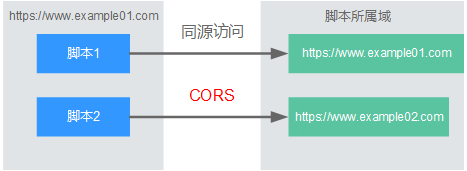
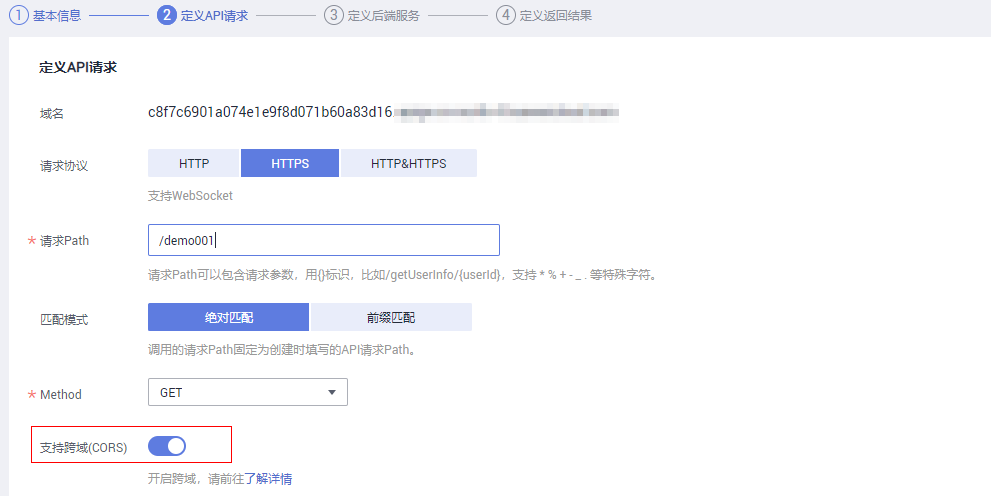
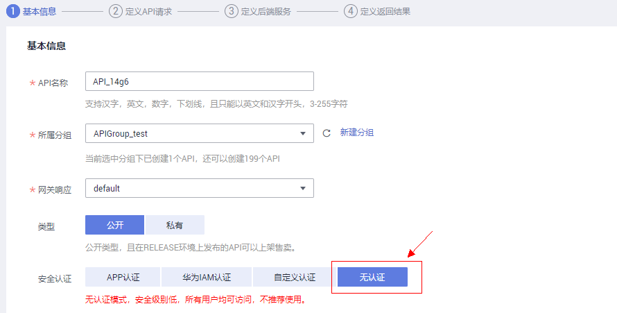
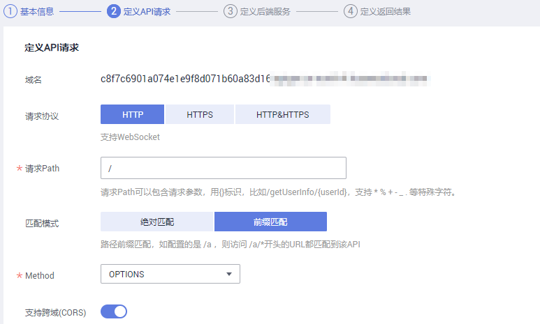

# 开启跨域访问<a name="ZH-CN_TOPIC_0000001142797434"></a>

## 什么是跨域访问<a name="zh-cn_topic_0000001128377396_zh-cn_topic_0118021495_section7660134562313"></a>

浏览器出于安全性考虑，会限制从页面脚本内发起的跨域访问（CORS）请求，此时页面只能访问同源的资源，而CORS允许浏览器向跨域服务器，发送XMLHttpRequest请求，从而实现跨域访问。

**图 1**  跨域访问<a name="zh-cn_topic_0000001128377396_zh-cn_topic_0118021495_fig7411102051912"></a>  


浏览器将CORS请求分为两类：

-   **简单请求**

    简单跨域请求的场景需要满足以下两个条件：

    1.  请求方法是HEAD，GET，或者POST。
    2.  HTTP的头信息不超出以下范围：
        -   Accept
        -   Accept-Language
        -   Content-Language
        -   Last-Event-ID
        -   Content-Type：取值范围：application/x-www-form-urlencoded、multipart/form-data、text/plain

    对于简单请求，浏览器自动在头信息之中，添加一个Origin字段，Origin字段用于说明本次请求来自哪个源（协议+域名+端口）。服务器根据这个值，决定是否同意这次请求。服务器响应消息中包含“Access-Control-Allow-Origin”时，表示同意请求。


-   **非简单请求**

    不满足简单请求两个条件的都为非简单请求。

    对于非简单请求，在正式通信之前，浏览器会增加一次HTTP查询请求，称为预检请求。浏览器询问服务器，当前页面所在的源是否在服务器的许可名单之中，以及可以使用哪些HTTP请求方法和头信息字段。预检通过后，浏览器向服务器发送简单请求。


## 开启跨域访问<a name="zh-cn_topic_0000001128377396_zh-cn_topic_0118021495_section1054782014131"></a>

API网关默认不开启跨域访问，如果您需要开启，请参考以下说明完成跨域配置。如需自定义跨域的请求头、跨域的请求方法和指定授权访问的域，请使用[跨域资源共享插件](跨域资源共享插件.md#ZH-CN_TOPIC_0000001188957133)。

-   <a name="zh-cn_topic_0000001128377396_zh-cn_topic_0118021495_li156616153578"></a>**简单跨域访问**

    如果是创建新的API，在定义API请求时，打开“支持跨域（CORS）”开关。详细的使用指导，可参考[简单请求](#zh-cn_topic_0000001128377396_zh-cn_topic_0118021495_section56741429495)。

    **图 2**  支持跨域<a name="zh-cn_topic_0000001128377396_zh-cn_topic_0118021495_fig4602042336"></a>  
    

-   **非简单请求的跨域访问**

    > **须知：** 
    >非简单请求的跨域访问需要在API的分组中**创建一个“Method”为“OPTIONS”的API，作为预检请求**。

    预检请求API的参数设置，请参考以下说明填写。详细的使用指导可参考[非简单请求](#zh-cn_topic_0000001128377396_zh-cn_topic_0118021495_section4215507492)。

    1.  在API的基本信息中，安全认证选“无认证”。

        **图 3**  预检请求-使用无认证方式<a name="zh-cn_topic_0000001128377396_zh-cn_topic_0118021495_fig24421049349"></a>  
        

    2.  定义API请求时，参数填写说明如下：

        -   请求协议：选择与已开启CORS的API相同的请求协议
        -   请求Path：填斜杠/
        -   Method：选择“OPTIONS”
        -   支持CORS：选择开启CORS

        **图 4**  预检请求-定义API请求<a name="zh-cn_topic_0000001128377396_zh-cn_topic_0118021495_fig196891157181014"></a>  
        

    3.  后端服务选择Mock。

        **图 5**  预检请求-后端选Mock<a name="zh-cn_topic_0000001128377396_zh-cn_topic_0118021495_fig5918359955"></a>  
        


## 简单请求<a name="zh-cn_topic_0000001128377396_zh-cn_topic_0118021495_section56741429495"></a>

对于简单请求，您需要[开启简单跨域访问](#zh-cn_topic_0000001128377396_zh-cn_topic_0118021495_li156616153578)。

**场景一：**已开启CORS，且后端服务响应消息中未指定跨域头时，API网关接受任意域的请求，并返回“Access-Control-Allow-Origin”跨域头，示例如下：

**浏览器发送一个带Origin字段的请求消息：**

```
GET /simple HTTP/1.1
Host: www.test.com
Orgin: http://www.cors.com
Content-Type: application/x-www-form-urlencoded; charset=utf-8
Accept: application/json
Date: Tue, 15 Jan 2019 01:25:52 GMT
```

Origin：此字段必选，表示请求消息所属源，上例中请求来源于“http://www.cors.com”，API网关/后端服务根据这个值，决定是否同意本次请求。

**后端服务返回响应消息：**

```
HTTP/1.1 200 OK
Date: Tue, 15 Jan 2019 01:25:52 GMT
Content-Type: application/json
Content-Length: 16
Server: api-gateway

{"status":"200"}
```

**API网关响应消息：**

```
HTTP/1.1 200 OK
Date: Tue, 15 Jan 2019 01:25:52 GMT
Content-Type: application/json
Content-Length: 16
Server: api-gateway
X-Request-Id: 454d689fa69847610b3ca486458fb08b
Access-Control-Allow-Origin: *

{"status":"200"}
```

Access-Control-Allow-Origin：此字段必选，“\*”表示API网关接受任意域的请求。

**场景二：**已开启CORS，且后端服务响应消息中指定跨域头时，后端服务响应的跨域头将覆盖API网关增加的跨域头，示例如下：

**浏览器发送一个带Origin字段的请求消息：**

```
GET /simple HTTP/1.1
Host: www.test.com
Orgin: http://www.cors.com
Content-Type: application/x-www-form-urlencoded; charset=utf-8
Accept: application/json
Date: Tue, 15 Jan 2019 01:25:52 GMT
```

Origin：此字段必选，表示请求消息所属源，上例中请求来源于“http://www.cors.com”，API网关/后端服务根据这个值，决定是否同意本次请求。

**后端服务返回响应消息：**

```
HTTP/1.1 200 OK
Date: Tue, 15 Jan 2019 01:25:52 GMT
Content-Type: application/json
Content-Length: 16
Server: api-gateway
Access-Control-Allow-Origin: http://www.cors.com

{"status":"200"}
```

Access-Control-Allow-Origin：表示后端服务接受“http://www.cors.com”的请求。

**API网关响应消息：**

```
HTTP/1.1 200 OK
Date: Tue, 15 Jan 2019 01:25:52 GMT
Content-Type: application/json
Content-Length: 16
Server: api-gateway
X-Request-Id: 454d689fa69847610b3ca486458fb08b
Access-Control-Allow-Origin: http://www.cors.com

{"status":"200"}
```

后端服务响应消息中的跨域头覆盖API网关响应消息中的跨域头。

## 非简单请求<a name="zh-cn_topic_0000001128377396_zh-cn_topic_0118021495_section4215507492"></a>

对于非简单请求，您需要[开启跨域访问](#zh-cn_topic_0000001128377396_zh-cn_topic_0118021495_section1054782014131)，并且创建一个“Method”为“OPTIONS”的API。

> **说明：** 
>跨域共享资源插件不需要创建一个“Method”为“OPTIONS”的API。

“Method”为“OPTIONS”的API和普通API的区别如下：

-   所属分组：选择已开启CORS的API所在的分组。
-   安全认证：可选择“无认证”。无论选择哪种认证方式，API网关都按照无认证处理。
-   请求协议：选择与已开启CORS的API相同的请求协议。
-   请求Path：填斜杠/即可，也可选择与已开启CORS的API相同或者匹配的请求Path。
-   Method：选择“OPTIONS”。
-   支持CORS：选择开启CORS。

假设后端服务类型为Mock，示例如下：

**浏览器发送“Method”为“OPTIONS”的API请求：**

```
OPTIONS /HTTP/1.1
User-Agent: curl/7.29.0
Host: localhost
Accept: */*
Origin: http://www.cors.com
Access-Control-Request-Method: PUT 
Access-Control-Request-Headers: X-Sdk-Date
```

-   Origin：此字段必选，表示请求消息所属源。
-   Access-Control-Request-Method：此字段必选，表示请求会使用哪些HTTP请求方法。
-   Access-Control-Request-Headers：此字段可选，表示请求会额外发送的头信息字段。

**后端服务返回消息：**无

**API网关返回消息：**

```
HTTP/1.1 200 OK
Date: Tue, 15 Jan 2019 02:38:48 GMT
Content-Type: application/json
Content-Length: 1036
Server: api-gateway
X-Request-Id: c9b8926888c356d6a9581c5c10bb4d11
Access-Control-Allow-Origin: *
Access-Control-Allow-Headers: X-Stage,X-Sdk-Date,X-Sdk-Nonce,X-Proxy-Signed-Headers,X-Sdk-Content-Sha256,X-Forwarded-For,Authorization,Content-Type,Accept,Accept-Ranges,Cache-Control,Range
Access-Control-Expose-Headers: X-Request-Id,X-Apig-Latency,X-Apig-Upstream-Latency,X-Apig-RateLimit-Api,X-Apig-RateLimit-User,X-Apig-RateLimit-App,X-Apig-RateLimit-Ip,X-Apig-RateLimit-Api-Allenv
Access-Control-Allow-Methods: GET,POST,PUT,DELETE,HEAD,OPTIONS,PATCH
Access-Control-Max-Age: 172800
```

-   Access-Control-Allow-Origin：此字段必选，“\*”表示API网关接受任意域的请求。
-   Access-Control-Allow-Headers：当请求消息中包含此字段时，此字段必选。表示允许跨域的所有请求头信息字段。
-   Access-Control-Expose-Headers：表示跨域访问允许查看的返回头信息字段。
-   Access-Control-Allow-Methods：此字段必选，表示API网关支持的所有HTTP请求方法。
-   Access-Control-Max-Age：此字段可选，表示本次预检的有效期，单位：秒。在有效期内，无需再次发出预检请求。

**浏览器发送一个带Origin字段的请求头：**

```
PUT /simple HTTP/1.1
Host: www.test.com
Orgin: http://www.cors.com
Content-Type: application/x-www-form-urlencoded; charset=utf-8
Accept: application/json
Date: Tue, 15 Jan 2019 01:25:52 GMT
```

**后端服务返回消息：**

```
HTTP/1.1 200 OK
Date: Tue, 15 Jan 2019 01:25:52 GMT
Content-Type: application/json
Content-Length: 16
Server: api-gateway

{"status":"200"}
```

**API网关返回消息：**

```
HTTP/1.1 200 OK
Date: Tue, 15 Jan 2019 01:25:52 GMT
Content-Type: application/json
Content-Length: 16
Server: api-gateway
X-Request-Id: 454d689fa69847610b3ca486458fb08b
Access-Control-Allow-Origin: *

{"status":"200"}
```

