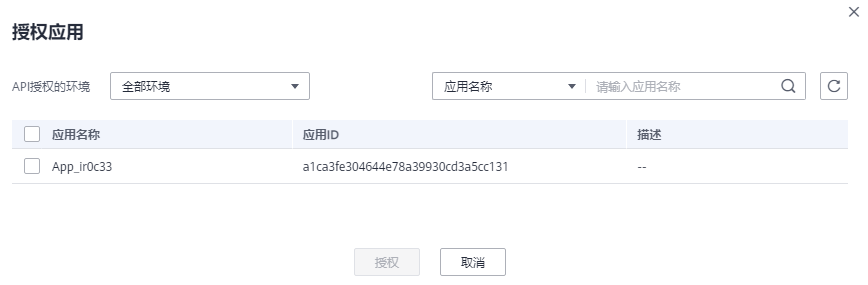

# 授权API

## 操作场景

API在创建后，通过指定授权给某些应用，让指定应用能够调用API。

> **说明：** 
>-   仅在API发布到环境后，才支持被调用。
>-   仅在API为APP认证时，才支持授权给应用。

## 前提条件

-   已创建API分组和分组内的API。
-   （可选）已创建环境。
-   已创建应用。

## 操作步骤

1.  登录管理控制台。
2.  在管理控制台左上角单击，选择区域。
3.  单击管理控制台左上角，然后单击“API网关 APIG”。
4.  在左侧选择您的API版本，单击并进入到对应版本的API开发与调用管理页面。
    -   “共享版”指直接创建并管理API，如涉及到费用，以API调用次数计费。
    -   “专享版”指在API专享版实例中创建并管理API，如涉及到费用，按实例运行时间计费。

5.  单击“开放API \> API管理”，进入到API管理信息页面。
6.  通过以下任意一种方法，进入“授权应用”页面。

    -   在待授权的API所在行，单击“授权”，进入“授权API”页面。单击“添加应用”，弹出“授权应用”对话框。
    -   勾选待授权的API，单击“授权”，进入“授权API”页面。单击“添加应用”，弹出“授权应用”对话框。
    -   通过API详情页面进入，步骤如下：
        1.  单击待授权的API名称，进入API详情页面。
        2.  单击“授权信息”，进入“授权信息”页签。
        3.  单击“添加授权”，弹出“授权应用”对话框。

    > **说明：** 
    >如果需要批量将多个API授权同一个应用，则勾选待授权的API，单击“授权”，进入“授权API”页面。单击“添加应用”，弹出“授权应用”对话框。最多同时授权1000个API。

7.  选择API授权环境，查询并勾选应用后，单击“授权”。

    

8.  授权成功后，可以在“授权信息”/“授权API”中查看已授权的应用。

    > **说明：** 
    >如果已授权的应用列表中包含无需授权的应用，在此应用所在行单击“解除授权”，将无需授权的应用删除。

## 使用API方式授权API

您还可以使用API的方式授权API，具体操作请查看以下链接。

[授权](https://support.huaweicloud.com/api-apig/CreateAuthorizingAppsV2.html)

[解除授权](https://support.huaweicloud.com/api-apig/CancelingAuthorizationV2.html)

## 后续操作

您将API授权给指定应用后，可以通过不同语言的SDK调用此API。

