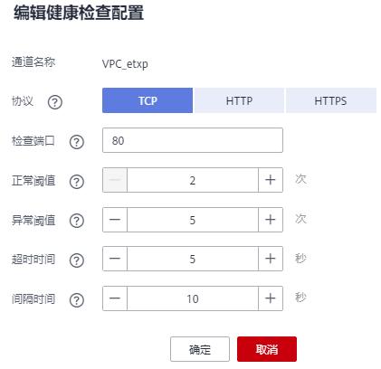

# 编辑健康检查配置

## 操作场景

VPC通道创建完成后，可通过编辑健康检查配置修改健康检查项。

## 前提条件

已创建VPC通道。

## 操作步骤

1.  登录管理控制台。
2.  在管理控制台左上角单击，选择区域。
3.  单击管理控制台左上角，然后单击“API网关 APIG”。
4.  在左侧选择您的API版本，单击并进入到对应版本的API开发与调用管理页面。
    -   “共享版”指直接创建并管理API，如涉及到费用，以API调用次数计费。
    -   “专享版”指在API专享版实例中创建并管理API，如涉及到费用，按实例运行时间计费。

5.  单击“开放API \> VPC通道”，进入到VPC通道列表页面。
6.  单击“_VPC通道__名称_”，进入VPC通道详情页面。
7.  单击“健康检查”，进入“健康检查”页签。
8.  单击“编辑”，弹出“编辑健康检查配置”对话框。
9.  编辑如[表1](#zh-cn_topic_0000001174416943_table4566428105819)所示信息。

    

    **表 1**  健康检查

    
    <table><thead align="left"><tr id="zh-cn_topic_0000001174416943_row55651281581"><th class="cellrowborder" valign="top" width="20%" id="mcps1.2.3.1.1">
信息项

    </th>
    <th class="cellrowborder" valign="top" width="80%" id="mcps1.2.3.1.2">
描述

    </th>
    </tr>
    </thead>
    <tbody><tr id="zh-cn_topic_0000001174416943_row14565172885814"><td class="cellrowborder" valign="top" width="20%" headers="mcps1.2.3.1.1 ">
协议

    </td>
    <td class="cellrowborder" valign="top" width="80%" headers="mcps1.2.3.1.2 ">
使用以下协议，对VPC中主机执行健康检查。

    <ul id="zh-cn_topic_0000001174416943_ul17565828165818"><li>TCP</li><li>HTTP</li><li>HTTPS</li></ul>
    
默认为TCP协议。

    </td>
    </tr>
    <tr id="zh-cn_topic_0000001174416943_row1056617289586"><td class="cellrowborder" valign="top" width="20%" headers="mcps1.2.3.1.1 ">
路径

    </td>
    <td class="cellrowborder" valign="top" width="80%" headers="mcps1.2.3.1.2 ">
健康检查时的目标路径。

    
仅在协议为“HTTP”或“HTTPS”时，需要设置。

    </td>
    </tr>
    <tr id="zh-cn_topic_0000001174416943_row3566928165819"><td class="cellrowborder" valign="top" width="20%" headers="mcps1.2.3.1.1 ">
检查端口

    </td>
    <td class="cellrowborder" valign="top" width="80%" headers="mcps1.2.3.1.2 ">
健康检查的目标端口。

    
缺省时为VPC中主机的端口号。

    </td>
    </tr>
    <tr id="zh-cn_topic_0000001174416943_row5566162865810"><td class="cellrowborder" valign="top" width="20%" headers="mcps1.2.3.1.1 ">
正常阈值

    </td>
    <td class="cellrowborder" valign="top" width="80%" headers="mcps1.2.3.1.2 ">
判定VPC中主机正常的依据为：连续检查<em id="zh-cn_topic_0000001174416943_i1756615281583">x</em>成功，x为您设置的正常阈值。

    
取值为2 ~ 10。缺省时为2。

    </td>
    </tr>
    <tr id="zh-cn_topic_0000001174416943_row7566152810582"><td class="cellrowborder" valign="top" width="20%" headers="mcps1.2.3.1.1 ">
异常阈值

    </td>
    <td class="cellrowborder" valign="top" width="80%" headers="mcps1.2.3.1.2 ">
判定VPC中主机异常的依据为：连续检查<em id="zh-cn_topic_0000001174416943_i10566228165817">x失败</em>，x为您设置的异常阈值。

    
取值为2 ~ 10。缺省时为5。

    </td>
    </tr>
    <tr id="zh-cn_topic_0000001174416943_row125661828145813"><td class="cellrowborder" valign="top" width="20%" headers="mcps1.2.3.1.1 ">
超时时间

    </td>
    <td class="cellrowborder" valign="top" width="80%" headers="mcps1.2.3.1.2 ">
检查期间，无响应的时间，单位为秒。

    
取值为2 ~ 30。缺省时为5。

    </td>
    </tr>
    <tr id="zh-cn_topic_0000001174416943_row55661628115819"><td class="cellrowborder" valign="top" width="20%" headers="mcps1.2.3.1.1 ">
间隔时间

    </td>
    <td class="cellrowborder" valign="top" width="80%" headers="mcps1.2.3.1.2 ">
连续两次检查的间隔时间，单位为秒。

    
取值为5 ~ 300。缺省时为10。

    </td>
    </tr>
    <tr id="zh-cn_topic_0000001174416943_row185664289589"><td class="cellrowborder" valign="top" width="20%" headers="mcps1.2.3.1.1 ">
HTTP响应码

    </td>
    <td class="cellrowborder" valign="top" width="80%" headers="mcps1.2.3.1.2 ">
目标HTTP响应时使用的HTTP代码。

    
仅在协议为“HTTP”或“HTTPS”时，需要设置。

    </td>
    </tr>
    </tbody>
    </table>

10. 单击“确定”，完成健康检查配置的修改。

