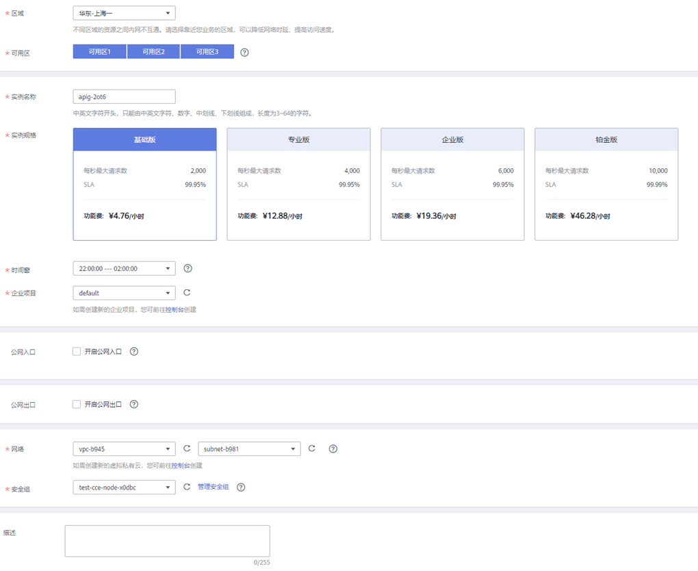

# 购买专享版实例

本小节指导您顺利购买专享版实例，实例创建完成后，才能创建API并对外提供服务。如果您对服务的性能需求不大，可使用共享版API网关，直接[创建与管理API](https://support.huaweicloud.com/zh-cn/qs-apig/apig-ug-180307002.html)，而无需单独购买专享版实例。

关于您该选择哪种API网关，请参考[产品规格说明](https://support.huaweicloud.com/zh-cn/productdesc-apig/apig-specifications.html)。

## 购买专享版的约束说明

购买专享实例存在一些约束，当您的用户登录后无法购买专享实例，或者购买实例后创建失败，请参考以下约束说明进行检查，并解除限制。

-   实例配额

    同一项目ID下，一个主帐号默认只能创建5个专享版实例。如果您需要创建更多实例，可[提交工单](https://console.huaweicloud.com/ticket/)，申请修改配额。

-   用户权限

    如果您使用系统角色相关权限，需要同时拥有“APIG Administrator”和“VPC Administrator”权限才能购买专享版实例。

    如果您使用系统策略，则拥有“APIG FullAccess”即可。

    如果使用自定义策略，请参考[对用户组授权](API网关自定义策略.md#ZH-CN_TOPIC_0000001188877317)。

-   子网中可用私有地址数量

    API网关专享实例的基础版、专业版、企业版，以及铂金版分别需要3、5、6、7个私有地址，请确保您选择的子网段有足够多的私有地址可用。私有地址可在虚拟私有云服务的控制台查询。

## 网络环境准备

-   VPC

    虚拟私有云。专享版实例需要配置虚拟私有云（VPC），在同一VPC中的资源（如ECS），可以使用专享版实例的私有地址调用API。

    在购买专享版实例时，建议配置和您其他关联业务相同VPC，确保网络安全的同时，方便网络配置。

-   弹性公网IP

    专享版实例的API如果要允许外部调用，则需要购买一个弹性公网IP，并绑定给实例，作为实例的公网入口。

    > **说明：** 
    >如果API的后端服务部署在公网，还需要有公网出口访问权限，这由API网关统一规划，不需要单独购买弹性公网IP。

-   安全组

    安全组类似防火墙，控制谁能访问实例的指定端口，以及控制实例的通信数据流向指定的目的地址。安全组入方向规则建议按需开放地址与端口，这样可以最大程度保护实例的网络安全。

    专享版实例绑定的安全组有如下要求：

    -   入方向：如果需要从公网调用API，或从其他安全组内资源调用API，则需要为专享版实例绑定的安全组的入方向放开80（HTTP）、443（HTTPS）两个端口。
    -   出方向：如果后端服务部署在公网，或者其他安全组内，则需要为专享版实例绑定的安全组的出方向放开后端服务地址与API调用监听端口。
    -   如果API的前后端服务与专享版实例绑定了相同的安全组、相同的虚拟私有云，则无需专门为专享版实例开放上述端口。

## 操作步骤

1.  登录管理控制台。
2.  在管理控制台左上角单击，选择区域。
3.  单击管理控制台左上角，然后单击“API网关 APIG”。
4.  在左侧导航栏单击“专享版”。
5.  单击“购买专享版实例”，进入实例购买的配置页面。

    

    **表 1**  API网关专享版实例参数说明

    
    <table><thead align="left"><tr id="zh-cn_topic_0000001174416945_row161543278159"><th class="cellrowborder" valign="top" width="20.22%" id="mcps1.2.3.1.1">
参数项

    </th>
    <th class="cellrowborder" valign="top" width="79.78%" id="mcps1.2.3.1.2">
说明

    </th>
    </tr>
    </thead>
    <tbody><tr id="zh-cn_topic_0000001174416945_row121549274150"><td class="cellrowborder" valign="top" width="20.22%" headers="mcps1.2.3.1.1 ">
计费模式

    </td>
    <td class="cellrowborder" valign="top" width="79.78%" headers="mcps1.2.3.1.2 ">
实例收费方式，当前支持“按需计费”和“包周期”两种方式。

    </td>
    </tr>
    <tr id="zh-cn_topic_0000001174416945_row181551227111516"><td class="cellrowborder" valign="top" width="20.22%" headers="mcps1.2.3.1.1 ">
区域

    </td>
    <td class="cellrowborder" valign="top" width="79.78%" headers="mcps1.2.3.1.2 ">
指APIG专享版实例部署的区域，建议和您其他的业务部署在相同区域，这样不同的业务可以在VPC内以子网方式通信，节省公网带宽成本，降低网络延时。

    </td>
    </tr>
    <tr id="zh-cn_topic_0000001174416945_row115572711154"><td class="cellrowborder" valign="top" width="20.22%" headers="mcps1.2.3.1.1 ">
可用区

    </td>
    <td class="cellrowborder" valign="top" width="79.78%" headers="mcps1.2.3.1.2 ">
指同一区域内电力、网络等资源物理隔离的地理区域，一般为互相独立的机房。

    
APIG实例支持同时选择多个可用区，进行跨可用区部署，提升实例高可用性。

    </td>
    </tr>
    <tr id="zh-cn_topic_0000001174416945_row71551276154"><td class="cellrowborder" valign="top" width="20.22%" headers="mcps1.2.3.1.1 ">
实例名称

    </td>
    <td class="cellrowborder" valign="top" width="79.78%" headers="mcps1.2.3.1.2 ">
实例的名称，根据规划自定义。

    </td>
    </tr>
    <tr id="zh-cn_topic_0000001174416945_row7155427191515"><td class="cellrowborder" valign="top" width="20.22%" headers="mcps1.2.3.1.1 ">
实例规格

    </td>
    <td class="cellrowborder" valign="top" width="79.78%" headers="mcps1.2.3.1.2 ">
当前开放基础版、专业版、企业版、铂金版实例。不同实例规格，对API请求的并发支持能力不同，具体请参考产品介绍的<a href="https://support.huaweicloud.com/productdesc-apig/apig-specifications.html" target="_blank" rel="noopener noreferrer">规格说明</a>章节。

    </td>
    </tr>
    <tr id="zh-cn_topic_0000001174416945_row615582710155"><td class="cellrowborder" valign="top" width="20.22%" headers="mcps1.2.3.1.1 ">
时间窗

    </td>
    <td class="cellrowborder" valign="top" width="79.78%" headers="mcps1.2.3.1.2 ">
指允许云服务技术支持对实例进行维护的时间段。如果有维护需要，技术支持会提前与您沟通确认。

    
建议选择业务量较少的时间段。

    </td>
    </tr>
    <tr id="zh-cn_topic_0000001174416945_row1715615272159"><td class="cellrowborder" valign="top" width="20.22%" headers="mcps1.2.3.1.1 ">
企业项目

    </td>
    <td class="cellrowborder" valign="top" width="79.78%" headers="mcps1.2.3.1.2 ">
当您使用企业用户登录时，可选择实例所属企业项目。

    
有关企业项目的资源使用、迁移以及用户权限等，请参考<a href="https://support.huaweicloud.com/usermanual-em/zh-cn_topic_0131965280.html" target="_blank" rel="noopener noreferrer">《企业管理用户指南》</a>。

    </td>
    </tr>
    <tr id="zh-cn_topic_0000001174416945_row115615275151"><td class="cellrowborder" valign="top" width="20.22%" headers="mcps1.2.3.1.1 ">
公网入口

    </td>
    <td class="cellrowborder" valign="top" width="79.78%" headers="mcps1.2.3.1.2 ">
指允许外部服务通过弹性IP地址，调用专享版实例创建的API。开启“公网入口”，需要绑定一个“弹性IP地址”，弹性IP地址另行<a href="https://www.huaweicloud.com/pricing.html#/eip" target="_blank" rel="noopener noreferrer">收费</a>。

    
您需要使用独立域名/子域名访问，使用子域名访问时存在单日访问次数限制。可在创建API分组后，为分组绑定独立域名，独立域名需要解析到专享版实例的弹性IP。

    
例如您有一个API，请求协议为HTTPS，Path为/apidemo，开启了公网访问，并为分组绑定了独立域名后，可使用https://{domain}/apidemo这个URL访问您的API。其中，{domain}表示已绑定到分组的独立域名（独立域名需要解析到专享版实例的弹性IP地址），目标端口443可默认缺省。

    </td>
    </tr>
    <tr id="zh-cn_topic_0000001174416945_row17156327111515"><td class="cellrowborder" valign="top" width="20.22%" headers="mcps1.2.3.1.1 ">
公网出口

    </td>
    <td class="cellrowborder" valign="top" width="79.78%" headers="mcps1.2.3.1.2 ">
指允许专享版实例API的后端服务部署在外部网络，APIG为实例开启公网出口。您可以根据业务预估设置合适的“出公网带宽”。出公网带宽可配置范围为1~2000Mbit/s，费用按小时计算，以弹性IP服务的价格为准。

    </td>
    </tr>
    <tr id="zh-cn_topic_0000001174416945_row131561927111513"><td class="cellrowborder" valign="top" width="20.22%" headers="mcps1.2.3.1.1 ">
IPv6

    </td>
    <td class="cellrowborder" valign="top" width="79.78%" headers="mcps1.2.3.1.2 ">
<strong id="zh-cn_topic_0000001174416945_b191561127141517">仅在计费模式为“按需计费”时，需要配置。</strong>

    
如果后端服务部署在外部网络，且需要使用IPv6地址访问，则需要勾选“支持IPv6”。

    
 说明： 

仅部分Region支持。

    

    </td>
    </tr>
    <tr id="zh-cn_topic_0000001174416945_row1115762710157"><td class="cellrowborder" valign="top" width="20.22%" headers="mcps1.2.3.1.1 ">
网络

    </td>
    <td class="cellrowborder" valign="top" width="79.78%" headers="mcps1.2.3.1.2 ">
指为实例绑定到一个虚拟私有云，并为其分配子网。

    
在相同虚拟私有云中的云服务资源（如ECS），可以使用APIG专享版实例的私有地址调用API。

    
建议将专享版实例和您的其他关联业务配置一个相同的虚拟私有云，确保网络安全的同时，方便网络配置。

    </td>
    </tr>
    <tr id="zh-cn_topic_0000001174416945_row3157827121516"><td class="cellrowborder" valign="top" width="20.22%" headers="mcps1.2.3.1.1 ">
安全组

    </td>
    <td class="cellrowborder" valign="top" width="79.78%" headers="mcps1.2.3.1.2 ">
安全组用于设置端口访问规则，定义哪些端口允许被外部访问，以及允许访问外部哪些地址与端口。

    
例如，后端服务部署在外部网络，则需要设置相应的安全组规则，允许访问后端服务地址与API调用监听端口。

    
 说明： 

如果开启公网入口，安全组入方向需要放开80（HTTP）和443（HTTPS）端口的访问权限。

    

    </td>
    </tr>
    <tr id="zh-cn_topic_0000001174416945_row3157182713157"><td class="cellrowborder" valign="top" width="20.22%" headers="mcps1.2.3.1.1 ">
描述

    </td>
    <td class="cellrowborder" valign="top" width="79.78%" headers="mcps1.2.3.1.2 ">
实例的描述信息。

    </td>
    </tr>
    <tr id="zh-cn_topic_0000001174416945_row81571827151516"><td class="cellrowborder" valign="top" width="20.22%" headers="mcps1.2.3.1.1 ">
购买时长

    </td>
    <td class="cellrowborder" valign="top" width="79.78%" headers="mcps1.2.3.1.2 ">
计费模式为“包年/包月”时配置。实例的购买时长，最短1个月。

    </td>
    </tr>
    </tbody>
    </table>

6.  单击“立即购买”，进入实例规格确认页面。
7.  规格确认无误后，勾选用户协议和隐私政策的阅读并同意声明，单击“提交”，并确认实例规格后，专享版实例开始创建，界面显示创建进度。

    如果实例计费方式为包周期，则需要待订单支付完成后，开始创建实例。

## 后续操作说明

实例创建成功后，您可以进入实例控制台，开始创建和管理您的API。进入实例控制台后，概览界面展现实例信息、网络配置、API资源详情，以及监控数据。

其中，实例名称、描述、时间窗、安全组，以及弹性IP地址等可以修改。

