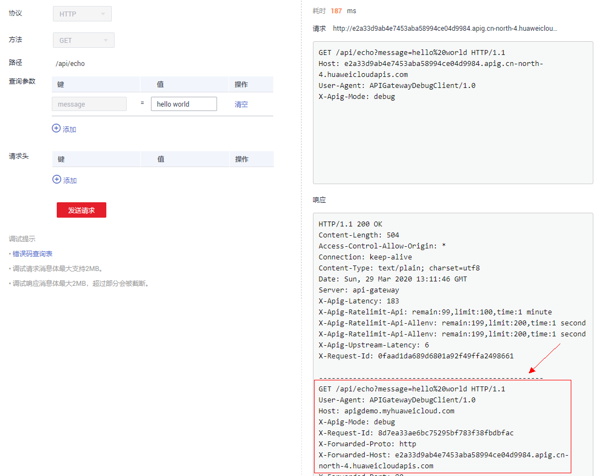
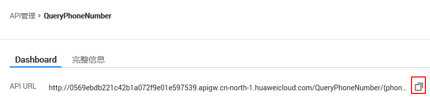
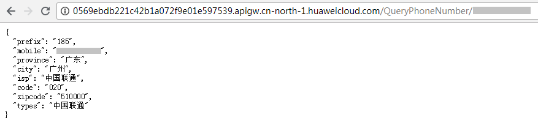

# 体验demo

## 操作场景

通过一键式操作，完成一个具备“HTTP回显”功能的API的创建、发布以及绑定流控，此demo主要用于演示API网关的使用。

此demo中，系统自动完成如下操作：

-   创建分组。
-   创建API。
-   调试API并发布到Release环境。
-   创建流控策略并将API绑定流控策略。

“HTTP回显”API的业务概述：您通过HTTP GET方式调用API，业务后端将本次调用的所有请求信息通过response返回给您。

> **说明：**   
>-   您如果需要再次体验demo，需要先将demo创建的API和API分组删除。  
>-   仅在第一体验时创建流控策略，如果再次体验前未删除，再次体验时不会再创建另一个流控策略。  

## 操作步骤

1.  登录管理控制台。
2.  在管理控制台左上角单击，选择区域。
3.  在服务列表中，单击“应用服务 \> API网关”，进入API网关服务管理页面。
4.  在左侧选择您的API版本，单击并进入到对应版本的API开发与调用管理页面。

    “共享版”指直接创建并管理API，如涉及到费用，以API调用次数计费。

    “专享版”指在API专享版实例中创建并管理API，如涉及到费用，按实例运行时间计费。

5.  单击“体验demo”，进入“体验demo”页面。
6.  单击“调用API”，进入“调试API”页面。
7.  在“查询参数”以及“请求头”处分别添加请求参数与头部消息。

    在此Demo中，请求参数与头部消息参数只做演示参考，无实际作用。

    -   调试成功时，返回HTTP状态码为“200”和本次调试的请求信息与返回信息。

        调试成功后，将回显Demo实际收到的本次请求信息。如下图所示。

    -   调试失败时，返回HTTP状态码为4_xx_或5_xx_，具体错误信息请参见[错误码](https://support.huaweicloud.com/ugcall-apig/apig-zh-ug-180530090.html)。

    **图 1**  调试API  
    

8.  调用API。
    1.  在“开放API \> API管理”中，单击“HttpEchoDemo”，进入HTTP回显的API详情页面。
    2.  在“总览”页签，在“API URL”所在行，单击，复制URL。

        **图 2**  API详情  
        

    3.  在浏览器中粘贴URL，按“Enter”，查看API调用结果。

        后端成功返回后，页面显示本次API调用的实际请求信息，即后端Demo服务收到的API最终信息。

        **图 3**  调用结果  
        

