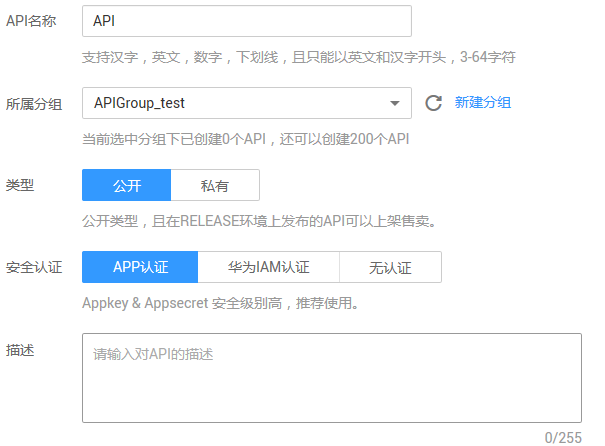
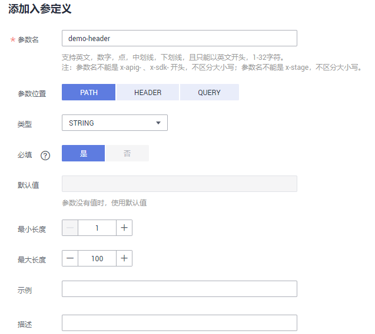
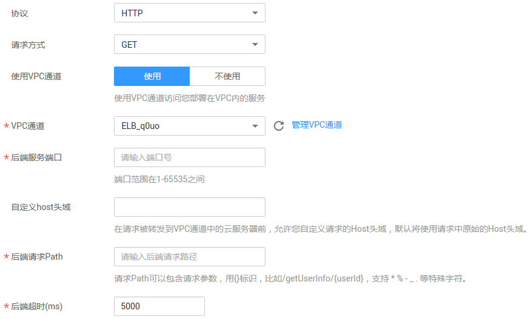
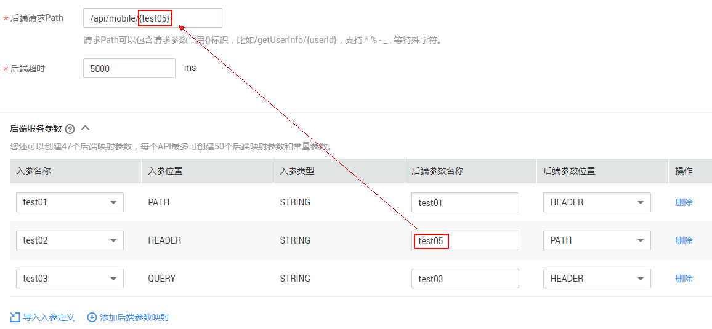
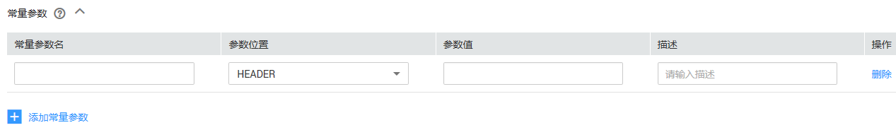

# 创建API<a name="zh-cn_topic_0080101678"></a>

## 操作场景<a name="section1731012541118"></a>

API提供者把API接口配置在API网关中，开放后端能力。

创建API主要分为四个步骤：设置基本信息、定义API请求、定义后端服务和定义返回结果。

> **说明：**   
>-   API网关服务基于REST的API架构，API的开放和调用需要遵循RESTful相关规范。  
>-   每个用户最多可以创建200个API。  

## 前提条件<a name="section83110548119"></a>

-   已创建API分组。如果未创建API分组，可在本操作页面中创建API分组。
-   如果后端服务需要使用VPC通道，请先[创建VPC通道](创建VPC通道.md)，或在本操作页面中创建VPC通道。

## 设置基本信息<a name="section8731554122615"></a>

1.  登录管理控制台。
2.  在管理控制台左上角单击，选择区域。
3.  在服务列表中，单击“应用服务 \> API网关”，进入API网关服务管理页面。
4.  单击“开放API \> API管理”，进入到API列表信息页面。
5.  单击“新建API”，进入“新建API”页面，如[图1](#fig59892196141)所示。填写如[表1](#table195413315428)所示信息。

    **图 1**  设置基本信息<a name="fig59892196141"></a>  
    

    **表 1**  基本信息

    <a name="table195413315428"></a>
    <table><thead align="left"><tr id="row45523384220"><th class="cellrowborder" valign="top" width="20%" id="mcps1.2.3.1.1"><p id="p65563314423"><a name="p65563314423"></a><a name="p65563314423"></a>信息项</p>
    </th>
    <th class="cellrowborder" valign="top" width="80%" id="mcps1.2.3.1.2"><p id="p356183311427"><a name="p356183311427"></a><a name="p356183311427"></a>描述</p>
    </th>
    </tr>
    </thead>
    <tbody><tr id="row1156183364219"><td class="cellrowborder" valign="top" width="20%" headers="mcps1.2.3.1.1 "><p id="p105616333427"><a name="p105616333427"></a><a name="p105616333427"></a>API名称</p>
    </td>
    <td class="cellrowborder" valign="top" width="80%" headers="mcps1.2.3.1.2 "><p id="p1656123374219"><a name="p1656123374219"></a><a name="p1656123374219"></a>API名称。</p>
    </td>
    </tr>
    <tr id="row14879114316433"><td class="cellrowborder" valign="top" width="20%" headers="mcps1.2.3.1.1 "><p id="p12880154304320"><a name="p12880154304320"></a><a name="p12880154304320"></a>所属分组</p>
    </td>
    <td class="cellrowborder" valign="top" width="80%" headers="mcps1.2.3.1.2 "><p id="p48801043134312"><a name="p48801043134312"></a><a name="p48801043134312"></a>API所属分组。</p>
    <p id="p9491203112812"><a name="p9491203112812"></a><a name="p9491203112812"></a>如果尚未创建API分组，单击“新建分组”，为API新创建一个分组。</p>
    </td>
    </tr>
    <tr id="row247519275166"><td class="cellrowborder" valign="top" width="20%" headers="mcps1.2.3.1.1 "><p id="p14476127151620"><a name="p14476127151620"></a><a name="p14476127151620"></a>类型</p>
    </td>
    <td class="cellrowborder" valign="top" width="80%" headers="mcps1.2.3.1.2 "><p id="p1347622781611"><a name="p1347622781611"></a><a name="p1347622781611"></a>API类型：</p>
    <a name="ul0446338191910"></a><a name="ul0446338191910"></a><ul id="ul0446338191910"><li>公开：选择“公开”类型时，API支持上架。</li><li>私有：选择“私有”类型时，当该API所在分组上架时，该API不会上架。</li></ul>
    </td>
    </tr>
    <tr id="row8159123418166"><td class="cellrowborder" valign="top" width="20%" headers="mcps1.2.3.1.1 "><p id="p015933461620"><a name="p015933461620"></a><a name="p015933461620"></a>安全认证</p>
    </td>
    <td class="cellrowborder" valign="top" width="80%" headers="mcps1.2.3.1.2 "><p id="p1369005482116"><a name="p1369005482116"></a><a name="p1369005482116"></a>API认证方式：</p>
    <a name="ul10691205415213"></a><a name="ul10691205415213"></a><ul id="ul10691205415213"><li>APP认证：表示由API网关服务负责接口请求的安全认证。</li><li>华为IAM认证：表示借助IAM服务进行安全认证。</li><li>无认证：表示不需要认证。</li></ul>
    <p id="p4159203413168"><a name="p4159203413168"></a><a name="p4159203413168"></a>各种认证方式下的API调用稍有不同，具体请参考《<a href="https://support.huaweicloud.com/devg-apig/apig-zh-dev-180307010.html" target="_blank" rel="noopener noreferrer">API网关开发指南</a>》。</p>
    <p id="p19611248142514"><a name="p19611248142514"></a><a name="p19611248142514"></a>推荐使用APP认证方式。</p>
    <div class="notice" id="note13699104617916"><a name="note13699104617916"></a><a name="note13699104617916"></a><span class="noticetitle"> 注意： </span><div class="noticebody"><a name="ul77001646498"></a><a name="ul77001646498"></a><ul id="ul77001646498"><li>认证方式为华为IAM认证时，任何API网关租户均可以访问此API，可能存在恶意刷流量，导致过量计费的风险。</li><li>认证方式为无认证时，任何公网用户均可以访问此API，可能存在恶意刷流量，导致过量计费的风险。</li></ul>
    </div></div>
    </td>
    </tr>
    <tr id="row45611440141619"><td class="cellrowborder" valign="top" width="20%" headers="mcps1.2.3.1.1 "><p id="p1156124041619"><a name="p1156124041619"></a><a name="p1156124041619"></a>描述</p>
    </td>
    <td class="cellrowborder" valign="top" width="80%" headers="mcps1.2.3.1.2 "><p id="p25611440141620"><a name="p25611440141620"></a><a name="p25611440141620"></a>API的描述。</p>
    </td>
    </tr>
    </tbody>
    </table>

6.  单击“下一步”，进入“定义API请求”页面。

## 定义API请求<a name="section79773019167"></a>

1.  在“定义API请求”页面，填写如[表2](#table197931223191513)所示信息。

    **图 2**  定义API请求<a name="fig141813303224"></a>  
    

    **表 2**  定义API请求

    <a name="table197931223191513"></a>
    <table><thead align="left"><tr id="row1079312371517"><th class="cellrowborder" valign="top" width="20%" id="mcps1.2.3.1.1"><p id="p625934217155"><a name="p625934217155"></a><a name="p625934217155"></a>信息项</p>
    </th>
    <th class="cellrowborder" valign="top" width="80%" id="mcps1.2.3.1.2"><p id="p826211426152"><a name="p826211426152"></a><a name="p826211426152"></a>描述</p>
    </th>
    </tr>
    </thead>
    <tbody><tr id="row197932236152"><td class="cellrowborder" valign="top" width="20%" headers="mcps1.2.3.1.1 "><p id="p9793132319151"><a name="p9793132319151"></a><a name="p9793132319151"></a>域名</p>
    </td>
    <td class="cellrowborder" valign="top" width="80%" headers="mcps1.2.3.1.2 "><p id="p8793182315151"><a name="p8793182315151"></a><a name="p8793182315151"></a>系统默认分配的一个子域名。</p>
    </td>
    </tr>
    <tr id="row1579302341513"><td class="cellrowborder" valign="top" width="20%" headers="mcps1.2.3.1.1 "><p id="p14793172319157"><a name="p14793172319157"></a><a name="p14793172319157"></a>请求协议</p>
    </td>
    <td class="cellrowborder" valign="top" width="80%" headers="mcps1.2.3.1.2 "><p id="p56583574195"><a name="p56583574195"></a><a name="p56583574195"></a>分为三种类型：</p>
    <a name="ul1117910143194"></a><a name="ul1117910143194"></a><ul id="ul1117910143194"><li>HTTP</li><li>HTTPS</li><li>HTTP&amp;HTTPS</li></ul>
    <p id="p95915251811"><a name="p95915251811"></a><a name="p95915251811"></a>传输重要或敏感数据时推荐使用HTTPS。</p>
    </td>
    </tr>
    <tr id="row579482381519"><td class="cellrowborder" valign="top" width="20%" headers="mcps1.2.3.1.1 "><p id="p1479472311515"><a name="p1479472311515"></a><a name="p1479472311515"></a>请求Path</p>
    </td>
    <td class="cellrowborder" valign="top" width="80%" headers="mcps1.2.3.1.2 "><p id="p1979472319154"><a name="p1979472319154"></a><a name="p1979472319154"></a>接口请求的路径。</p>
    <p id="p5794142310151"><a name="p5794142310151"></a><a name="p5794142310151"></a>格式如：/{serviceName}/{interfaceName}</p>
    <a name="ul168262410193"></a><a name="ul168262410193"></a><ul id="ul168262410193"><li>{}中的内容区分大小写。</li><li>请求Path中包含请求参数时，必须设置对应的入参定义。</li></ul>
    </td>
    </tr>
    <tr id="row1779416236159"><td class="cellrowborder" valign="top" width="20%" headers="mcps1.2.3.1.1 "><p id="p47941423151518"><a name="p47941423151518"></a><a name="p47941423151518"></a>匹配模式</p>
    </td>
    <td class="cellrowborder" valign="top" width="80%" headers="mcps1.2.3.1.2 "><p id="p194871356202018"><a name="p194871356202018"></a><a name="p194871356202018"></a>分为两种模式：</p>
    <a name="ul4488556192019"></a><a name="ul4488556192019"></a><ul id="ul4488556192019"><li>绝对匹配：调用的请求Path固定为创建时填写的API请求Path。</li><li>前缀匹配：调用的请求Path将以创建时填写的API请求Path为前缀，支持接口定义多个不同Path。<div class="p" id="p179585272018"><a name="p179585272018"></a><a name="p179585272018"></a>例如，请求路径为/test/AA，使用前缀匹配时，通过/test/AA/CC可以访问，但是通过/test/AACC无法访问。<div class="note" id="note18958112122016"><a name="note18958112122016"></a><a name="note18958112122016"></a><span class="notetitle"> 说明： </span><div class="notebody"><p id="p89581023201"><a name="p89581023201"></a><a name="p89581023201"></a>前缀匹配不支持“+”字符。</p>
    </div></div>
    </div>
    </li></ul>
    </td>
    </tr>
    <tr id="row1779432312154"><td class="cellrowborder" valign="top" width="20%" headers="mcps1.2.3.1.1 "><p id="p13794162316153"><a name="p13794162316153"></a><a name="p13794162316153"></a>Method</p>
    </td>
    <td class="cellrowborder" valign="top" width="80%" headers="mcps1.2.3.1.2 "><p id="p67943234152"><a name="p67943234152"></a><a name="p67943234152"></a>接口调用方式：GET、POST、DELETE、PUT、PATCH、HEAD、OPTIONS、ANY</p>
    <p id="p1415013241202"><a name="p1415013241202"></a><a name="p1415013241202"></a>其中ANY表示该API支持任意请求方法。</p>
    </td>
    </tr>
    <tr id="row19149171881810"><td class="cellrowborder" valign="top" width="20%" headers="mcps1.2.3.1.1 "><p id="p21502182182"><a name="p21502182182"></a><a name="p21502182182"></a>支持CORS</p>
    </td>
    <td class="cellrowborder" valign="top" width="80%" headers="mcps1.2.3.1.2 "><p id="p4909125414281"><a name="p4909125414281"></a><a name="p4909125414281"></a>是否开启跨域访问CORS（cross-origin resource sharing）。</p>
    <p id="p158511625154816"><a name="p158511625154816"></a><a name="p158511625154816"></a>CORS允许浏览器向跨域服务器，发出XMLHttpRequest请求，从而克服了AJAX只能同源使用的限制。</p>
    <p id="p2526151865310"><a name="p2526151865310"></a><a name="p2526151865310"></a>CORS请求分为两类：</p>
    <a name="ul14470542195410"></a><a name="ul14470542195410"></a><ul id="ul14470542195410"><li>简单请求：头信息之中，增加一个Origin字段。</li><li>非简单请求：在正式通信之前，增加一次HTTP查询请求。</li></ul>
    <p id="p1017293811207"><a name="p1017293811207"></a><a name="p1017293811207"></a>开启CORS（非简单请求）时，您需要单独创建一个“Method”为“OPTIONS”的API，具体步骤请参见<a href="开启跨域访问.md">开启跨域访问</a>。</p>
    </td>
    </tr>
    </tbody>
    </table>

2.  （可选）设置入参定义。

    入参定义是指您调用API时，需要传入的参数的说明。

    1.  单击“添加入参定义”，弹出“添加入参定义”对话框。
    2.  输入如[表3](#table87021501869)所示信息。

        **图 3**  添加入参定义<a name="fig16140144812288"></a>  
        

        **表 3**  入参定义

        <a name="table87021501869"></a>
        <table><thead align="left"><tr id="row15700808618"><th class="cellrowborder" valign="top" width="20%" id="mcps1.2.3.1.1"><p id="p4700601963"><a name="p4700601963"></a><a name="p4700601963"></a>信息项</p>
        </th>
        <th class="cellrowborder" valign="top" width="80%" id="mcps1.2.3.1.2"><p id="p1670020769"><a name="p1670020769"></a><a name="p1670020769"></a>描述</p>
        </th>
        </tr>
        </thead>
        <tbody><tr id="row470020016611"><td class="cellrowborder" valign="top" width="20%" headers="mcps1.2.3.1.1 "><p id="p13700502613"><a name="p13700502613"></a><a name="p13700502613"></a>参数名</p>
        </td>
        <td class="cellrowborder" valign="top" width="80%" headers="mcps1.2.3.1.2 "><p id="p97001503618"><a name="p97001503618"></a><a name="p97001503618"></a>参数的名称，如果参数在“PATH”位置，那么参数名称需要和“请求Path”中的名称相同。</p>
        <div class="note" id="note1086540637"><a name="note1086540637"></a><a name="note1086540637"></a><span class="notetitle"> 说明： </span><div class="notebody"><a name="ul7763461339"></a><a name="ul7763461339"></a><ul id="ul7763461339"><li>参数名不能为x-sdk-*开头。</li><li>参数名不能为x-stage。</li><li>HEADER位置参数名不再区分大小写。</li></ul>
        </div></div>
        </td>
        </tr>
        <tr id="row1470020017612"><td class="cellrowborder" valign="top" width="20%" headers="mcps1.2.3.1.1 "><p id="p18700204613"><a name="p18700204613"></a><a name="p18700204613"></a>参数位置</p>
        </td>
        <td class="cellrowborder" valign="top" width="80%" headers="mcps1.2.3.1.2 "><p id="p15700401369"><a name="p15700401369"></a><a name="p15700401369"></a>选择参数在请求中的位置。</p>
        <p id="p67002019617"><a name="p67002019617"></a><a name="p67002019617"></a>参数位置有如下三种：PATH、HEADER、QUERY</p>
        </td>
        </tr>
        <tr id="row19700601611"><td class="cellrowborder" valign="top" width="20%" headers="mcps1.2.3.1.1 "><p id="p7700170167"><a name="p7700170167"></a><a name="p7700170167"></a>类型</p>
        </td>
        <td class="cellrowborder" valign="top" width="80%" headers="mcps1.2.3.1.2 "><p id="p13700140765"><a name="p13700140765"></a><a name="p13700140765"></a>字段的类型，包含String和Number。</p>
        </td>
        </tr>
        <tr id="row5700204611"><td class="cellrowborder" valign="top" width="20%" headers="mcps1.2.3.1.1 "><p id="p27001201369"><a name="p27001201369"></a><a name="p27001201369"></a>必填</p>
        </td>
        <td class="cellrowborder" valign="top" width="80%" headers="mcps1.2.3.1.2 "><p id="p117001201765"><a name="p117001201765"></a><a name="p117001201765"></a>请求API时，此参数是否为必填。如果选择“是”，API网关将校验请求中是否包含此参数，如果不包含，则拒绝该请求。</p>
        </td>
        </tr>
        <tr id="row27021401062"><td class="cellrowborder" valign="top" width="20%" headers="mcps1.2.3.1.1 "><p id="p4702150860"><a name="p4702150860"></a><a name="p4702150860"></a>默认值</p>
        </td>
        <td class="cellrowborder" valign="top" width="80%" headers="mcps1.2.3.1.2 "><p id="p157023014616"><a name="p157023014616"></a><a name="p157023014616"></a>“必填”为“否”时，默认值生效。请求中不包含此参数时，API网关自动增加默认值发送给后端服务。</p>
        </td>
        </tr>
        <tr id="row147021201266"><td class="cellrowborder" valign="top" width="20%" headers="mcps1.2.3.1.1 "><p id="p170219015612"><a name="p170219015612"></a><a name="p170219015612"></a>示例</p>
        </td>
        <td class="cellrowborder" valign="top" width="80%" headers="mcps1.2.3.1.2 "><p id="p67027016618"><a name="p67027016618"></a><a name="p67027016618"></a>参数值的填写示例。</p>
        </td>
        </tr>
        <tr id="row10702701367"><td class="cellrowborder" valign="top" width="20%" headers="mcps1.2.3.1.1 "><p id="p5702005611"><a name="p5702005611"></a><a name="p5702005611"></a>描述</p>
        </td>
        <td class="cellrowborder" valign="top" width="80%" headers="mcps1.2.3.1.2 "><p id="p15702100169"><a name="p15702100169"></a><a name="p15702100169"></a>对于此参数的描述。</p>
        </td>
        </tr>
        </tbody>
        </table>

    3.  单击“确定”，完成入参定义的设置。

3.  当“Method”为“POST”/“PUT”/“PATCH”/“ANY”时，您可以在“请求体内容描述”中增加对于请求体的描述信息。
4.  单击“下一步”，进入“定义后端服务”页面。

## 定义后端服务<a name="section16484051169"></a>

1.  在“定义后端服务”页面，选择API后端服务类型。

    后端服务类型分HTTP/HTTPS、FunctionGraph和Mock三种，具体参数描述见[表4](#table19365277271)。

    **图 4**  HTTP/HTTPS类型<a name="fig620914489351"></a>  
    

    **表 4**  定义后端服务

    <a name="table19365277271"></a>
    <table><thead align="left"><tr id="row113612717272"><th class="cellrowborder" valign="top" width="18%" id="mcps1.2.4.1.1"><p id="p9361827202711"><a name="p9361827202711"></a><a name="p9361827202711"></a>服务类型</p>
    </th>
    <th class="cellrowborder" valign="top" width="19%" id="mcps1.2.4.1.2"><p id="p1236527142713"><a name="p1236527142713"></a><a name="p1236527142713"></a>服务参数</p>
    </th>
    <th class="cellrowborder" valign="top" width="63%" id="mcps1.2.4.1.3"><p id="p9361927132717"><a name="p9361927132717"></a><a name="p9361927132717"></a>参数说明</p>
    </th>
    </tr>
    </thead>
    <tbody><tr id="row73602710275"><td class="cellrowborder" rowspan="8" valign="top" width="18%" headers="mcps1.2.4.1.1 "><p id="p1636142722717"><a name="p1636142722717"></a><a name="p1636142722717"></a>HTTP/HTTPS</p>
    <p id="p1682518352286"><a name="p1682518352286"></a><a name="p1682518352286"></a></p>
    </td>
    <td class="cellrowborder" valign="top" width="19%" headers="mcps1.2.4.1.2 "><p id="p436122720273"><a name="p436122720273"></a><a name="p436122720273"></a>协议</p>
    </td>
    <td class="cellrowborder" valign="top" width="63%" headers="mcps1.2.4.1.3 "><p id="p1736327172718"><a name="p1736327172718"></a><a name="p1736327172718"></a>HTTP或HTTPS，传输重要或敏感数据时推荐使用HTTPS。</p>
    <div class="note" id="note10254542173111"><a name="note10254542173111"></a><a name="note10254542173111"></a><span class="notetitle"> 说明： </span><div class="notebody"><p id="p6254134217316"><a name="p6254134217316"></a><a name="p6254134217316"></a>支持WebSocket通信。</p>
    </div></div>
    </td>
    </tr>
    <tr id="row136132714270"><td class="cellrowborder" valign="top" headers="mcps1.2.4.1.1 "><p id="p4373274271"><a name="p4373274271"></a><a name="p4373274271"></a>请求方式</p>
    </td>
    <td class="cellrowborder" valign="top" headers="mcps1.2.4.1.2 "><p id="p1637727122712"><a name="p1637727122712"></a><a name="p1637727122712"></a>接口调用方式，包括GET、POST、DELETE、PUT、PATCH、HEAD、OPTIONS、ANY。</p>
    <p id="p195711941328"><a name="p195711941328"></a><a name="p195711941328"></a>其中ANY表示该API支持任意请求方法。</p>
    </td>
    </tr>
    <tr id="row1037627142710"><td class="cellrowborder" valign="top" headers="mcps1.2.4.1.1 "><p id="p1537102716276"><a name="p1537102716276"></a><a name="p1537102716276"></a>使用VPC通道</p>
    </td>
    <td class="cellrowborder" valign="top" headers="mcps1.2.4.1.2 "><p id="p10560125819313"><a name="p10560125819313"></a><a name="p10560125819313"></a>是否使用VPC通道。</p>
    <p id="p8977155517198"><a name="p8977155517198"></a><a name="p8977155517198"></a>包括使用和不使用。</p>
    </td>
    </tr>
    <tr id="row19372278271"><td class="cellrowborder" valign="top" headers="mcps1.2.4.1.1 "><p id="p1337152742710"><a name="p1337152742710"></a><a name="p1337152742710"></a>后端服务地址（可选）</p>
    </td>
    <td class="cellrowborder" valign="top" headers="mcps1.2.4.1.2 "><p id="p9942165415311"><a name="p9942165415311"></a><a name="p9942165415311"></a>IP地址:端口/域名。仅在不使用VPC通道时，需要设置。</p>
    <p id="p488045922618"><a name="p488045922618"></a><a name="p488045922618"></a>端口范围：1 ~ 65535。</p>
    <p id="p1583414428393"><a name="p1583414428393"></a><a name="p1583414428393"></a>如果需要创建变量标识，则填写“#变量名#”，如#ipaddress#。支持创建多个变量标识，如#ipaddress##test#。</p>
    </td>
    </tr>
    <tr id="row74195413537"><td class="cellrowborder" valign="top" headers="mcps1.2.4.1.1 "><p id="p194214544531"><a name="p194214544531"></a><a name="p194214544531"></a>VPC通道（可选）</p>
    </td>
    <td class="cellrowborder" valign="top" headers="mcps1.2.4.1.2 "><p id="p174245411537"><a name="p174245411537"></a><a name="p174245411537"></a>选择已创建的VPC通道名称。仅在使用VPC通道时，需要设置。</p>
    </td>
    </tr>
    <tr id="row885711935416"><td class="cellrowborder" valign="top" headers="mcps1.2.4.1.1 "><p id="p98571790546"><a name="p98571790546"></a><a name="p98571790546"></a>自定义host头域（可选）</p>
    </td>
    <td class="cellrowborder" valign="top" headers="mcps1.2.4.1.2 "><p id="p38575911546"><a name="p38575911546"></a><a name="p38575911546"></a>在请求被发送到VPC通道中主机前，允许您自定义请求的Host头域，默认将使用请求中原始的Host头域。仅在使用VPC通道时，需要设置。</p>
    </td>
    </tr>
    <tr id="row17493203292814"><td class="cellrowborder" valign="top" headers="mcps1.2.4.1.1 "><p id="p1849333212812"><a name="p1849333212812"></a><a name="p1849333212812"></a>后端请求Path</p>
    </td>
    <td class="cellrowborder" valign="top" headers="mcps1.2.4.1.2 "><p id="p2049313323280"><a name="p2049313323280"></a><a name="p2049313323280"></a>后端服务的路径，即服务的uri，可以包含路径参数，以{路径参数}形式表示，比如/getUserInfo/{userId}。</p>
    <p id="p8776113994318"><a name="p8776113994318"></a><a name="p8776113994318"></a>如果请求路径中含有环境变量，则使用#变量名#的方式将环境变量定义到请求路径中，如/#path#。支持创建多个环境变量，如/#path##request#。</p>
    </td>
    </tr>
    <tr id="row937327162710"><td class="cellrowborder" valign="top" headers="mcps1.2.4.1.1 "><p id="p0373278279"><a name="p0373278279"></a><a name="p0373278279"></a>后端超时</p>
    </td>
    <td class="cellrowborder" valign="top" headers="mcps1.2.4.1.2 "><p id="p73712772713"><a name="p73712772713"></a><a name="p73712772713"></a>请求超时时间，1 ~ 60000ms。默认为5000ms。</p>
    </td>
    </tr>
    <tr id="row437172713271"><td class="cellrowborder" rowspan="4" valign="top" width="18%" headers="mcps1.2.4.1.1 "><p id="p173713278278"><a name="p173713278278"></a><a name="p173713278278"></a>FunctionGraph</p>
    <p id="p837152712716"><a name="p837152712716"></a><a name="p837152712716"></a></p>
    </td>
    <td class="cellrowborder" valign="top" width="19%" headers="mcps1.2.4.1.2 "><p id="p537327172715"><a name="p537327172715"></a><a name="p537327172715"></a>functionURN</p>
    </td>
    <td class="cellrowborder" valign="top" width="63%" headers="mcps1.2.4.1.3 "><p id="p146286273411"><a name="p146286273411"></a><a name="p146286273411"></a>函数请求唯一标识。</p>
    <p id="p2037927122718"><a name="p2037927122718"></a><a name="p2037927122718"></a>单击“添加”，添加所需的functionURN。</p>
    </td>
    </tr>
    <tr id="row1955572782812"><td class="cellrowborder" valign="top" headers="mcps1.2.4.1.1 "><p id="p5557927142820"><a name="p5557927142820"></a><a name="p5557927142820"></a>版本</p>
    </td>
    <td class="cellrowborder" valign="top" headers="mcps1.2.4.1.2 "><p id="p185575279281"><a name="p185575279281"></a><a name="p185575279281"></a>函数的版本。</p>
    </td>
    </tr>
    <tr id="row2748152111301"><td class="cellrowborder" valign="top" headers="mcps1.2.4.1.1 "><p id="p6748142114308"><a name="p6748142114308"></a><a name="p6748142114308"></a>调用类型</p>
    </td>
    <td class="cellrowborder" valign="top" headers="mcps1.2.4.1.2 "><a name="ul6993844165717"></a><a name="ul6993844165717"></a><ul id="ul6993844165717"><li>sync：同步调用。指后端函数服务收到调用请求后立即执行并返回调用结果，客户端发送请求后同步等待，收到后端响应后关闭连接。</li><li>async：异步调用。客户端不关注请求调用的结果，服务端收到请求后将请求排队，排队成功后请求就返回，服务端在空闲的情况下会逐个处理排队的请求。</li></ul>
    </td>
    </tr>
    <tr id="row163722720271"><td class="cellrowborder" valign="top" headers="mcps1.2.4.1.1 "><p id="p737122722716"><a name="p737122722716"></a><a name="p737122722716"></a>后端超时</p>
    </td>
    <td class="cellrowborder" valign="top" headers="mcps1.2.4.1.2 "><p id="p512711458254"><a name="p512711458254"></a><a name="p512711458254"></a>请求超时时间，1 ~ 60000ms。默认为5000ms。</p>
    </td>
    </tr>
    <tr id="row186341217183017"><td class="cellrowborder" valign="top" width="18%" headers="mcps1.2.4.1.1 "><p id="p96349176305"><a name="p96349176305"></a><a name="p96349176305"></a>Mock</p>
    </td>
    <td class="cellrowborder" valign="top" width="19%" headers="mcps1.2.4.1.2 "><p id="p1263421713304"><a name="p1263421713304"></a><a name="p1263421713304"></a>Mock返回结果</p>
    </td>
    <td class="cellrowborder" valign="top" width="63%" headers="mcps1.2.4.1.3 "><p id="p126347170308"><a name="p126347170308"></a><a name="p126347170308"></a>Mock一般用于开发调试验证。在项目初始阶段，后端服务没有搭建好API联调环境，可以使用Mock模式，将预期结果固定返回给API调用方，方便调用方进行项目开发。</p>
    </td>
    </tr>
    </tbody>
    </table>

    > **说明：**   
    >-   在API定义中配置了变量标识后，在API调试页面将无法调试。  
    >-   变量名严格区分大小写。  
    >-   如果在API定义中设置变量，那么必须在待发布环境上配置变量名和变量值，否则变量无法赋值，API将无法正常调用。  

2.  （可选）添加后端策略。

    添加多个后端策略后，通过不同的策略条件，请求被转发到不同的后端服务中。

    1.  单击“添加策略后端”。
    2.  后端策略增加的参数，具体如[表5](#table161651642172215)所示，其他参数说明参见[表4](#table19365277271)。

        **图 5**  后端策略新增参数<a name="fig13882182964017"></a>  
        

        **表 5**  后端策略参数

        <a name="table161651642172215"></a>
        <table><thead align="left"><tr id="row816694252213"><th class="cellrowborder" valign="top" width="20%" id="mcps1.2.3.1.1"><p id="p869118215233"><a name="p869118215233"></a><a name="p869118215233"></a>信息项</p>
        </th>
        <th class="cellrowborder" valign="top" width="80%" id="mcps1.2.3.1.2"><p id="p156912217236"><a name="p156912217236"></a><a name="p156912217236"></a>描述</p>
        </th>
        </tr>
        </thead>
        <tbody><tr id="row121661242152210"><td class="cellrowborder" valign="top" width="20%" headers="mcps1.2.3.1.1 "><p id="p116614252220"><a name="p116614252220"></a><a name="p116614252220"></a>后端策略名称</p>
        </td>
        <td class="cellrowborder" valign="top" width="80%" headers="mcps1.2.3.1.2 "><p id="p16166134282212"><a name="p16166134282212"></a><a name="p16166134282212"></a>您自定义的名称，用于识别不同的后端策略。</p>
        </td>
        </tr>
        <tr id="row216624212221"><td class="cellrowborder" valign="top" width="20%" headers="mcps1.2.3.1.1 "><p id="p151661142102210"><a name="p151661142102210"></a><a name="p151661142102210"></a>生效方式</p>
        </td>
        <td class="cellrowborder" valign="top" width="80%" headers="mcps1.2.3.1.2 "><a name="ul0239558175417"></a><a name="ul0239558175417"></a><ul id="ul0239558175417"><li>满足任一条件：只要满足策略条件中的任意一项，此后端策略就可以生效。</li><li>满足全部条件：只有满足所有的策略条件，此后端策略才生效。</li></ul>
        </td>
        </tr>
        <tr id="row0152121682419"><td class="cellrowborder" valign="top" width="20%" headers="mcps1.2.3.1.1 "><p id="p215211632418"><a name="p215211632418"></a><a name="p215211632418"></a>策略条件</p>
        </td>
        <td class="cellrowborder" valign="top" width="80%" headers="mcps1.2.3.1.2 "><p id="p923965815413"><a name="p923965815413"></a><a name="p923965815413"></a>使后端策略生效的条件，具体如<a href="#table10241058205411">表6</a>所示。</p>
        </td>
        </tr>
        </tbody>
        </table>

        **表 6**  策略条件

        <a name="table10241058205411"></a>
        <table><thead align="left"><tr id="row16240858165410"><th class="cellrowborder" valign="top" width="20%" id="mcps1.2.3.1.1"><p id="p10240165817543"><a name="p10240165817543"></a><a name="p10240165817543"></a>信息项</p>
        </th>
        <th class="cellrowborder" valign="top" width="80%" id="mcps1.2.3.1.2"><p id="p19240125815419"><a name="p19240125815419"></a><a name="p19240125815419"></a>描述</p>
        </th>
        </tr>
        </thead>
        <tbody><tr id="row14240175855413"><td class="cellrowborder" valign="top" width="20%" headers="mcps1.2.3.1.1 "><p id="p162405589548"><a name="p162405589548"></a><a name="p162405589548"></a>条件来源</p>
        </td>
        <td class="cellrowborder" valign="top" width="80%" headers="mcps1.2.3.1.2 "><a name="ul824095855419"></a><a name="ul824095855419"></a><ul id="ul824095855419"><li>源地址：以访问API的请求地址作为策略条件来源。</li><li>请求入参：以请求入参参数作为策略条件来源。</li></ul>
        </td>
        </tr>
        <tr id="row124095810545"><td class="cellrowborder" valign="top" width="20%" headers="mcps1.2.3.1.1 "><p id="p1224085815417"><a name="p1224085815417"></a><a name="p1224085815417"></a>参数名称</p>
        </td>
        <td class="cellrowborder" valign="top" width="80%" headers="mcps1.2.3.1.2 "><p id="p20240658125416"><a name="p20240658125416"></a><a name="p20240658125416"></a>仅在“条件来源”为“请求入参”时，需要设置。选择已创建的入参参数名称。</p>
        </td>
        </tr>
        <tr id="row16241195813548"><td class="cellrowborder" valign="top" width="20%" headers="mcps1.2.3.1.1 "><p id="p10240125816544"><a name="p10240125816544"></a><a name="p10240125816544"></a>条件类型</p>
        </td>
        <td class="cellrowborder" valign="top" width="80%" headers="mcps1.2.3.1.2 "><p id="p13240125885416"><a name="p13240125885416"></a><a name="p13240125885416"></a>仅在“条件来源”为“请求入参”时，需要设置。</p>
        <a name="ul142415589544"></a><a name="ul142415589544"></a><ul id="ul142415589544"><li>相等：请求参数值必须为输入值时，条件成立。</li><li>枚举：请求参数值只需要和枚举值中任何一个值相同，条件成立。</li><li>匹配：请求参数值只需要和<span>正则表达式</span>中任何一个值相同，条件成立。</li></ul>
        </td>
        </tr>
        <tr id="row62411958195412"><td class="cellrowborder" valign="top" width="20%" headers="mcps1.2.3.1.1 "><p id="p19241115865413"><a name="p19241115865413"></a><a name="p19241115865413"></a>条件值</p>
        </td>
        <td class="cellrowborder" valign="top" width="80%" headers="mcps1.2.3.1.2 "><a name="ul102411958125415"></a><a name="ul102411958125415"></a><ul id="ul102411958125415"><li>“条件类型”为“相等”时，输入一个值。</li><li>“条件类型”为“枚举”时，输入多个值，以英文逗号隔开。</li><li>“条件类型”为“匹配”时，输入一个范围，例如：[0-5]。</li><li>“条件来源”为“源地址”时，输入一个或多个IP地址，以英文逗号隔开。</li></ul>
        </td>
        </tr>
        </tbody>
        </table>


3.  （可选）配置后端服务参数。

    将调用API时传入的参数映射到后端服务对应的位置。

    1.  在“后端服务参数”右侧单击，通过以下任意一种方法配置后端服务参数。
        -   单击“导入入参定义”，系统自动添加已创建的所有入参参数。
        -   单击“添加后端参数映射”，按照需求添加您所需要的后端参数映射。

    2.  根据后端服务实际的参数名称和参数位置修改映射关系，如[图6](#fig138502167331)所示。

        **图 6**  配置后端服务参数<a name="fig138502167331"></a>  
        

        1.  参数在“PATH”位置，那么参数名称需要和“后端请求Path”中的名称相同。
        2.  调用API的请求参数名称、位置可以与后端参数名称、位置不同。

            > **说明：**   
            >-   参数名不能为x-sdk-\*开头。  
            >-   参数名不能为x-stage。  
            >-   HEADER位置参数名不再区分大小写。  

        3.  如上图，test01和test03在调用API时分别配置于PATH和QUERY位置，后端服务通过映射，将在HEADER位置接收test01和test03的值。test02在调用API时配置于HEADER位置，后端服务通过映射，将在PATH位置以参数名test05来接收test02的值。

            例如，test01为abc，test02为def，test03为xyz。

            调用API请求：

            ```
            curl -ik -H 'test02:def' -X GET https://myhwclouds.com/v1.0/abc?test03=xyz
            ```

            后端服务请求：

            ```
            curl -ik -H 'test01:abc' -H 'test03:xyz' -X GET https://myhwclouds.com/v1.0/def
            ```


4.  （可选）设置常量参数。

    如果后端服务需要接收API调用者不可见的常量，可以通过设置常量参数来实现。API网关在请求后端服务时，将常量参数增加到指定请求位置，并将请求发送给后端服务。

    1.  在“常量参数”右边单击，显示常量参数列表。
    2.  单击“添加常量参数”，输入如[表7](#table1835918141595)所示信息。

        **图 7**  添加常量参数<a name="fig49610214320"></a>  
        

        **表 7**  常量参数

        <a name="table1835918141595"></a>
        <table><thead align="left"><tr id="row43581714193"><th class="cellrowborder" valign="top" width="20%" id="mcps1.2.3.1.1"><p id="p163583143913"><a name="p163583143913"></a><a name="p163583143913"></a>信息项</p>
        </th>
        <th class="cellrowborder" valign="top" width="80%" id="mcps1.2.3.1.2"><p id="p335881412912"><a name="p335881412912"></a><a name="p335881412912"></a>描述</p>
        </th>
        </tr>
        </thead>
        <tbody><tr id="row535818141391"><td class="cellrowborder" valign="top" width="20%" headers="mcps1.2.3.1.1 "><p id="p635816141094"><a name="p635816141094"></a><a name="p635816141094"></a>常量参数名</p>
        </td>
        <td class="cellrowborder" valign="top" width="80%" headers="mcps1.2.3.1.2 "><p id="p193581148918"><a name="p193581148918"></a><a name="p193581148918"></a>常量参数的名称，如果参数在“PATH”位置，那么参数名称需要和“后端请求Path”中的名称相同。</p>
        <div class="note" id="note177432316818"><a name="note177432316818"></a><a name="note177432316818"></a><span class="notetitle"> 说明： </span><div class="notebody"><a name="ul3775202311815"></a><a name="ul3775202311815"></a><ul id="ul3775202311815"><li>参数名不能为x-sdk-*开头。</li><li>参数名不能为x-stage。</li><li>HEADER位置参数名不再区分大小写。</li></ul>
        </div></div>
        </td>
        </tr>
        <tr id="row135851411919"><td class="cellrowborder" valign="top" width="20%" headers="mcps1.2.3.1.1 "><p id="p153589140914"><a name="p153589140914"></a><a name="p153589140914"></a>参数位置</p>
        </td>
        <td class="cellrowborder" valign="top" width="80%" headers="mcps1.2.3.1.2 "><p id="p435810141397"><a name="p435810141397"></a><a name="p435810141397"></a>选择参数在请求中的位置。</p>
        <p id="p1935811141599"><a name="p1935811141599"></a><a name="p1935811141599"></a>参数位置有如下三种：PATH、QUERY、HEADER</p>
        </td>
        </tr>
        <tr id="row1935841420916"><td class="cellrowborder" valign="top" width="20%" headers="mcps1.2.3.1.1 "><p id="p133581614392"><a name="p133581614392"></a><a name="p133581614392"></a>参数值</p>
        </td>
        <td class="cellrowborder" valign="top" width="80%" headers="mcps1.2.3.1.2 "><p id="p83581914693"><a name="p83581914693"></a><a name="p83581914693"></a>输入参数的值。</p>
        </td>
        </tr>
        <tr id="row12358131417915"><td class="cellrowborder" valign="top" width="20%" headers="mcps1.2.3.1.1 "><p id="p123586141299"><a name="p123586141299"></a><a name="p123586141299"></a>描述</p>
        </td>
        <td class="cellrowborder" valign="top" width="80%" headers="mcps1.2.3.1.2 "><p id="p1135818143910"><a name="p1135818143910"></a><a name="p1135818143910"></a>对于此常量参数的描述。</p>
        </td>
        </tr>
        </tbody>
        </table>

        > **说明：**   
        >-   API网关将包含常量参数的请求发送给后端服务前，会对特殊参数值进行百分号编码，请确保后端服务支持百分号编码。例如，参数值**\[apig\]**，在百分号编码后变为**%5Bapig%5D**。  
        >-   “PATH”位置的参数值会对如下字符进行百分号编码：ASCII码为0到31的字符、?、\>、<、/、%、\#、"、\[、\\、\]、^、\`、\{、|、\}、空白符、ASCII码为127到255的字符。  
        >-   “QUERY”位置的参数值会对如下字符进行百分号编码：ASCII码为0到31的字符、\>、=、<、+、&、%、\#、"、\[、\\、\]、^、\`、\{、|、\}、空白符、ASCII码为127到255的字符。  


5.  单击“下一步”，进入“返回结果基础定义”页面。

## 定义返回结果<a name="section14735012301"></a>

1.  在“返回结果基础定义”页面，填写如[表8](#table744813380582)所示信息。

    **表 8**  定义返回结果

    <a name="table744813380582"></a>
    <table><thead align="left"><tr id="row134496380581"><th class="cellrowborder" valign="top" width="28.999999999999996%" id="mcps1.2.3.1.1"><p id="p13631445105915"><a name="p13631445105915"></a><a name="p13631445105915"></a>信息项</p>
    </th>
    <th class="cellrowborder" valign="top" width="71%" id="mcps1.2.3.1.2"><p id="p126342455591"><a name="p126342455591"></a><a name="p126342455591"></a>描述</p>
    </th>
    </tr>
    </thead>
    <tbody><tr id="row19449113814581"><td class="cellrowborder" valign="top" width="28.999999999999996%" headers="mcps1.2.3.1.1 "><p id="p044973820581"><a name="p044973820581"></a><a name="p044973820581"></a>成功响应示例</p>
    </td>
    <td class="cellrowborder" valign="top" width="71%" headers="mcps1.2.3.1.2 "><p id="p24491738195810"><a name="p24491738195810"></a><a name="p24491738195810"></a>成功调用API时，返回的响应信息示例。</p>
    </td>
    </tr>
    <tr id="row20449143825819"><td class="cellrowborder" valign="top" width="28.999999999999996%" headers="mcps1.2.3.1.1 "><p id="p6449153816588"><a name="p6449153816588"></a><a name="p6449153816588"></a>失败响应示例</p>
    </td>
    <td class="cellrowborder" valign="top" width="71%" headers="mcps1.2.3.1.2 "><p id="p5449123817582"><a name="p5449123817582"></a><a name="p5449123817582"></a>调用API失败时，返回的响应信息示例。</p>
    </td>
    </tr>
    </tbody>
    </table>

2.  单击“完成”，完成API的创建。

    API创建完成后，在API列表页面单击API名称，查看API详细信息。


## 后续操作<a name="section1679143819506"></a>

您创建完API后，通过[调试API](调试API.md)，验证服务是否正常。

## 使用API方式创建API<a name="section7546754133419"></a>

您还可以使用API的方式创建API，具体操作请查看以下链接。

[注册API](https://support.huaweicloud.com/api-apig/apig-zh-api-180713025.html)

## 创建API相关的FAQ<a name="section587115111915"></a>

[API网关是否支持多后端节点方案？](https://support.huaweicloud.com/apig_faq/apig-zh-faq-180606012.html)

[如何选择认证方式？](https://support.huaweicloud.com/apig_faq/apig-faq-190202022.html)

[为什么后端服务调用失败？](https://support.huaweicloud.com/apig_faq/zh-cn_topic_0087908599.html)

[在API网关中创建完成API，调用时报“No backend available”错误，怎么解决？](https://support.huaweicloud.com/apig_faq/apig-zh-faq-181016018.html)

[使用JavaScript调用API，报\{error\_msg: "The API does not exist or has not been published in an environment",…\}错误，怎么解决？](https://support.huaweicloud.com/apig_faq/apig-zh-faq-181016020.html)

