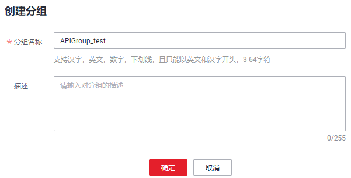

# 创建API分组

## 操作场景

创建API前，需要先创建API分组。API分组相当于API的集合，API提供者以API分组为单位，管理分组内的所有API。

> **说明：**   
>-   一个API只能属于某一个API分组。  
>-   每个用户最多创建50个API分组。  

## 操作步骤

1.  登录管理控制台。
2.  在管理控制台左上角单击，选择区域。
3.  在服务列表中，单击“应用服务 \> API网关”，进入API网关服务管理页面。
4.  单击“开放API \> API分组”，进入到API分组信息页面。
5.  单击“创建分组”，弹出“创建分组”对话框，如[图1](#fig149471128308)所示。填写如[表1](#table195413315428)所示信息。

    **图 1**  创建分组  
    

    **表 1**  分组信息表

    
    <table><thead align="left"><tr id="row45523384220"><th class="cellrowborder" valign="top" width="31.03%" id="mcps1.2.3.1.1">
信息项

    </th>
    <th class="cellrowborder" valign="top" width="68.97%" id="mcps1.2.3.1.2">
描述

    </th>
    </tr>
    </thead>
    <tbody><tr id="row1156183364219"><td class="cellrowborder" valign="top" width="31.03%" headers="mcps1.2.3.1.1 ">
分组名称

    </td>
    <td class="cellrowborder" valign="top" width="68.97%" headers="mcps1.2.3.1.2 ">
API分组名称，用于将API接口进行分组管理。

    </td>
    </tr>
    <tr id="row14879114316433"><td class="cellrowborder" valign="top" width="31.03%" headers="mcps1.2.3.1.1 ">
描述

    </td>
    <td class="cellrowborder" valign="top" width="68.97%" headers="mcps1.2.3.1.2 ">
对分组的介绍

    </td>
    </tr>
    </tbody>
    </table>

6.  完成分组信息填写后，单击“确定”，创建API分组。

    创建分组成功后，在“API分组”页面的列表中显示新创建的API分组。

    > **说明：**   
    >-   API分组创建后，系统为分组自动分配一个内部测试用的子域名，此子域名每天最多可以访问1000次。  
    >-   对外开放API时，您需要为API分组绑定您自己的独立域名。  

## 使用API方式创建API分组

您还可以使用API的方式创建API分组，具体操作请查看以下链接。

[创建API分组](https://support.huaweicloud.com/api-apig/apig-zh-api-180713016.html)

## 后续操作

API分组创建成功后，您可以为此分组[绑定域名](绑定域名.md)，API调用者通过访问独立域名来调用您开放的API。

