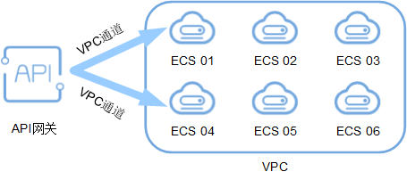

# 创建VPC通道

## 操作场景

API网关支持将部署在VPC中的后端服务开放API。

创建VPC通道后，在创建API，且后端服务类型为HTTP时，后端服务地址可以直接使用已创建的VPC通道。

例如，VPC中包含6台ECS，已创建一条VPC通道，其中ECS 01和ECS 04已添加到VPC通道中，此时API网关通过VPC通道可以直接访问VPC中的ECS 01和ECS 04。

**图 1**  通过API网关访问VPC通道中的ECS  

> **说明：**   
>每个用户最多创建30个VPC通道。  

## 前提条件

已创建弹性云服务器。

## 操作步骤

1.  登录管理控制台。
2.  在管理控制台左上角单击，选择区域。
3.  在服务列表中，单击“应用服务 \> API网关”，进入API网关服务管理页面。
4.  单击“开放API \> VPC通道”，进入到VPC通道列表页面。
5.  单击“创建VPC通道”，进入“新建VPC通道”页面，填写如[表1](#table1110161851716)所示信息。

    **表 1**  VPC通道配置

    
    <table><thead align="left"><tr id="row11118189178"><th class="cellrowborder" valign="top" width="18%" id="mcps1.2.4.1.1">
信息项

    </th>
    <th class="cellrowborder" valign="top" width="40%" id="mcps1.2.4.1.2">
描述

    </th>
    <th class="cellrowborder" valign="top" width="42%" id="mcps1.2.4.1.3">
说明

    </th>
    </tr>
    </thead>
    <tbody><tr id="row6111191851715"><td class="cellrowborder" valign="top" width="18%" headers="mcps1.2.4.1.1 ">
通道名称

    </td>
    <td class="cellrowborder" valign="top" width="40%" headers="mcps1.2.4.1.2 ">
自定义VPC通道名称，用于识别不同的VPC通道。

    </td>
    <td class="cellrowborder" valign="top" width="42%" headers="mcps1.2.4.1.3 "><ul id="ul9322050165213"><li>支持汉字、英文、数字、下划线和中划线。</li><li>只能以汉字或者英文开头。</li><li>3 ~ 64个字符。</li></ul>
    </td>
    </tr>
    <tr id="row18111101816173"><td class="cellrowborder" valign="top" width="18%" headers="mcps1.2.4.1.1 ">
端口

    </td>
    <td class="cellrowborder" valign="top" width="40%" headers="mcps1.2.4.1.2 ">
VPC通道中主机的端口号。

    </td>
    <td class="cellrowborder" valign="top" width="42%" headers="mcps1.2.4.1.3 ">
1 ~ 65535

    </td>
    </tr>
    <tr id="row311112189175"><td class="cellrowborder" valign="top" width="18%" headers="mcps1.2.4.1.1 ">
分发算法

    </td>
    <td class="cellrowborder" valign="top" width="40%" headers="mcps1.2.4.1.2 ">
通过分发算法确定请求被发送到哪台主机。

    
分发算法包含如下几种：

    <ul id="ul24918264502"><li>加权轮询</li><li>加权最少连接</li><li>源地址哈希</li><li>URI哈希</li></ul>
    </td>
    <td class="cellrowborder" valign="top" width="42%" headers="mcps1.2.4.1.3 ">
仅在“通道类型”为“快速通道”时，需要配置。

    </td>
    </tr>
    <tr id="row131116181170"><td class="cellrowborder" valign="top" width="18%" headers="mcps1.2.4.1.1 ">
协议

    </td>
    <td class="cellrowborder" valign="top" width="40%" headers="mcps1.2.4.1.2 ">
使用以下协议，对VPC中主机执行健康检查。

    <ul id="ul19904951155719"><li>TCP</li><li>HTTP</li></ul>
    </td>
    <td class="cellrowborder" valign="top" width="42%" headers="mcps1.2.4.1.3 ">
默认为TCP协议。

    </td>
    </tr>
    <tr id="row18456130124815"><td class="cellrowborder" valign="top" width="18%" headers="mcps1.2.4.1.1 ">
路径

    </td>
    <td class="cellrowborder" valign="top" width="40%" headers="mcps1.2.4.1.2 ">
健康检查时的目标路径。

    </td>
    <td class="cellrowborder" valign="top" width="42%" headers="mcps1.2.4.1.3 ">
仅在协议为“HTTP”时，需要设置。

    </td>
    </tr>
    <tr id="row311151817174"><td class="cellrowborder" valign="top" width="18%" headers="mcps1.2.4.1.1 ">
检查端口

    </td>
    <td class="cellrowborder" valign="top" width="40%" headers="mcps1.2.4.1.2 ">
健康检查的目标端口。

    </td>
    <td class="cellrowborder" valign="top" width="42%" headers="mcps1.2.4.1.3 ">
缺省时为VPC中主机的端口号。

    </td>
    </tr>
    <tr id="row1611281881717"><td class="cellrowborder" valign="top" width="18%" headers="mcps1.2.4.1.1 ">
正常阈值

    </td>
    <td class="cellrowborder" valign="top" width="40%" headers="mcps1.2.4.1.2 ">
判定VPC通道中主机正常的依据为：连续检查<em id="i421224922811">x</em>成功，x为您设置的正常阈值。

    </td>
    <td class="cellrowborder" valign="top" width="42%" headers="mcps1.2.4.1.3 ">
取值为2 ~ 10。缺省时为2。

    </td>
    </tr>
    <tr id="row1852365410195"><td class="cellrowborder" valign="top" width="18%" headers="mcps1.2.4.1.1 ">
异常阈值

    </td>
    <td class="cellrowborder" valign="top" width="40%" headers="mcps1.2.4.1.2 ">
判定VPC通道中主机异常的依据为：连续检查<em id="i37296135294">x失败</em>，x为您设置的异常阈值。

    </td>
    <td class="cellrowborder" valign="top" width="42%" headers="mcps1.2.4.1.3 ">
取值为2 ~ 10。缺省时为5。

    </td>
    </tr>
    <tr id="row9935144112016"><td class="cellrowborder" valign="top" width="18%" headers="mcps1.2.4.1.1 ">
超时时间

    </td>
    <td class="cellrowborder" valign="top" width="40%" headers="mcps1.2.4.1.2 ">
检查期间，无响应的时间，单位为秒。

    </td>
    <td class="cellrowborder" valign="top" width="42%" headers="mcps1.2.4.1.3 ">
取值为2 ~ 30。缺省时为5。

    </td>
    </tr>
    <tr id="row12537112014201"><td class="cellrowborder" valign="top" width="18%" headers="mcps1.2.4.1.1 ">
间隔时间

    </td>
    <td class="cellrowborder" valign="top" width="40%" headers="mcps1.2.4.1.2 ">
连续两次检查的间隔时间，单位为秒。

    </td>
    <td class="cellrowborder" valign="top" width="42%" headers="mcps1.2.4.1.3 ">
取值为5 ~ 300。缺省时为10。

    </td>
    </tr>
    <tr id="row154521040174814"><td class="cellrowborder" valign="top" width="18%" headers="mcps1.2.4.1.1 ">
HTTP响应码

    </td>
    <td class="cellrowborder" valign="top" width="40%" headers="mcps1.2.4.1.2 ">
检查目标HTTP响应时，判断成功使用的HTTP响应码。

    </td>
    <td class="cellrowborder" valign="top" width="42%" headers="mcps1.2.4.1.3 ">
仅在协议为“HTTP”时，需要设置。

    </td>
    </tr>
    </tbody>
    </table>

6.  单击“下一步”，进入“添加弹性云服务器”页面。
7.  单击“添加弹性云服务器”，弹出“添加弹性云服务器”对话框。
8.  勾选需要添加的弹性云服务器，单击“添加”。

    > **说明：**   
    >待添加的弹性云服务器的安全组必须允许100.125.0.0/16网段访问，否则将导致健康检查失败及业务不通。  

9.  单击“完成”，完成VPC通道的创建。

