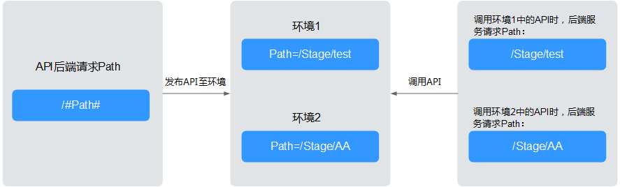
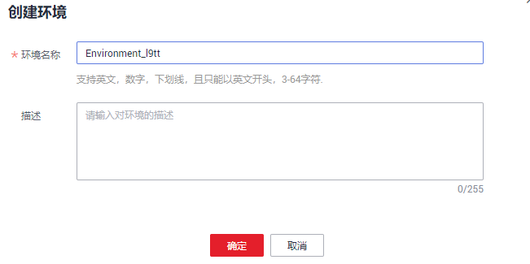
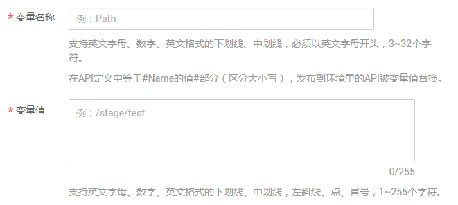

# 创建环境和环境变量（可选）

## 操作场景

API可以同时提供给不同的环境调用，如生产、测试或开发。RELEASE是默认存在的环境，无需创建。且API网关提供环境变量功能，通过创建环境变量，实现在不同的环境定义不同的API调用路径。

环境变量是指在环境上创建可管理的一种变量，该变量固定在环境上。通过创建环境变量，实现同一个API，在不同环境中调用不同的后端服务。

当创建API时定义了变量标识，则需要在环境中添加变量。例如创建API时定义了变量名为“Path”，在环境1中创建了变量名“Path”，变量值“/Stage/test”，则API在发布到环境1时，使用“/Stage/test”代替“Path”，API调用者在环境1中调用此API时，后端服务请求Path为“/Stage/test”。在环境2中创建了变量名“Path”，变量值“/Stage/AA”，则API在发布到环境2时，使用“/Stage/AA”代替“Path”，API调用者在环境2中调用此API时，后端服务请求Path为“/Stage/AA”。

**图 1**  环境变量示意图  

> **说明：**   
>-   每个用户最多创建10个环境。  
>-   每个分组在任意一个环境中，最多创建50个变量。  

## 前提条件

已创建API分组。

## 创建环境

1.  登录管理控制台。
2.  在管理控制台左上角单击，选择区域。
3.  在服务列表中，选择“应用服务 \> API网关”，进入API网关服务管理页面。
4.  在左侧选择您的API版本，单击并进入到对应版本的API开发与调用管理页面。

    “共享版”指直接创建并管理API，如涉及到费用，以API调用次数计费。

    “专享版”指在API专享版实例中创建并管理API，如涉及到费用，按实例运行时间计费。

5.  单击“开放API \> 环境管理”，进入到环境管理信息页面。
6.  单击“创建环境”，弹出“创建环境”对话框。填写如[表1](#table195413315428)所示信息。

    **图 2**  创建环境  
    

    **表 1**  环境信息

    
    <table><thead align="left"><tr id="row45523384220"><th class="cellrowborder" valign="top" width="20%" id="mcps1.2.3.1.1">
信息项

    </th>
    <th class="cellrowborder" valign="top" width="80%" id="mcps1.2.3.1.2">
描述

    </th>
    </tr>
    </thead>
    <tbody><tr id="row1156183364219"><td class="cellrowborder" valign="top" width="20%" headers="mcps1.2.3.1.1 ">
环境名称

    </td>
    <td class="cellrowborder" valign="top" width="80%" headers="mcps1.2.3.1.2 ">
API环境名称。

    </td>
    </tr>
    <tr id="row14879114316433"><td class="cellrowborder" valign="top" width="20%" headers="mcps1.2.3.1.1 ">
描述

    </td>
    <td class="cellrowborder" valign="top" width="80%" headers="mcps1.2.3.1.2 ">
-

    </td>
    </tr>
    </tbody>
    </table>

7.  单击“确定”，创建环境。

    创建环境成功后，在“环境管理”页面的列表中显示新创建的环境。

## 访问环境

通过RESTful API可以访问API默认的RELEASE环境，如果访问其他环境，需要在请求头中添加X-Stage头，内容为环境名。例如访问名为“DEVELOP”的环境，则添加“X-Stage:DEVELOP”。

> **说明：**   
>API网关管理控制台的“调试”功能，固定为调试环境，不支持携带环境变量调试。  

## 创建环境变量

1.  登录管理控制台。
2.  在管理控制台左上角单击，选择区域。
3.  在服务列表中，选择“应用服务 \> API网关”，进入API网关服务管理页面。
4.  单击“开放API \> API分组”，进入到API分组信息页面。
5.  通过以下任意一种方式，进入“变量管理”页签。
    -   单击_“分组名称_”，进入分组详细信息页面。单击“变量管理”。
    -   在待创建环境变量的分组所在行，单击“更多 \> 变量管理”。

6.  在“环境”中选择待添加变量的环境名称，单击“添加变量”，弹出“新增变量”对话框。
7.  填写如[表2](#table179600199520)所示信息。

    **图 3**  新增变量  
    

    **表 2**  新增变量

    
    <table><thead align="left"><tr id="row209601419855"><th class="cellrowborder" valign="top" width="20%" id="mcps1.2.3.1.1">
信息项

    </th>
    <th class="cellrowborder" valign="top" width="80%" id="mcps1.2.3.1.2">
描述

    </th>
    </tr>
    </thead>
    <tbody><tr id="row9961119151"><td class="cellrowborder" valign="top" width="20%" headers="mcps1.2.3.1.1 ">
变量名称

    </td>
    <td class="cellrowborder" valign="top" width="80%" headers="mcps1.2.3.1.2 ">
变量的名称，必须与创建API时定义的变量标识完全相同。

    </td>
    </tr>
    <tr id="row139611919855"><td class="cellrowborder" valign="top" width="20%" headers="mcps1.2.3.1.1 ">
变量值

    </td>
    <td class="cellrowborder" valign="top" width="80%" headers="mcps1.2.3.1.2 ">
变量路径。

    </td>
    </tr>
    </tbody>
    </table>

8.  单击“确定”，完成变量的添加。

    > **说明：**   
    >如果不再需要此变量时，在变量所在行单击“删除”。  
    >在实际发送API请求中，环境变量名称与变量值会明文传递，请勿携带隐私信息。  

## 使用API方式创建环境

您还可以使用API的方式创建环境和变量，具体操作请查看以下链接。

[创建环境](https://support.huaweicloud.com/api-apig/apig-zh-api-180713052.html)

[新建变量](https://support.huaweicloud.com/api-apig/apig-zh-api-180713058.html)

## 环境变量相关的FAQ

[API发布到不同环境后，会调用不同的后端服务吗？](https://support.huaweicloud.com/apig_faq/apig-zh-faq-181016019.html)

## 后续操作

创建完环境和环境变量后，您可以将API[发布到环境](发布API.md)，以便API调用者调用。

