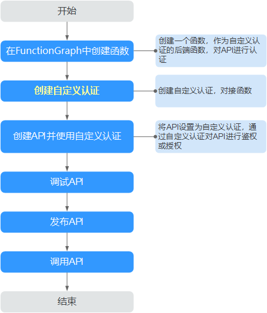

# 创建自定义认证

## 操作场景

自定义认证包含两种认证：前端自定义认证和后端自定义认证。

-   前端自定义认证：如果您希望使用自己的认证系统，而不是APP认证/华为IAM认证对API的访问进行认证鉴权时，您可以使用自定义认证，通过您自定义的函数进行认证鉴权。
-   后端自定义认证：当不同的后端服务使用不同的认证系统时，导致您需要为不同的认证系统定制化开发API，而APIG通过自定义认证功能，将多种认证系统集成，简化API开发的复杂度。您只需要在APIG中创建自定义的函数认证，APIG通过此函数对接后端认证系统，获取后端服务的访问授权。

> **说明：**   
>自定义认证依赖函数服务。如果当前Region没有上线函数服务，则不支持使用自定义认证。  

使用自定义认证调用API的流程如下图所示：

**图 1**  使用自定义认证调用API  

## 前提条件

已在函数工作流服务中完成函数创建。

## 操作步骤

1.  登录管理控制台。
2.  在管理控制台左上角单击，选择区域。
3.  在服务列表中，单击“应用服务 \> API网关”，进入API网关信息页面。
4.  在左侧选择您的API版本，单击并进入到对应版本的API开发与调用管理页面。

    “共享版”指直接创建并管理API，如涉及到费用，以API调用次数计费。

    “专享版”指在API专享版实例中创建并管理API，如涉及到费用，按实例运行时间计费。

5.  在“开放API \> 自定义认证”页签，单击“创建自定义认证”，弹出“创建自定义认证”对话框。
6.  填写如[表1](#table1175955105713)所示信息。

    **表 1**  自定义认证参数

    
    <table><thead align="left"><tr id="row5761552570"><th class="cellrowborder" valign="top" width="18.63%" id="mcps1.2.3.1.1">
信息项

    </th>
    <th class="cellrowborder" valign="top" width="81.37%" id="mcps1.2.3.1.2">
描述

    </th>
    </tr>
    </thead>
    <tbody><tr id="row1177655185716"><td class="cellrowborder" valign="top" width="18.63%" headers="mcps1.2.3.1.1 ">
认证名称

    </td>
    <td class="cellrowborder" valign="top" width="81.37%" headers="mcps1.2.3.1.2 ">
您自定义的认证名称，用于区分不同的自定义认证。

    </td>
    </tr>
    <tr id="row167705511576"><td class="cellrowborder" valign="top" width="18.63%" headers="mcps1.2.3.1.1 ">
类型

    </td>
    <td class="cellrowborder" valign="top" width="81.37%" headers="mcps1.2.3.1.2 "><ul id="ul129967179014"><li>前端：对API的访问进行认证鉴权。</li><li>后端：对后端服务的访问授权。</li></ul>
    </td>
    </tr>
    <tr id="row477165515711"><td class="cellrowborder" valign="top" width="18.63%" headers="mcps1.2.3.1.1 ">
函数地址

    </td>
    <td class="cellrowborder" valign="top" width="81.37%" headers="mcps1.2.3.1.2 ">
选择在FunctionGraph中创建的函数。

    </td>
    </tr>
    <tr id="row161282255918"><td class="cellrowborder" valign="top" width="18.63%" headers="mcps1.2.3.1.1 ">
身份来源

    </td>
    <td class="cellrowborder" valign="top" width="81.37%" headers="mcps1.2.3.1.2 ">
设置用于认证的请求参数。

    
当“类型”为“前端”，且“缓存时间”不为0时，必须设置此参数。使用缓存时，此参数将作为搜索条件来查询认证结果。

    </td>
    </tr>
    <tr id="row135741955592"><td class="cellrowborder" valign="top" width="18.63%" headers="mcps1.2.3.1.1 ">
缓存时间

    </td>
    <td class="cellrowborder" valign="top" width="81.37%" headers="mcps1.2.3.1.2 ">
设置认证结果缓存的时间。

    
值为0时代表不缓存，最大支持3600秒。

    </td>
    </tr>
    <tr id="row14393914205913"><td class="cellrowborder" valign="top" width="18.63%" headers="mcps1.2.3.1.1 ">
用户数据

    </td>
    <td class="cellrowborder" valign="top" width="81.37%" headers="mcps1.2.3.1.2 ">
您自定义的请求参数，APIG调用函数时，与“身份来源”一同作为请求参数。

    </td>
    </tr>
    </tbody>
    </table>

7.  单击“创建”，完成自定义认证的创建。

