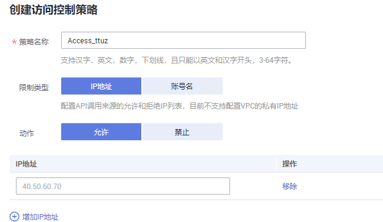

# 创建访问控制策略

## 操作场景

访问控制策略是API网关提供的API安全防护组件之一，主要用来控制访问API的IP地址和帐户，您可以通过设置IP地址或帐户的黑白名单来允许/拒绝某个IP地址或帐户访问API。

访问控制策略和API本身是相互独立的，只有将访问控制策略绑定API后，访问控制策略才对绑定的API生效。

> **说明：**   
>-   每个用户最多可以创建100个访问控制策略。  
>-   同一个环境中一个API只能被一个访问控制策略绑定，一个访问控制策略可以绑定多个API。  

## 创建访问控制策略

1.  登录管理控制台。
2.  （可选）获取账户名。
    1.  单击用户名，在下拉列表中单击“我的凭证”。
    2.  在“我的凭证”页面查看账号名。

        **图 1**  查看账号名  
        

3.  在管理控制台左上角单击，选择区域。
4.  在服务列表中，单击“应用服务 \> API网关”，进入API网关服务管理页面。
5.  单击“开放API \> 访问控制”，进入访问控制策略列表页面。
6.  单击“创建访问控制策略”，弹出“创建访问控制策略”对话框。
7.  输入[表1](#table7929152105014)如所示信息。

    **图 2**  创建访问控制策略  
    

    **表 1**  访问控制策略信息

    
    <table><thead align="left"><tr id="row89302529507"><th class="cellrowborder" valign="top" width="20%" id="mcps1.2.3.1.1">
信息项

    </th>
    <th class="cellrowborder" valign="top" width="80%" id="mcps1.2.3.1.2">
描述

    </th>
    </tr>
    </thead>
    <tbody><tr id="row1093065235019"><td class="cellrowborder" valign="top" width="20%" headers="mcps1.2.3.1.1 ">
策略名称

    </td>
    <td class="cellrowborder" valign="top" width="80%" headers="mcps1.2.3.1.2 ">
访问控制策略的名称。

    </td>
    </tr>
    <tr id="row209301752205016"><td class="cellrowborder" valign="top" width="20%" headers="mcps1.2.3.1.1 ">
限制类型

    </td>
    <td class="cellrowborder" valign="top" width="80%" headers="mcps1.2.3.1.2 ">
控制访问API的类型。

    <ul id="ul4791720111517"><li>IP地址：允许/禁止访问API的IP地址。</li><li>账号名：允许/禁止访问API的账号名。</li></ul>
    </td>
    </tr>
    <tr id="row199311852115011"><td class="cellrowborder" valign="top" width="20%" headers="mcps1.2.3.1.1 ">
动作

    </td>
    <td class="cellrowborder" valign="top" width="80%" headers="mcps1.2.3.1.2 ">
包括允许和禁止。

    
和“限制类型”配合使用，允许/禁止访问API的IP地址/账号名。

    </td>
    </tr>
    <tr id="row8931952145014"><td class="cellrowborder" valign="top" width="20%" headers="mcps1.2.3.1.1 ">
IP地址

    </td>
    <td class="cellrowborder" valign="top" width="80%" headers="mcps1.2.3.1.2 ">
输入需要允许或者禁止访问API的IP地址。

    
仅在“限制类型”为“IP地址”时，需要设置。

    </td>
    </tr>
    <tr id="row119892011151611"><td class="cellrowborder" valign="top" width="20%" headers="mcps1.2.3.1.1 ">
账号名

    </td>
    <td class="cellrowborder" valign="top" width="80%" headers="mcps1.2.3.1.2 ">
输入需要允许或者禁止访问API的账号名。

    
仅在“限制类型”为“账号名”时，需要设置。支持输入多个账户名，以英文“,”隔开，如aaa,bbb。

    </td>
    </tr>
    </tbody>
    </table>

8.  单击“确定”，完成访问控制策略的创建。

## 绑定API

1.  登录管理控制台。
2.  在管理控制台左上角单击，选择区域。
3.  在服务列表中，单击“应用服务 \> API网关”，进入API网关服务管理页面。
4.  单击“开放API \> 访问控制”，进入访问控制策略列表页面。
5.  通过以下任意一种方法，进入“绑定API”页面。
    -   在待绑定的访问控制策略所在行，单击“绑定API”，进入已绑定API列表页面。单击“绑定API”。
    -   单击策略名称，进入策略详情页面。单击“绑定API”。

6.  选择“API分组”、“环境”以及“API名称”，筛选所需的API。
7.  勾选API，单击“绑定”，完成API绑定策略。

    > **说明：**   
    >在访问控制策略绑定API后，如果API不需要调用此策略，单击“解除”，解除绑定。  

