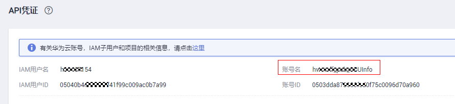

# 创建访问控制策略

## 操作场景

通过创建访问控制策略来控制API调用者。

> **说明：**   
>每个用户最多可以创建100个访问控制策略。  

## 操作步骤

1.  登录管理控制台。
2.  （可选）获取账户名。
    1.  单击用户名，在下拉列表中单击“我的凭证”。
    2.  在“我的凭证”页面查看账号名。

        **图 1**  查看账号名  
        

3.  在管理控制台左上角单击，选择区域。
4.  在服务列表中，单击“应用服务 \> API网关”，进入API网关服务管理页面。
5.  单击“开放API \> 访问控制”，进入访问控制策略列表页面。
6.  单击“创建访问控制策略”，弹出“创建访问控制策略”对话框。
7.  输入[表1](#table7929152105014)如所示信息。

    **表 1**  访问控制策略信息

    
    <table><thead align="left"><tr id="row89302529507"><th class="cellrowborder" valign="top" width="17%" id="mcps1.2.4.1.1">
信息项

    </th>
    <th class="cellrowborder" valign="top" width="38.03%" id="mcps1.2.4.1.2">
描述

    </th>
    <th class="cellrowborder" valign="top" width="44.97%" id="mcps1.2.4.1.3">
说明

    </th>
    </tr>
    </thead>
    <tbody><tr id="row1093065235019"><td class="cellrowborder" valign="top" width="17%" headers="mcps1.2.4.1.1 ">
策略名称

    </td>
    <td class="cellrowborder" valign="top" width="38.03%" headers="mcps1.2.4.1.2 ">
访问控制策略的名称。

    </td>
    <td class="cellrowborder" valign="top" width="44.97%" headers="mcps1.2.4.1.3 "><ul id="ul4807111355318"><li>必须以英文或汉字开头。</li><li>支持汉字、英文、数字和下划线。</li><li>长度为3 ~ 64个字符</li></ul>
    </td>
    </tr>
    <tr id="row209301752205016"><td class="cellrowborder" valign="top" width="17%" headers="mcps1.2.4.1.1 ">
限制类型

    </td>
    <td class="cellrowborder" valign="top" width="38.03%" headers="mcps1.2.4.1.2 ">
控制访问API的类型。

    </td>
    <td class="cellrowborder" valign="top" width="44.97%" headers="mcps1.2.4.1.3 "><ul id="ul4791720111517"><li>IP地址：允许/禁止访问API的IP地址。</li><li>账号名：允许/禁止访问API的账号名。</li></ul>
    </td>
    </tr>
    <tr id="row199311852115011"><td class="cellrowborder" valign="top" width="17%" headers="mcps1.2.4.1.1 ">
动作

    </td>
    <td class="cellrowborder" valign="top" width="38.03%" headers="mcps1.2.4.1.2 ">
包括允许和禁止。

    </td>
    <td class="cellrowborder" valign="top" width="44.97%" headers="mcps1.2.4.1.3 ">
和“限制类型”配合使用，允许/禁止访问API的IP地址/账号名。

    </td>
    </tr>
    <tr id="row8931952145014"><td class="cellrowborder" valign="top" width="17%" headers="mcps1.2.4.1.1 ">
IP地址

    </td>
    <td class="cellrowborder" valign="top" width="38.03%" headers="mcps1.2.4.1.2 ">
输入需要允许或者禁止访问API的IP地址。

    </td>
    <td class="cellrowborder" valign="top" width="44.97%" headers="mcps1.2.4.1.3 ">
仅在“限制类型”为“IP地址”时，需要设置。

    </td>
    </tr>
    <tr id="row119892011151611"><td class="cellrowborder" valign="top" width="17%" headers="mcps1.2.4.1.1 ">
账号名

    </td>
    <td class="cellrowborder" valign="top" width="38.03%" headers="mcps1.2.4.1.2 ">
输入需要允许或者禁止访问API的账号名。

    </td>
    <td class="cellrowborder" valign="top" width="44.97%" headers="mcps1.2.4.1.3 ">
仅在“限制类型”为“账号名”时，需要设置。支持输入多个账户名，以英文“,”隔开，如aaa,bbb。

    </td>
    </tr>
    </tbody>
    </table>

8.  单击“确定”，完成访问控制策略的创建。

