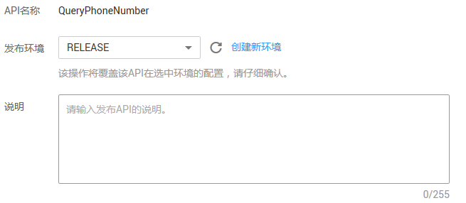
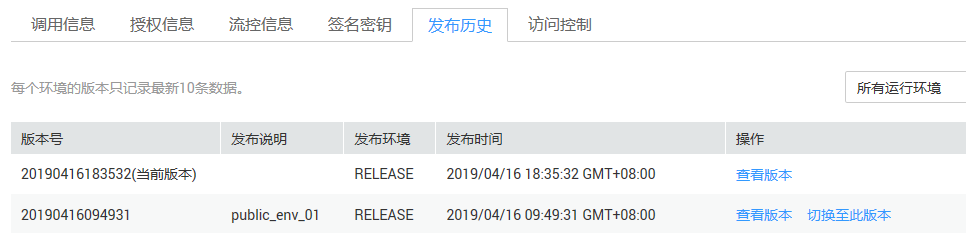

# 发布API

## 操作场景

创建完成的API，支持发布到不同的环境。API只有在发布到环境后，才支持被调用。API网关支持查看API发布历史（如版本、发布说明、发布时间和发布环境），并支持回滚到不同的API历史版本。

> **说明：**   
>-   已发布的API，在修改信息后，需要重新发布才能将修改后的信息同步到环境中。  
>-   同一个API在每个环境中最多纪录10条最新的发布历史。  

## 前提条件

-   已创建API分组和分组内的API。
-   已创建环境。

## 发布API

1.  登录管理控制台。
2.  在管理控制台左上角单击，选择区域。
3.  在服务列表中，单击“应用服务 \> API网关”，进入API网关服务管理页面。
4.  单击“开放API \> API管理”，进入到API管理信息页面。
5.  通过以下任意一种方法，进入“发布API”页面。
    -   在待发布的API所在行，单击“发布”。
    -   单击“_API名称_”，进入API详情页面。在右上角单击“发布”。

6.  选择API需要发布到的环境，并填写发布说明。

    **图 1**  发布API  
    

    > **说明：**   
    >-   如果API在选择的环境中已发布，再次发布即为覆盖该环境的API。  
    >-   如果在选择的环境时没有自己需要的环境，可以创建一个自己需要的环境。  

7.  单击“发布”，完成API发布。

## 查看发布历史

1.  登录管理控制台。
2.  在管理控制台左上角单击，选择区域。
3.  在服务列表中，单击“应用服务 \> API网关”，进入API网关服务管理页面。
4.  单击“开放API \> API管理”，进入到API管理信息页面。
5.  单击待查看发布历史的API名称，进入API详情页面。
6.  单击“完整信息”，进入“完整信息”页签。
7.  单击“发布历史”，进入“发布历史”页签。

    查看API的发布历史信息。

    **图 2**  发布历史  
    

8.  在版本所在行，单击“查看版本”，弹出此版本详细信息对话框。

    查看API请求、后端请求、返回结果、入参定义、参数映射和常量参数。

9.  如果想要设置之前版本为当前版本，则在版本所在行，单击“切换至此版本”，弹出“切换至此版本”对话框。

    单击“确定”，完成版本的切换。此时版本号旁边显示“当前版本”，说明设置成功。

    API调用者调用此API时，API参数为“当前版本”设置的参数，不是最后一次编辑保存的API参数。

    例如，2018年8月1日发布在RELEASE环境的API匹配模式设置为“绝对匹配”，2018年8月20日修改API匹配模式设置为“前缀匹配”，并发布到RELEASE环境。然后设置2018年8月1日发布的版本为当前版本，此时API调用者调用此API时，API的匹配模式为“绝对匹配”。

## 使用API方式发布API和查看发布历史

您还可以使用API的方式发布API和查看发布历史，具体操作请查看以下链接。

[发布API](https://support.huaweicloud.com/api-apig/apig-zh-api-180713028.html)

[切换API版本](https://support.huaweicloud.com/api-apig/apig-zh-api-180713032.html)

[查询API历史版本列表](https://support.huaweicloud.com/api-apig/apig-zh-api-180713033.html)

## 发布API相关的FAQ

[对API的修改是否需要重新发布？](https://support.huaweicloud.com/apig_faq/apig-zh-faq-180307002.html)

[API发布到RELEASE环境可以正常访问，发布到非RELEASE环境无法访问？](https://support.huaweicloud.com/apig_faq/apig-zh-faq-180606011.html)

[API发布到不同环境后，会调用不同的后端服务吗？](https://support.huaweicloud.com/apig_faq/apig-zh-faq-181016019.html)

