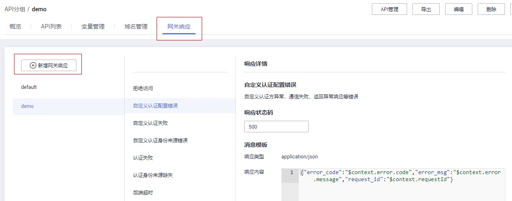

# 新增网关响应<a name="apig-lgug-200226001"></a>

## 操作场景<a name="section1731012541118"></a>

网关响应指API网关未能成功处理API请求，从而产生的错误响应。API网关提供默认的网关响应（default），如果您需要自定义响应状态码或网关响应内容，可在API分组管理中新增网关响应，其中响应内容符合JSON格式即可。

例如，“default”网关的响应内容为：

```
{"error_code": "$context.error.code", "error_msg": "$context.error.message", "request_id": "$context.requestId"}
```

您可以自定义为：

```
{"errorcode": "$context.error.code", "errormsg": "$context.error.message", "requestid": "$context.requestId","apiId":"$context.apiId"}
```

JSON体的内容可以按需定制，包括增减字段内容。

> **说明：**   
>-   API提供的默认网关响应“default”也可以编辑修改。  
>-   您可以新增多个网关响应，支持同一分组下不同API配置不同的网关响应内容。  
>-   网关响应所定义的错误类型固定且不可修改，具体见[网关错误响应类型说明](#section188951150101)。  
>-   响应内容支持调用API网关运行时变量（$context变量），具体见[API网关运行时可获取变量](#section0417113411215)。  

## 前提条件<a name="section83110548119"></a>

已创建分组。

## 操作步骤<a name="section333201863716"></a>

1.  登录管理控制台。
2.  在管理控制台左上角单击，选择区域。
3.  在服务列表中，选择“应用服务 \> API网关”，进入API网关服务管理页面。
4.  在左侧选择您的API版本，单击并进入到对应版本的API开发与调用管理页面。

    “共享版”指直接创建并管理API，如涉及到费用，以API调用次数计费。

    “专享版”指在API专享版实例中创建并管理API，如涉及到费用，按实例运行时间计费。

5.  单击“开放API \> API分组”，进入到API分组信息页面。
6.  找到您要新增或编辑修改网关响应的分组，单击并进入分组详情页。
7.  单击其中的“网关响应”页签，即可新增或编辑网关响应内容。

    右侧有“编辑”按钮，单击即可修改响应状态码、响应内容。

8.  不论“default”或是您自定义的网关响应，响应类型范围固定不可修改。您可以修改每种响应的状态码，以及响应内容。

    响应内容的错误信息以及其他信息，可通过变量的方式获取，支持的变量见[表2](#table1777615351141)。

    


## 网关错误响应类型说明<a name="section188951150101"></a>

API网关提供的错误响应类型见[表1](#table4964122534120)，其中响应状态码可以按实际需要做自定义修改。

**表 1**  API网关的错误响应类型

<a name="table4964122534120"></a>
<table><thead align="left"><tr id="row7964925154114"><th class="cellrowborder" valign="top" width="20.227977202279774%" id="mcps1.2.5.1.1"><p id="p11964102544116"><a name="p11964102544116"></a><a name="p11964102544116"></a>错误响应类型</p>
</th>
<th class="cellrowborder" valign="top" width="12.538746125387462%" id="mcps1.2.5.1.2"><p id="p99641225154116"><a name="p99641225154116"></a><a name="p99641225154116"></a>默认的响应状态码</p>
</th>
<th class="cellrowborder" valign="top" width="20.48795120487951%" id="mcps1.2.5.1.3"><p id="p996412514110"><a name="p996412514110"></a><a name="p996412514110"></a>错误说明</p>
</th>
<th class="cellrowborder" valign="top" width="46.745325467453256%" id="mcps1.2.5.1.4"><p id="p20664205118428"><a name="p20664205118428"></a><a name="p20664205118428"></a>详细说明</p>
</th>
</tr>
</thead>
<tbody><tr id="row69641525144119"><td class="cellrowborder" valign="top" width="20.227977202279774%" headers="mcps1.2.5.1.1 "><p id="p16964192511418"><a name="p16964192511418"></a><a name="p16964192511418"></a>ACCESS_DENIED</p>
</td>
<td class="cellrowborder" valign="top" width="12.538746125387462%" headers="mcps1.2.5.1.2 "><p id="p8964425124113"><a name="p8964425124113"></a><a name="p8964425124113"></a>403</p>
</td>
<td class="cellrowborder" valign="top" width="20.48795120487951%" headers="mcps1.2.5.1.3 "><p id="p29641725204118"><a name="p29641725204118"></a><a name="p29641725204118"></a>拒绝访问</p>
</td>
<td class="cellrowborder" valign="top" width="46.745325467453256%" headers="mcps1.2.5.1.4 "><p id="p1866419517426"><a name="p1866419517426"></a><a name="p1866419517426"></a>拒绝访问，如触发配置的访问控制策略、或异常攻击检测拦截</p>
</td>
</tr>
<tr id="row119641025184116"><td class="cellrowborder" valign="top" width="20.227977202279774%" headers="mcps1.2.5.1.1 "><p id="p896402514117"><a name="p896402514117"></a><a name="p896402514117"></a>AUTHORIZER_CONF_FAILURE</p>
</td>
<td class="cellrowborder" valign="top" width="12.538746125387462%" headers="mcps1.2.5.1.2 "><p id="p0964132514113"><a name="p0964132514113"></a><a name="p0964132514113"></a>500</p>
</td>
<td class="cellrowborder" valign="top" width="20.48795120487951%" headers="mcps1.2.5.1.3 "><p id="p996415251415"><a name="p996415251415"></a><a name="p996415251415"></a>自定义认证配置错误</p>
</td>
<td class="cellrowborder" valign="top" width="46.745325467453256%" headers="mcps1.2.5.1.4 "><p id="p15664205164214"><a name="p15664205164214"></a><a name="p15664205164214"></a>自定义认证方异常，通信失败、返回异常响应等错误</p>
</td>
</tr>
<tr id="row1196418255418"><td class="cellrowborder" valign="top" width="20.227977202279774%" headers="mcps1.2.5.1.1 "><p id="p09648258413"><a name="p09648258413"></a><a name="p09648258413"></a>AUTHORIZER_FAILURE</p>
</td>
<td class="cellrowborder" valign="top" width="12.538746125387462%" headers="mcps1.2.5.1.2 "><p id="p2964162544116"><a name="p2964162544116"></a><a name="p2964162544116"></a>500</p>
</td>
<td class="cellrowborder" valign="top" width="20.48795120487951%" headers="mcps1.2.5.1.3 "><p id="p1496432534111"><a name="p1496432534111"></a><a name="p1496432534111"></a>自定义认证失败</p>
</td>
<td class="cellrowborder" valign="top" width="46.745325467453256%" headers="mcps1.2.5.1.4 "><p id="p176641351114214"><a name="p176641351114214"></a><a name="p176641351114214"></a>自定义认证方返回认证失败</p>
</td>
</tr>
<tr id="row996417256412"><td class="cellrowborder" valign="top" width="20.227977202279774%" headers="mcps1.2.5.1.1 "><p id="p15964162511419"><a name="p15964162511419"></a><a name="p15964162511419"></a>AUTHORIZER_IDENTITIES_FAILURE</p>
</td>
<td class="cellrowborder" valign="top" width="12.538746125387462%" headers="mcps1.2.5.1.2 "><p id="p2964102518413"><a name="p2964102518413"></a><a name="p2964102518413"></a>401</p>
</td>
<td class="cellrowborder" valign="top" width="20.48795120487951%" headers="mcps1.2.5.1.3 "><p id="p1096492517418"><a name="p1096492517418"></a><a name="p1096492517418"></a>自定义认证身份来源错误</p>
</td>
<td class="cellrowborder" valign="top" width="46.745325467453256%" headers="mcps1.2.5.1.4 "><p id="p466415112421"><a name="p466415112421"></a><a name="p466415112421"></a>前端自定义认证的身份来源信息缺失或不合法错误</p>
</td>
</tr>
<tr id="row139641525114114"><td class="cellrowborder" valign="top" width="20.227977202279774%" headers="mcps1.2.5.1.1 "><p id="p16964102544117"><a name="p16964102544117"></a><a name="p16964102544117"></a>AUTH_FAILURE</p>
</td>
<td class="cellrowborder" valign="top" width="12.538746125387462%" headers="mcps1.2.5.1.2 "><p id="p19647258417"><a name="p19647258417"></a><a name="p19647258417"></a>401</p>
</td>
<td class="cellrowborder" valign="top" width="20.48795120487951%" headers="mcps1.2.5.1.3 "><p id="p11964192554117"><a name="p11964192554117"></a><a name="p11964192554117"></a>认证失败</p>
</td>
<td class="cellrowborder" valign="top" width="46.745325467453256%" headers="mcps1.2.5.1.4 "><p id="p17664205194216"><a name="p17664205194216"></a><a name="p17664205194216"></a>认证失败，IAM或APP认证校验失败</p>
</td>
</tr>
<tr id="row396412518416"><td class="cellrowborder" valign="top" width="20.227977202279774%" headers="mcps1.2.5.1.1 "><p id="p3964625154118"><a name="p3964625154118"></a><a name="p3964625154118"></a>AUTH_HEADER_MISSING</p>
</td>
<td class="cellrowborder" valign="top" width="12.538746125387462%" headers="mcps1.2.5.1.2 "><p id="p896432518416"><a name="p896432518416"></a><a name="p896432518416"></a>401</p>
</td>
<td class="cellrowborder" valign="top" width="20.48795120487951%" headers="mcps1.2.5.1.3 "><p id="p3964142513415"><a name="p3964142513415"></a><a name="p3964142513415"></a>认证身份来源缺失</p>
</td>
<td class="cellrowborder" valign="top" width="46.745325467453256%" headers="mcps1.2.5.1.4 "><p id="p2664165116428"><a name="p2664165116428"></a><a name="p2664165116428"></a>认证身份来源信息缺失</p>
</td>
</tr>
<tr id="row199641259417"><td class="cellrowborder" valign="top" width="20.227977202279774%" headers="mcps1.2.5.1.1 "><p id="p169649256414"><a name="p169649256414"></a><a name="p169649256414"></a>BACKEND_TIMEOUT</p>
</td>
<td class="cellrowborder" valign="top" width="12.538746125387462%" headers="mcps1.2.5.1.2 "><p id="p89649251412"><a name="p89649251412"></a><a name="p89649251412"></a>504</p>
</td>
<td class="cellrowborder" valign="top" width="20.48795120487951%" headers="mcps1.2.5.1.3 "><p id="p496411251415"><a name="p496411251415"></a><a name="p496411251415"></a>后端超时</p>
</td>
<td class="cellrowborder" valign="top" width="46.745325467453256%" headers="mcps1.2.5.1.4 "><p id="p466410513424"><a name="p466410513424"></a><a name="p466410513424"></a>后端超时，与后端的网络交互超过预配置的时间错误</p>
</td>
</tr>
<tr id="row962514252514"><td class="cellrowborder" valign="top" width="20.227977202279774%" headers="mcps1.2.5.1.1 "><p id="p20626132518513"><a name="p20626132518513"></a><a name="p20626132518513"></a>BACKEND_UNAVAILABLE</p>
</td>
<td class="cellrowborder" valign="top" width="12.538746125387462%" headers="mcps1.2.5.1.2 "><p id="p11626192565111"><a name="p11626192565111"></a><a name="p11626192565111"></a>502</p>
</td>
<td class="cellrowborder" valign="top" width="20.48795120487951%" headers="mcps1.2.5.1.3 "><p id="p262642513515"><a name="p262642513515"></a><a name="p262642513515"></a>后端不可用</p>
</td>
<td class="cellrowborder" valign="top" width="46.745325467453256%" headers="mcps1.2.5.1.4 "><p id="p19626112512519"><a name="p19626112512519"></a><a name="p19626112512519"></a>后端不可用，网络不可达错误</p>
</td>
</tr>
<tr id="row214050134319"><td class="cellrowborder" valign="top" width="20.227977202279774%" headers="mcps1.2.5.1.1 "><p id="p1114012034312"><a name="p1114012034312"></a><a name="p1114012034312"></a>DEFAULT_4XX</p>
</td>
<td class="cellrowborder" valign="top" width="12.538746125387462%" headers="mcps1.2.5.1.2 "><p id="p91405017435"><a name="p91405017435"></a><a name="p91405017435"></a>-</p>
</td>
<td class="cellrowborder" valign="top" width="20.48795120487951%" headers="mcps1.2.5.1.3 "><p id="p014110084314"><a name="p014110084314"></a><a name="p014110084314"></a>默认4XX</p>
</td>
<td class="cellrowborder" valign="top" width="46.745325467453256%" headers="mcps1.2.5.1.4 "><p id="p81411606436"><a name="p81411606436"></a><a name="p81411606436"></a>其它4XX类错误</p>
</td>
</tr>
<tr id="row1529215012432"><td class="cellrowborder" valign="top" width="20.227977202279774%" headers="mcps1.2.5.1.1 "><p id="p182921205436"><a name="p182921205436"></a><a name="p182921205436"></a>DEFAULT_5XX</p>
</td>
<td class="cellrowborder" valign="top" width="12.538746125387462%" headers="mcps1.2.5.1.2 "><p id="p20292003439"><a name="p20292003439"></a><a name="p20292003439"></a>-</p>
</td>
<td class="cellrowborder" valign="top" width="20.48795120487951%" headers="mcps1.2.5.1.3 "><p id="p10292203436"><a name="p10292203436"></a><a name="p10292203436"></a>默认5XX</p>
</td>
<td class="cellrowborder" valign="top" width="46.745325467453256%" headers="mcps1.2.5.1.4 "><p id="p12923010432"><a name="p12923010432"></a><a name="p12923010432"></a>其它5XX类错误</p>
</td>
</tr>
<tr id="row144447074320"><td class="cellrowborder" valign="top" width="20.227977202279774%" headers="mcps1.2.5.1.1 "><p id="p1344400194310"><a name="p1344400194310"></a><a name="p1344400194310"></a>NOT_FOUND</p>
</td>
<td class="cellrowborder" valign="top" width="12.538746125387462%" headers="mcps1.2.5.1.2 ">&nbsp;&nbsp;</td>
<td class="cellrowborder" valign="top" width="20.48795120487951%" headers="mcps1.2.5.1.3 "><p id="p1744410144320"><a name="p1744410144320"></a><a name="p1744410144320"></a>未找到匹配的API</p>
</td>
<td class="cellrowborder" valign="top" width="46.745325467453256%" headers="mcps1.2.5.1.4 "><p id="p184445019437"><a name="p184445019437"></a><a name="p184445019437"></a>未匹配到API</p>
</td>
</tr>
<tr id="row1662216074313"><td class="cellrowborder" valign="top" width="20.227977202279774%" headers="mcps1.2.5.1.1 "><p id="p762213044314"><a name="p762213044314"></a><a name="p762213044314"></a>REQUEST_PARAMETERS_FAILURE</p>
</td>
<td class="cellrowborder" valign="top" width="12.538746125387462%" headers="mcps1.2.5.1.2 "><p id="p162280134311"><a name="p162280134311"></a><a name="p162280134311"></a>400</p>
</td>
<td class="cellrowborder" valign="top" width="20.48795120487951%" headers="mcps1.2.5.1.3 "><p id="p46221607438"><a name="p46221607438"></a><a name="p46221607438"></a>请求参数错误</p>
</td>
<td class="cellrowborder" valign="top" width="46.745325467453256%" headers="mcps1.2.5.1.4 "><p id="p11623409437"><a name="p11623409437"></a><a name="p11623409437"></a>请求参数校验失败、不支持的HTTP方法</p>
</td>
</tr>
<tr id="row17847314164817"><td class="cellrowborder" valign="top" width="20.227977202279774%" headers="mcps1.2.5.1.1 "><p id="p18847314154812"><a name="p18847314154812"></a><a name="p18847314154812"></a>THROTTLED</p>
</td>
<td class="cellrowborder" valign="top" width="12.538746125387462%" headers="mcps1.2.5.1.2 "><p id="p10847514124817"><a name="p10847514124817"></a><a name="p10847514124817"></a>429</p>
</td>
<td class="cellrowborder" valign="top" width="20.48795120487951%" headers="mcps1.2.5.1.3 "><p id="p784711145481"><a name="p784711145481"></a><a name="p784711145481"></a>调用次数超出阈值</p>
</td>
<td class="cellrowborder" valign="top" width="46.745325467453256%" headers="mcps1.2.5.1.4 "><p id="p9847171414482"><a name="p9847171414482"></a><a name="p9847171414482"></a>API调用次数超出所配置的流量策略阈值</p>
</td>
</tr>
<tr id="row10991114164818"><td class="cellrowborder" valign="top" width="20.227977202279774%" headers="mcps1.2.5.1.1 "><p id="p1991131424819"><a name="p1991131424819"></a><a name="p1991131424819"></a>UNAUTHORIZED</p>
</td>
<td class="cellrowborder" valign="top" width="12.538746125387462%" headers="mcps1.2.5.1.2 "><p id="p3991151444813"><a name="p3991151444813"></a><a name="p3991151444813"></a>401</p>
</td>
<td class="cellrowborder" valign="top" width="20.48795120487951%" headers="mcps1.2.5.1.3 "><p id="p69912014124812"><a name="p69912014124812"></a><a name="p69912014124812"></a>应用未授权</p>
</td>
<td class="cellrowborder" valign="top" width="46.745325467453256%" headers="mcps1.2.5.1.4 "><p id="p69911514104816"><a name="p69911514104816"></a><a name="p69911514104816"></a>使用的应用未被授权访问该API</p>
</td>
</tr>
</tbody>
</table>

## API网关运行时可获取变量<a name="section0417113411215"></a>

**表 2**  网关错误响应消息体支持的变量

<a name="table1777615351141"></a>
<table><thead align="left"><tr id="row177619351743"><th class="cellrowborder" valign="top" width="36.53%" id="mcps1.2.3.1.1"><p id="p1977619351342"><a name="p1977619351342"></a><a name="p1977619351342"></a>运行时变量名称</p>
</th>
<th class="cellrowborder" valign="top" width="63.470000000000006%" id="mcps1.2.3.1.2"><p id="p477613351845"><a name="p477613351845"></a><a name="p477613351845"></a>描述</p>
</th>
</tr>
</thead>
<tbody><tr id="row977616351242"><td class="cellrowborder" valign="top" width="36.53%" headers="mcps1.2.3.1.1 "><p id="p1811712611910"><a name="p1811712611910"></a><a name="p1811712611910"></a>$context.apiId</p>
</td>
<td class="cellrowborder" valign="top" width="63.470000000000006%" headers="mcps1.2.3.1.2 "><p id="p191189261995"><a name="p191189261995"></a><a name="p191189261995"></a>API的ID</p>
</td>
</tr>
<tr id="row67764351412"><td class="cellrowborder" valign="top" width="36.53%" headers="mcps1.2.3.1.1 "><p id="p1211815261394"><a name="p1211815261394"></a><a name="p1211815261394"></a>$context.appId</p>
</td>
<td class="cellrowborder" valign="top" width="63.470000000000006%" headers="mcps1.2.3.1.2 "><p id="p12118192618913"><a name="p12118192618913"></a><a name="p12118192618913"></a>API调用者的APP对象ID</p>
</td>
</tr>
<tr id="row117771350415"><td class="cellrowborder" valign="top" width="36.53%" headers="mcps1.2.3.1.1 "><p id="p811882620919"><a name="p811882620919"></a><a name="p811882620919"></a>$context.requestId</p>
</td>
<td class="cellrowborder" valign="top" width="63.470000000000006%" headers="mcps1.2.3.1.2 "><p id="p11188264912"><a name="p11188264912"></a><a name="p11188264912"></a>当次API调用生成跟踪ID</p>
</td>
</tr>
<tr id="row7777203515419"><td class="cellrowborder" valign="top" width="36.53%" headers="mcps1.2.3.1.1 "><p id="p911911267920"><a name="p911911267920"></a><a name="p911911267920"></a>$context.stage</p>
</td>
<td class="cellrowborder" valign="top" width="63.470000000000006%" headers="mcps1.2.3.1.2 "><p id="p121199263911"><a name="p121199263911"></a><a name="p121199263911"></a>API调用的部署环境</p>
</td>
</tr>
<tr id="row187779351416"><td class="cellrowborder" valign="top" width="36.53%" headers="mcps1.2.3.1.1 "><p id="p21196261797"><a name="p21196261797"></a><a name="p21196261797"></a>$context.sourceIp</p>
</td>
<td class="cellrowborder" valign="top" width="63.470000000000006%" headers="mcps1.2.3.1.2 "><p id="p1711911262911"><a name="p1711911262911"></a><a name="p1711911262911"></a>API调用者的源地址</p>
</td>
</tr>
<tr id="row1777763516418"><td class="cellrowborder" valign="top" width="36.53%" headers="mcps1.2.3.1.1 "><p id="p1611912261294"><a name="p1611912261294"></a><a name="p1611912261294"></a>$context.authorizer.frontend.property</p>
</td>
<td class="cellrowborder" valign="top" width="63.470000000000006%" headers="mcps1.2.3.1.2 "><p id="p811919260911"><a name="p811919260911"></a><a name="p811919260911"></a>前端自定义认证响应的context映射的指定键值对的字符串值</p>
</td>
</tr>
<tr id="row177718351244"><td class="cellrowborder" valign="top" width="36.53%" headers="mcps1.2.3.1.1 "><p id="p171191426395"><a name="p171191426395"></a><a name="p171191426395"></a>$context.authorizer.backend.property</p>
</td>
<td class="cellrowborder" valign="top" width="63.470000000000006%" headers="mcps1.2.3.1.2 "><p id="p11196263917"><a name="p11196263917"></a><a name="p11196263917"></a>后端自定义认证响应的context映射的指定键值对的字符串值</p>
</td>
</tr>
<tr id="row1525252112911"><td class="cellrowborder" valign="top" width="36.53%" headers="mcps1.2.3.1.1 "><p id="p12119102617915"><a name="p12119102617915"></a><a name="p12119102617915"></a>$context.error.message</p>
</td>
<td class="cellrowborder" valign="top" width="63.470000000000006%" headers="mcps1.2.3.1.2 "><p id="p16119122615919"><a name="p16119122615919"></a><a name="p16119122615919"></a>当前网关错误响应的错误信息</p>
</td>
</tr>
<tr id="row14409142112910"><td class="cellrowborder" valign="top" width="36.53%" headers="mcps1.2.3.1.1 "><p id="p111922612914"><a name="p111922612914"></a><a name="p111922612914"></a>$context.error.code</p>
</td>
<td class="cellrowborder" valign="top" width="63.470000000000006%" headers="mcps1.2.3.1.2 "><p id="p71196263913"><a name="p71196263913"></a><a name="p71196263913"></a>当前网关错误响应的错误码</p>
</td>
</tr>
<tr id="row5568821496"><td class="cellrowborder" valign="top" width="36.53%" headers="mcps1.2.3.1.1 "><p id="p4119142620915"><a name="p4119142620915"></a><a name="p4119142620915"></a>$context.error.type</p>
</td>
<td class="cellrowborder" valign="top" width="63.470000000000006%" headers="mcps1.2.3.1.2 "><p id="p1611916261499"><a name="p1611916261499"></a><a name="p1611916261499"></a>当前网关错误响应的错误类型</p>
</td>
</tr>
</tbody>
</table>

