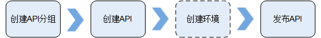

# 概述

您作为API提供者，需要实现一个或一组API的开放，那么您需要先后完成以下工作：

1.  [创建API分组](创建API分组.md)

    API分组相当于API的集合，您在创建API前，需要先创建API分组。

2.  [绑定域名](绑定域名.md)

    开放API前，您需要为API分组绑定一个或多个独立域名（即自定义域名），API调用者通过访问独立域名来调用您开放的API。

3.  [创建API](创建API.md)

    创建API包括定义前后端的请求路径和参数、请求相关协议等。

4.  [调试API](调试API.md)

    管理控制台提供调试功能，您可以添加HTTP头部参数与body体参数，调试API接口，验证服务是否正常。

5.  [创建环境和环境变量（可选）](创建环境和环境变量（可选）.md)

    API可以同时提供给不同的场景调用，如生产环境（RELEASE）及其他自定义环境。RELEASE是默认存在的环境，无需创建。且API网关提供环境变量功能，通过创建环境变量，实现在不同的环境定义不同的API调用路径。

6.  [发布API](发布API.md)

    只有在将API发布到环境后，API才支持被调用。API网关支持查看API发布历史（如版本、发布说明、发布时间和发布环境），并支持回滚到不同的API历史版本。

7.  将API上架云市场（可选）

    如果您的API希望上架到华为云市场售卖，请参考常见问题：[“如何将API上架到华为云应用市场售卖”](https://support.huaweicloud.com/apig_faq/HowToSaleAPIs.html)。

> **须知：**   
>-   确保后端服务可以正常访问。  
>-   API网关默认传递请求正文给后端服务，如果涉及到用户隐私或敏感信息，建议API开发者考虑提供加密传输机制，防止隐私或敏感信息泄露。  
>-   API网关默认传递请求报头中的用户IP地址给后端服务，如果用户IP地址为隐私或敏感信息，请API开发者提供隐私保护声明给API调用者。  

**图 1**  开放API流程图  

