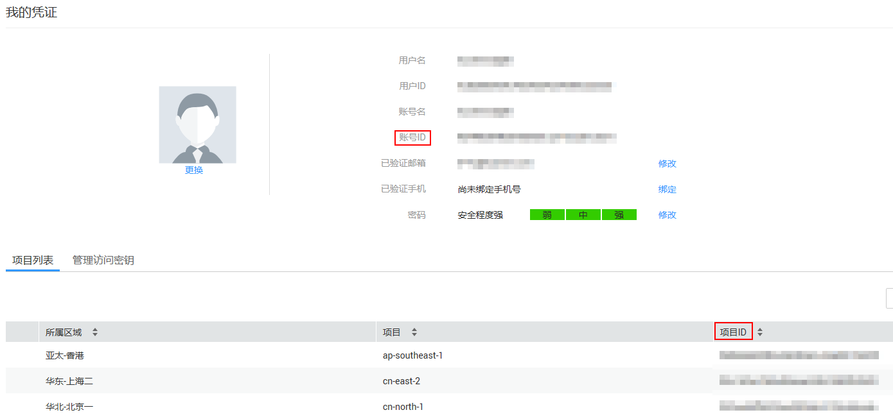

# 添加特殊租户流控

## 操作场景

如果需要为某个租户设置特定的流控值，则通过添加特殊租户流控可以实现。

## 前提条件

已创建流控策略。

## 操作步骤

1.  登录管理控制台。
2.  单击用户名，在下拉列表中单击“我的凭证”。
3.  在“我的凭证”页面查看账号ID和项目ID。

    **图 1**  查看账号ID和项目ID  
    

4.  在管理控制台左上角单击，选择区域。
5.  在服务列表中，单击“应用服务 \> API网关”，进入API网关服务管理页面。
6.  单击“开放API \> 流量控制”，进入到流量控制信息页面。
7.  单击待添加特殊租户流控的流控策略的名称，进入流控详情页面。
8.  单击“特殊租户流控”，进入特殊租户流控页面。
9.  单击“添加特殊租户”，弹出“添加特殊租户”对话框。
10. 输入如[表1](#table10544879441)所示信息。

    **表 1**  特殊租户流控信息

    
    <table><thead align="left"><tr id="row05460718446"><th class="cellrowborder" valign="top" width="26%" id="mcps1.2.4.1.1">
信息项

    </th>
    <th class="cellrowborder" valign="top" width="41%" id="mcps1.2.4.1.2">
描述

    </th>
    <th class="cellrowborder" valign="top" width="33%" id="mcps1.2.4.1.3">
说明

    </th>
    </tr>
    </thead>
    <tbody><tr id="row1554610717441"><td class="cellrowborder" valign="top" width="26%" headers="mcps1.2.4.1.1 ">
租户ID

    </td>
    <td class="cellrowborder" valign="top" width="41%" headers="mcps1.2.4.1.2 ">
租户的ID

    </td>
    <td class="cellrowborder" valign="top" width="33%" headers="mcps1.2.4.1.3 ">
<a href="#li785710139335">3</a>中获取的账号ID或项目ID

    <ul id="ul828993183611"><li>绑定APP认证的API时，租户ID为项目ID</li><li>绑定华为IAM认证的API时，租户ID为账号ID</li></ul>
    </td>
    </tr>
    <tr id="row754620754418"><td class="cellrowborder" valign="top" width="26%" headers="mcps1.2.4.1.1 ">
阈值

    </td>
    <td class="cellrowborder" valign="top" width="41%" headers="mcps1.2.4.1.2 ">
固定时间段内，此租户访问API的最大值。

    </td>
    <td class="cellrowborder" valign="top" width="33%" headers="mcps1.2.4.1.3 ">
不能超过API流量限制值。

    </td>
    </tr>
    </tbody>
    </table>

11. 单击“确定”，完成特殊租户流控的添加。

    > **说明：**   
    >特殊租户流控值和用户流量限制值共同作用时，以特殊租户流控值为准。  
    >例如：API流量限制值为10，用户流量限制值为3，时长为1分钟，特殊租户（租户ID为A）流控值为2，特殊租户（租户ID为B）流控值为4，租户A在1分钟内最多可以访问绑定了该流控策略的API 2次，租户B在1分钟内最多可以访问绑定了该流控策略的API 4次。  

