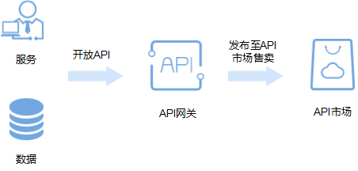

# 简介

API网关（API Gateway）是为您提供高性能、高可用、高安全的API托管服务，帮助您轻松构建、管理和部署任意规模的API。借助API网关，可以简单、快速、低成本、低风险地实现内部系统集成、业务能力开放及业务能力变现。

**图 1**  API网关服务开放API简介  

本手册主要介绍企业或开发者如何通过API网关开放自身的服务、数据，实现业务能力变现。

如果您希望通过云市场或其他方式获取并调用他人在API网关开放的API，减少开发时间与成本，请参考《[API网关 用户指南\(调用API\)](https://support.huaweicloud.com/ugcall-apig/zh-cn_topic_0080101651.html)》。

通过API网关开放API时，您可以实现以下功能：

-   通过控制台界面简化创建API的流程
-   通过页面调试工具实现便捷简单的调试API
-   将API发布到指定环境，以便调用
-   对API实现流量控制，限制单位时间内API的被调用次数
-   为API创建访问控制，实现黑白名单的功能
-   为API创建签名密钥，以便更安全的访问后端服务
-   创建VPC通道，实现负载均衡

