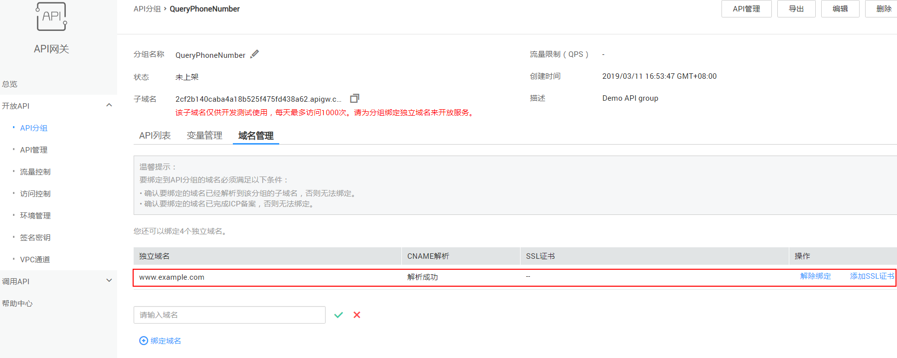

# 绑定域名

## 操作场景

开放API前，您需要为API分组绑定一个或多个独立域名，API网关通过独立域名定位到此分组。如果您未绑定独立域名，那么调用API时默认使用子域名，API网关对子域名的访问次数做了限制，每天最多可以访问1000次。

> **说明：**   
>每个分组最多可以绑定5个独立域名。  

在绑定域名前，您需要理解以下2个概念：

-   子域名：API分组创建后，系统为分组自动分配一个内部测试用的子域名，此子域名唯一且不可更改，每天最多可以访问1000次。
-   独立域名：您自定义的域名，API调用者通过访问独立域名来调用您开放的API。

## 前提条件

1.  已有独立域名。可通过[域名注册服务](https://www.huaweicloud.com/product/domain.html)申请新的域名。
2.  已[备案独立域名](https://beian.huaweicloud.com/)，未备案的独立域名无法被访问。
3.  已将独立域名CNAME解析到分组的子域名上，具体方法请参见[增加CNAME类型记录集](https://support.huaweicloud.com/usermanual-dns/dns_usermanual_0010.html)。
4.  如果API分组中的API支持HTTPS请求协议，那么在独立域名中需要添加SSL证书，请您提前准备SSL证书。此证书不支持导入，您需要填写证书的名称、内容和密钥。

## 操作步骤

1.  登录管理控制台。
2.  在管理控制台左上角单击，选择区域。
3.  在服务列表中，选择“应用服务 \> API网关”，进入API网关服务管理页面。
4.  在左侧选择您的API版本，单击并进入到对应版本的API开发与调用管理页面。

    “共享版”指直接创建并管理API，如涉及到费用，以API调用次数计费。

    “专享版”指在API专享版实例中创建并管理API，如涉及到费用，按实例运行时间计费。

5.  单击“开放API \> API分组”，进入到API分组信息页面。
6.  通过以下任意一种方式，进入“域名管理”页签。
    -   单击_“分组名称_”，进入分组详细信息页面。单击“域名管理”。
    -   在待绑定域名的分组所在行，单击“更多 \> 域名管理”。

7.  单击“绑定域名”，输入域名名称，单击，如[图1](#apig-zh-ug-180327076_fig105910599542)所示。

    **图 1**  成功绑定域名  
    

    > **说明：**   
    >如果不再需要此域名时，在域名所在行，单击“解除绑定”。  
    >域名需要先CNAME解析到分组子域名，否则绑定失败。  

8.  （可选）API分组中的API支持HTTPS请求协议时，需要添加SSL证书。
    1.  单击“添加SSL证书”，弹出“添加SSL证书”对话框。
    2.  输入证书名称、证书内容和密钥，单击“确定”，完成SSL证书的添加。

        > **说明：**   
        >-   如果需要编辑此SSL证书，单击证书名称后的，修改证书名称。由于证书内容和密钥已经加密，不支持再次查看，如果需要修改，请重新输入新的证书内容或者密钥。  
        >-   如果不再需要此SSL证书，在域名所在行，单击“删除SSL证书”。  

## 使用API方式绑定域名

您还可以使用API的方式绑定域名，具体操作请查看以下链接。

[绑定域名](https://support.huaweicloud.com/api-apig/apig-zh-api-180713154.html)

## 后续操作

绑定独立域名后，您可以开始[创建API](创建API.md)，将API接口配置在API网关中，开放后端能力。

