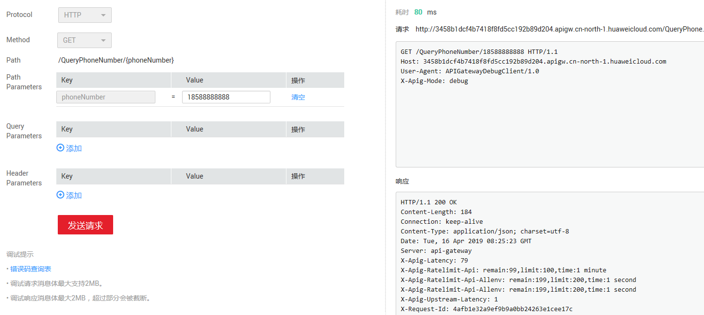

# 调试API

## 操作场景

API创建后需要验证服务是否正常，管理控制台提供调试功能，您可以添加HTTP头部参数与body体参数，调试API接口。

> **说明：**   
>-   后端路径中含有环境变量的API，不支持调试。  
>-   API绑定签名密钥时，不支持调试。  
>-   如果API已绑定流控策略，在调试API时，流控策略无效。  

## 前提条件

-   已创建API分组和分组内的API。
-   已搭建完成后端服务。

## 操作步骤

1.  登录管理控制台。
2.  在管理控制台左上角单击，选择区域。
3.  在服务列表中，选择“应用服务 \> API网关”，进入API网关服务管理页面。
4.  在左侧选择您的API版本，单击并进入到对应版本的API开发与调用管理页面。

    “共享版”指直接创建并管理API，如涉及到费用，以API调用次数计费。

    “专享版”指在API专享版实例中创建并管理API，如涉及到费用，按实例运行时间计费。

5.  单击“开放API \> API管理”，进入到API管理信息页面。
6.  通过以下任意一种方法，进入API调试页面。

    -   在待调试的API所在行，单击“更多 \> 调试”。
    -   单击“_API名称_”，进入API详情页面。在右上角单击“调试”。

    **图 1**  调试界面  
    

    左侧为API请求参数配置区域，参数说明如[表1](#apig-zh-ug-180307025_table1699044810457)所示。右侧为API发送的请求信息和API请求调用后的返回结果回显。

    **表 1**  调试API

    
    <table><thead align="left"><tr id="apig-zh-ug-180307025_row1699084815458"><th class="cellrowborder" valign="top" width="20%" id="mcps1.2.3.1.1">
参数名称

    </th>
    <th class="cellrowborder" valign="top" width="80%" id="mcps1.2.3.1.2">
说明

    </th>
    </tr>
    </thead>
    <tbody><tr id="apig-zh-ug-180307025_row2431345016"><td class="cellrowborder" valign="top" width="20%" headers="mcps1.2.3.1.1 ">
Protocol

    </td>
    <td class="cellrowborder" valign="top" width="80%" headers="mcps1.2.3.1.2 ">
仅在“请求协议”为“HTTP&amp;HTTPS”时，支持修改。

    </td>
    </tr>
    <tr id="apig-zh-ug-180307025_row699013480453"><td class="cellrowborder" valign="top" width="20%" headers="mcps1.2.3.1.1 ">
Method

    </td>
    <td class="cellrowborder" valign="top" width="80%" headers="mcps1.2.3.1.2 ">
仅在“Method”为“ANY”时，支持修改。

    </td>
    </tr>
    <tr id="apig-zh-ug-180307025_row1299115489454"><td class="cellrowborder" valign="top" width="20%" headers="mcps1.2.3.1.1 ">
Suffix

    </td>
    <td class="cellrowborder" valign="top" width="80%" headers="mcps1.2.3.1.2 ">
仅在“匹配模式”为“前缀模式”时，支持自定义路径。

    </td>
    </tr>
    <tr id="apig-zh-ug-180307025_row159914483458"><td class="cellrowborder" valign="top" width="20%" headers="mcps1.2.3.1.1 ">
Path Parameters

    </td>
    <td class="cellrowborder" valign="top" width="80%" headers="mcps1.2.3.1.2 ">
仅在“Path”中存在“{}”时，支持修改。

    </td>
    </tr>
    <tr id="apig-zh-ug-180307025_row10991184818452"><td class="cellrowborder" valign="top" width="20%" headers="mcps1.2.3.1.1 ">
Header Parameters

    </td>
    <td class="cellrowborder" valign="top" width="80%" headers="mcps1.2.3.1.2 ">
HTTP Headers的参数与参数值。

    </td>
    </tr>
    <tr id="apig-zh-ug-180307025_row14991164811452"><td class="cellrowborder" valign="top" width="20%" headers="mcps1.2.3.1.1 ">
Query Parameters

    </td>
    <td class="cellrowborder" valign="top" width="80%" headers="mcps1.2.3.1.2 ">
Query的参数与参数值。

    </td>
    </tr>
    <tr id="apig-zh-ug-180307025_row12855103617473"><td class="cellrowborder" valign="top" width="20%" headers="mcps1.2.3.1.1 ">
Body

    </td>
    <td class="cellrowborder" valign="top" width="80%" headers="mcps1.2.3.1.2 ">
仅在“Method”为“ANY”/“PATCH”/“POST”/“PUT”时，支持修改。

    </td>
    </tr>
    </tbody>
    </table>

7.  添加请求参数后，单击“发送请求”。

    右侧返回结果回显区域打印API调用的Response信息。

    -   调用成功时，返回HTTP状态码为“200”和Response信息。
    -   调试失败时，返回HTTP状态码为4_xx_或5_xx_，具体错误信息请参见[错误码](https://support.huaweicloud.com/ugcall-apig/apig-zh-ug-180530090.html)。

8.  您可以通过调整请求参数与参数值，发送不同的请求，验证API服务。

    > **说明：**   
    >如果需要修改API参数，请在右上角单击“编辑”，进入API编辑页面。  

## 后续操作

API调试成功后，您可以将API[发布到环境](发布API.md)，以便API调用者调用。或者出于API的安全性考虑，为API[创建流控策略](创建流控策略.md)、[创建访问控制策略](创建访问控制策略.md)和[创建并使用签名密钥](创建并使用签名密钥.md)。

