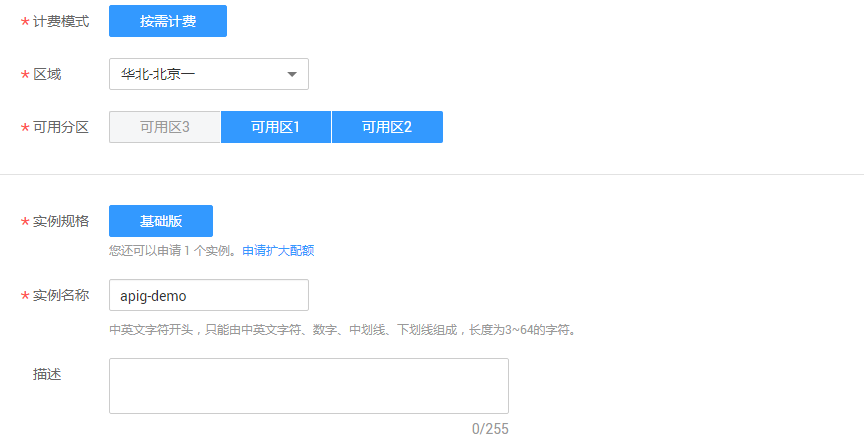
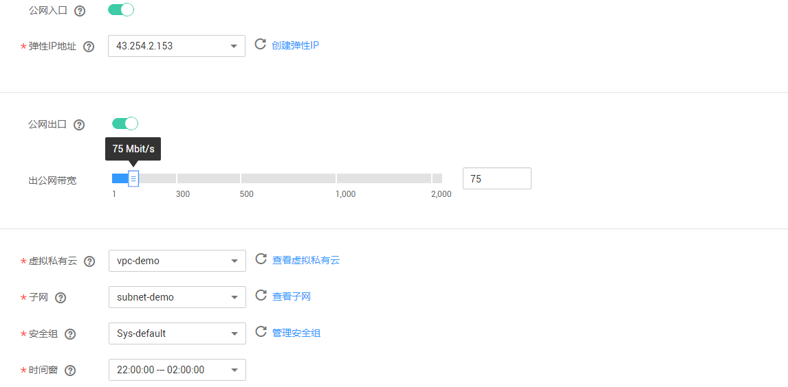
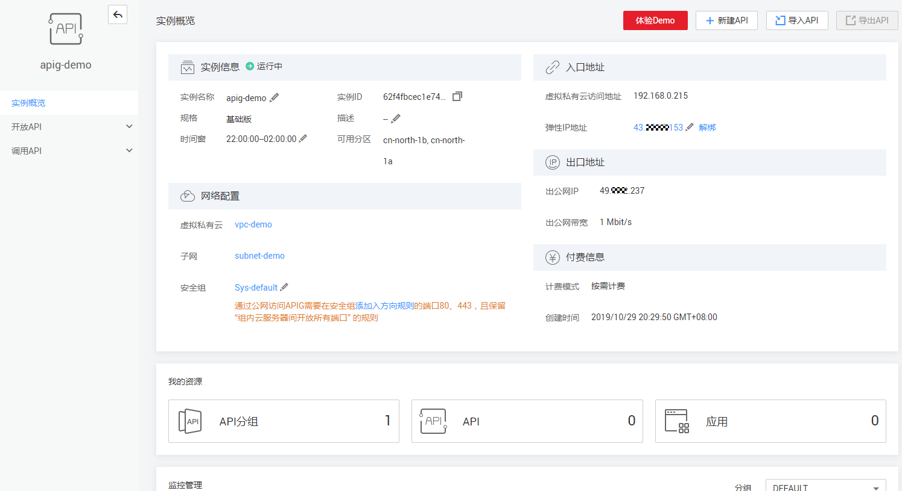

# 购买专享版实例

## 购买专享版的约束说明

购买专享实例存在一些约束，当您的用户登录后无法购买专享实例，或者购买实例后创建失败，请参考以下约束说明进行检查，并解除限制。

-   实例配额

    同一项目ID下，一个主账号默认只能创建1个专享版实例。如果您需要创建更多实例，可[提交工单](https://console.huaweicloud.com/ticket/)，申请修改配额。

-   用户权限

    专享版实例创建，需要拥有“APIG Administrator”、“VPC Administrator”权限，如果您的账号为IAM子用户，请确认具备以上权限。详情参考[对用户组授权](https://support.huaweicloud.com/usermanual-iam/zh-cn_topic_0046611269.html)。

-   子网中可用私有地址数量

    API网关专享实例的基础版、专业版、企业版，以及铂金版分别需要3、5、6、7个私有地址，请确保您选择的子网段有足够多的私有地址可用。私有地址可在虚拟私有云服务的控制台查询。

> **说明：**   
>共享版API网关可直接创建与管理API，无需单独购买实例。  

## 网络环境准备

-   VPC

    虚拟私有云。专享版实例需要配置虚拟私有云（VPC），在同一VPC中的资源（如ECS），可以使用专享版实例的私有地址调用API。在购买时专享版实例时，建议配置和您其他关联业务相同VPC，确保网络安全的同时，方便网络配置。

-   弹性公网IP

    专享版实例的API如果要允许外部调用，则需要购买一个弹性公网IP，并在购买时绑定给实例，作为实例的公网入口。

-   安全组

    安全组类似防火墙，控制谁能访问实例的指定端口，实例的通信数据流向指定的目的地址。安全组入方向规则建议按需开放地址与端口，这样可以最大程度保护实例的网络安全。

    专享版实例绑定的安全组有如下要求：

    -   入方向：如果需要从公网调用API，或从其他安全组内资源调用API，则需要为专享版实例绑定的安全组的入方向放开80（HTTP）、443（HTTPS）两个端口。
    -   出方向：如果后端服务部署在公网，或者其他安全组内，则需要为专享版实例绑定的安全组的出方向放开后端服务地址与API调用监听端口。
    -   如果API的前后端服务与专享版实例绑定了相同的安全组、相同的虚拟私有云，则无需专门为专享版实例开放上述端口。

## 操作步骤

1.  登录管理控制台。
2.  在管理控制台左上角单击，选择区域。
3.  在服务列表中，选择“应用服务 \> API网关”，进入API网关服务管理页面。
4.  在左侧选择您的API版本，单击并进入到对应版本的API开发与调用管理页面。

    “共享版”指直接创建并管理API，如涉及到费用，以API调用次数计费。

    “专享版”指在API专享版实例中创建并管理API，如涉及到费用，按实例运行时间计费。

5.  单击“购买专享版实例”，进入实例购买的配置页面。

    以下对各参数分别说明。

    **表 1**  购买API网关专享版实例参数说明

    
    <table><thead align="left"><tr id="row1783261918421"><th class="cellrowborder" valign="top" width="20.22%" id="mcps1.2.3.1.1">
参数项

    </th>
    <th class="cellrowborder" valign="top" width="79.78%" id="mcps1.2.3.1.2">
说明

    </th>
    </tr>
    </thead>
    <tbody><tr id="row198321619164219"><td class="cellrowborder" valign="top" width="20.22%" headers="mcps1.2.3.1.1 ">
计费模式

    </td>
    <td class="cellrowborder" valign="top" width="79.78%" headers="mcps1.2.3.1.2 ">
实例收费方式，当前支持“按需计费”，即按实际使用时长收费。

    </td>
    </tr>
    <tr id="row11832519144215"><td class="cellrowborder" valign="top" width="20.22%" headers="mcps1.2.3.1.1 ">
区域

    </td>
    <td class="cellrowborder" valign="top" width="79.78%" headers="mcps1.2.3.1.2 ">
指APIG专享版实例部署的区域，建议和您其他的业务部署在相同区域，这样不同的业务可以在VPC内以子网方式通信，节省公网带宽成本，降低网络延时。

    </td>
    </tr>
    <tr id="row13832219174219"><td class="cellrowborder" valign="top" width="20.22%" headers="mcps1.2.3.1.1 ">
可用区

    </td>
    <td class="cellrowborder" valign="top" width="79.78%" headers="mcps1.2.3.1.2 ">
指同一区域内电力、网络等资源物理隔离的地理区域，一般为互相独立的机房。

    
APIG实例支持同时选择多个可用区，进行跨可用区部署，提升实例高可用性。

    </td>
    </tr>
    <tr id="row8832191910422"><td class="cellrowborder" valign="top" width="20.22%" headers="mcps1.2.3.1.1 ">
实例规格

    </td>
    <td class="cellrowborder" valign="top" width="79.78%" headers="mcps1.2.3.1.2 ">
当前开放基础版、专业版、企业版、铂金版实例。不同实例规格，对API请求的并发支持能力不同，具体请参考产品介绍的<a href="https://support.huaweicloud.com/productdesc-apig/apig-specifications.html" target="_blank" rel="noopener noreferrer">规格说明</a>章节。

    </td>
    </tr>
    <tr id="row9832131918425"><td class="cellrowborder" valign="top" width="20.22%" headers="mcps1.2.3.1.1 ">
实例名称

    </td>
    <td class="cellrowborder" valign="top" width="79.78%" headers="mcps1.2.3.1.2 ">
-

    </td>
    </tr>
    <tr id="row1183261934216"><td class="cellrowborder" valign="top" width="20.22%" headers="mcps1.2.3.1.1 ">
描述

    </td>
    <td class="cellrowborder" valign="top" width="79.78%" headers="mcps1.2.3.1.2 ">
-

    </td>
    </tr>
    <tr id="row10832419144215"><td class="cellrowborder" valign="top" width="20.22%" headers="mcps1.2.3.1.1 ">
公网入口

    </td>
    <td class="cellrowborder" valign="top" width="79.78%" headers="mcps1.2.3.1.2 ">
指允许外部服务通过弹性IP地址，调用专享版实例创建的API。开启“公网入口”，需要绑定一个“弹性IP地址”，弹性IP地址另行<a href="https://www.huaweicloud.com/pricing.html#/eip" target="_blank" rel="noopener noreferrer">收费</a>。

    
例如您有一个API，请求协议为HTTPS，Path为/apidemo，开启了公网访问后，可使用https://{eip}/apidemo这个URL访问您的API。其中，{eip}表示弹性IP地址，目标端口443可默认缺省。

    
如果需要使用域名访问，可在创建API分组后，为分组绑定域名，对应的IP为购买专享版实例时绑定的弹性IP。

    </td>
    </tr>
    <tr id="row9889359446"><td class="cellrowborder" valign="top" width="20.22%" headers="mcps1.2.3.1.1 ">
公网出口

    </td>
    <td class="cellrowborder" valign="top" width="79.78%" headers="mcps1.2.3.1.2 ">
指允许专享版实例API的后端服务部署在外部网络，APIG为实例开启公网出口。您可以根据业务预估设置合适的“出公网带宽”。出公网带宽可配置范围为1~2000Mbit/s。

    </td>
    </tr>
    <tr id="row1817756184411"><td class="cellrowborder" valign="top" width="20.22%" headers="mcps1.2.3.1.1 ">
虚拟私有云

    </td>
    <td class="cellrowborder" valign="top" width="79.78%" headers="mcps1.2.3.1.2 ">
指为实例绑定到一个虚拟私有云。在相同虚拟私有云中的云服务资源（如ECS），可以使用APIG专享版实例的私有地址调用API。

    
建议将专享版实例和您的其他关联业务配置一个相同的虚拟私有云，确保网络安全的同时，方便网络配置。

    </td>
    </tr>
    <tr id="row73345604415"><td class="cellrowborder" valign="top" width="20.22%" headers="mcps1.2.3.1.1 ">
子网

    </td>
    <td class="cellrowborder" valign="top" width="79.78%" headers="mcps1.2.3.1.2 ">
为专享实例分配的子网段。

    </td>
    </tr>
    <tr id="row1948886184411"><td class="cellrowborder" valign="top" width="20.22%" headers="mcps1.2.3.1.1 ">
安全组

    </td>
    <td class="cellrowborder" valign="top" width="79.78%" headers="mcps1.2.3.1.2 ">
安全组用于设置端口访问规则，定义哪些端口允许被外部访问，以及允许访问外部哪些地址与端口。

    
例如，后端服务部署在外部网络，则需要设置相应的安全组规则，允许访问后端服务的地址及其监听端口。

    
 说明： 

如果开启公网入口，安全组入方向需要放开80（HTTP）和443（HTTPS）端口的访问权限。

    

    </td>
    </tr>
    <tr id="row063516613449"><td class="cellrowborder" valign="top" width="20.22%" headers="mcps1.2.3.1.1 ">
时间窗

    </td>
    <td class="cellrowborder" valign="top" width="79.78%" headers="mcps1.2.3.1.2 ">
指允许云服务技术支持对实例进行维护的时间段。如有维护需要，技术支持会提前与您沟通确认。

    
建议选择业务量较少的时间段。

    </td>
    </tr>
    </tbody>
    </table>

    **图 1**  实例购买-区域与规格等配置  
    

    **图 2**  实例购买-网络相关配置  
    

6.  单击“立即购买”，进入实例规格确认页面。
7.  规格确认无误后，勾选用户协议和隐私政策的阅读并同意声明，单击“提交”，并确认实例规格后，专享版实例开始创建，界面显示创建进度。

## 后续操作说明

实例创建成功后，您可以进入实例控制台，开始创建和管理您的API。进入实例控制台后，概览界面展现实例信息、网络配置、API资源详情，以及监控数据。

其中，实例名称、描述、时间窗、安全组，以及弹性IP地址可以修改。

**图 3**  API专享版实例控制台  

