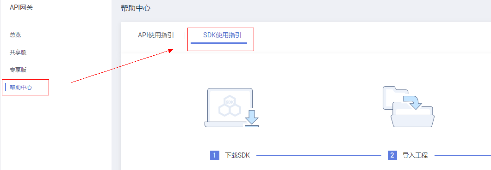

# SDK

API网关开放的API，安全认证方式可选IAM认证、APP认证或无认证。三者的区别以及如何选择，请参考[开发指南 如何选择认证方式](https://support.huaweicloud.com/devg-apig/apig-zh-dev-180307010.html)。

API网关开放的API，安全认证方式可选IAM认证、APP认证或无认证。三者的区别以及如何选择，请参考API网关服务开发指南中关于“如何选择认证方式”的介绍。

本操作主要提供APP认证的SDK下载以及文档。

IAM认证请参考[开发指南 使用IAM认证调用API](https://support.huaweicloud.com/devg-apig/apig-zh-dev-180307010.html)开发指南中关于“使用IAM认证调用API”的介绍。

## 操作场景

API使用APP认证时，请根据需要下载SDK包和文档，参考文档完成API的调用。

## 操作步骤

1.  登录管理控制台。
2.  在管理控制台左上角单击，选择区域。
3.  在服务列表中，选择“应用服务 \> API网关”，进入API网关服务管理页面。
4.  单击“调用API \> SDK”，进入到SDK页面。
5.  单击“帮助中心”，进入到帮助中心页面。

    帮助中心页面有一个“SDK使用指引”页签，如下图所示：

    **图 1**  SDK使用指引  
    

6.  在待下载的语言中，单击“SDK文档”/“下载SDK”，打开SDK文档或下载SDK包。

    

