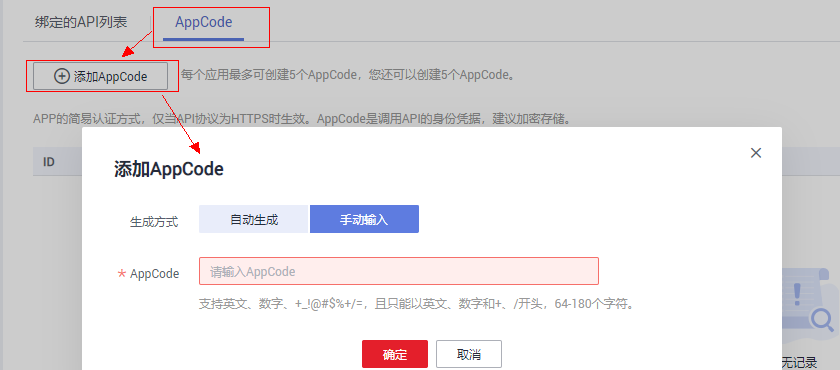
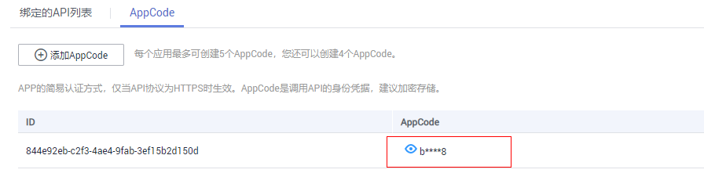
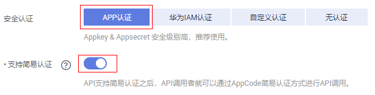
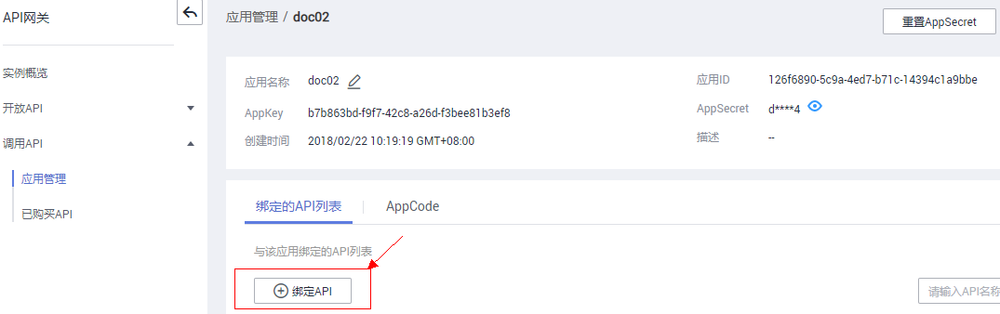

# 为简易认证添加AppCode<a name="apig-lgug-200227001"></a>

## 操作场景<a name="section1731012541118"></a>

简易认证指调用API时，在HTTP请求头部消息增加一个参数X-Apig-AppCode（参数值填AppCode），而不需要对请求内容签名，API网关也仅校验AppCode，不校验请求签名，从而实现快速响应。

当使用APP认证，且开启了简易认证模式，API请求既可以选择使用Appkey和AppSecret做签名和校验，也可以选择使用AppCode进行简易认证。

> **说明：**   
>-   仅共享版API网关支持简易认证。专享版目前不支持。  
>-   为了确保安全，简易认证仅支持HTTPS方式调用API，不支持HTTP。  

## 前提条件<a name="section83110548119"></a>

已创建应用。

## 生成AppCode<a name="section216645314349"></a>

1.  登录管理控制台。
2.  在管理控制台左上角单击，选择区域。
3.  在服务列表中，选择“应用服务 \> API网关”，进入API网关服务管理页面。
4.  在左侧选择您的API版本，单击并进入到对应版本的API开发与调用管理页面。

    “共享版”指直接创建并管理API，如涉及到费用，以API调用次数计费。

    “专享版”指在API专享版实例中创建并管理API，如涉及到费用，按实例运行时间计费。

5.  单击“调用API \> 应用管理”，进入到应用管理信息页面。
6.  单击待查看的应用名称，进入应用详情页面。
7.  单击“AppCode”页签，进入AppCode的管理界面。
8.  单击“添加AppCode”，生成AppCode。

    如下图所示，可自动生成，也可手动输入。

    


## 使用AppCode进行API请求的简易认证<a name="section123072058111814"></a>

1.  创建应用，并生成AppCode。生成方法见上述步骤。

    

2.  在创建API时，选择“APP认证”并且开启“支持简易认证”。

    

3.  将支持简易认证的API绑定到步骤1所创建的应用。

    

4.  发送请求时，增加请求头部参数“X-Apig-AppCode”，省略请求签名相关信息。

    以Curl方式为例，增加头部参数名称：X-Apig-AppCode，参数值填步骤1生成的AppCode。

    ```
    curl -X GET "https://api.exampledemo.com/testapi" -H "content-type: application/json"  -H "host: api.exampledemo.com" -H "X-Apig-AppCode: xhrJVJKABSOxc7d***********FZL4gSHEXkCMQC"
    ```


