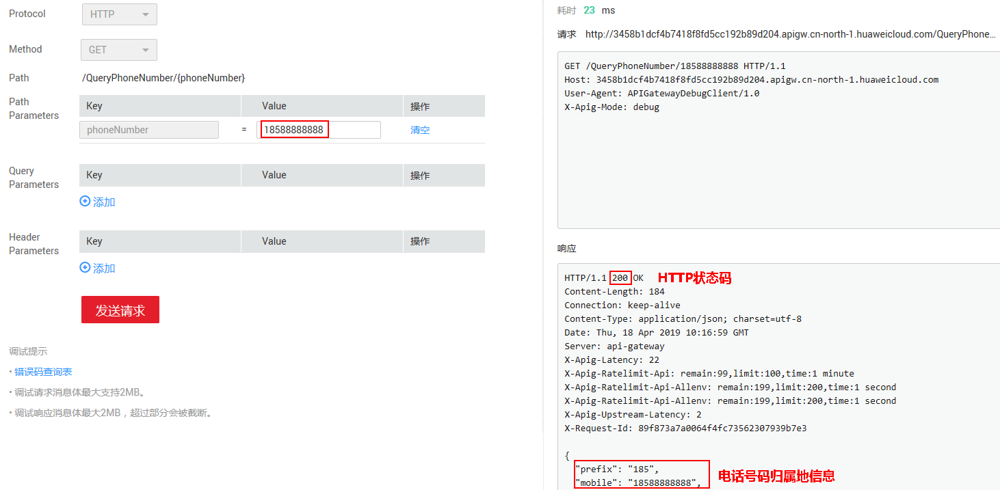
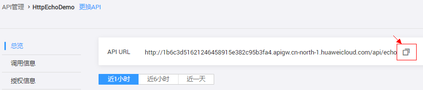
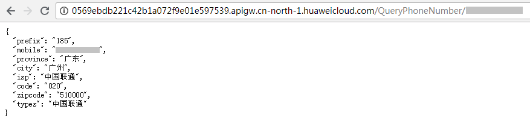

# 体验demo

## 操作场景

通过一键式操作，完成手机号码归属地查询API的创建、发布以及绑定流控，此demo主要用于演示API网关的使用。

> **说明：**   
>您如果需要再次体验demo，需要先将demo创建的API和API分组删除。  

## 操作步骤

1.  登录管理控制台。
2.  在管理控制台左上角单击，选择区域。
3.  在服务列表中，单击“应用服务 \> API网关”，进入API网关服务管理页面。

    左侧导航树中有“总览”、“开放API”、“调用API”和“帮助中心”四个栏目。

4.  单击“总览”，进入“总览”页面。
5.  单击“体验demo”，进入“体验demo”页面。

    此时系统已完成如下操作：

    -   创建分组。
    -   创建API。
    -   API发布到Release环境。
    -   创建流控策略。
    -   API绑定流控策略。

6.  单击“调用API”，进入“调试API”页面。
7.  在“value”输入待查询的电话号码，单击“发送请求”，查看返回结果。

    **图 1**  调试API  
    

8.  调用API。
    1.  在“开放API \> API管理”中，单击“QueryPhoneNumber”，进入QueryPhoneNumber详情页面。
    2.  在“Dashboard”页签，在“API URL”所在行，单击，复制URL。

        **图 2**  API详情  
        

    3.  在浏览器中粘贴URL，并将\{phoneNumber\}改为待查询的电话号码，按“Enter”，查看此电话号码所在地。

        **图 3**  调用结果  
        

