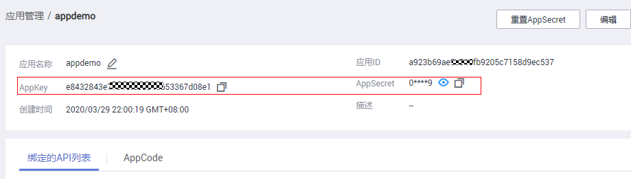

# 创建应用并获取授权

## 操作场景

使用APP认证的API，需要在API网关中创建一个应用，以生成应用ID和密钥对（AppKey、AppSecret）。将创建的应用绑定API后，才可以使用APP认证调用API。在API调用过程中，把密钥对替换SDK中的密钥对，API网关服务根据密钥对进行身份核对，完成鉴权。关于使用APP认证的方法，具体请参考《[API网关开发指南](https://support.huaweicloud.com/devg-apig/apig-zh-dev-180307002.html)》。

> **说明：**   
>-   从云市场购买的API，系统自动创建一个应用，无需单独创建应用。  
>-   使用无认证/华为IAM认证的API，无需创建应用。  
>-   每个用户最多创建50个应用。应用配额包括您自行创建的应用和API市场购买API生成的应用。  

## 创建应用

1.  登录管理控制台。
2.  在管理控制台左上角单击，选择区域。
3.  在服务列表中，选择“应用服务 \> API网关”，进入API网关服务管理页面。
4.  在左侧选择您的API版本，单击并进入到对应版本的API开发与调用管理页面。

    “共享版”指直接创建并管理API，如涉及到费用，以API调用次数计费。

    “专享版”指在API专享版实例中创建并管理API，如涉及到费用，按实例运行时间计费。

5.  单击“调用API \> 应用管理”，进入到应用管理信息页面。
6.  单击“创建应用”，弹出“创建应用”对话框。填写如[表1](#apig-zh-ug-180307010_table195413315428)所示信息。

    **表 1**  应用信息

    
    <table><thead align="left"><tr id="apig-zh-ug-180307010_row45523384220"><th class="cellrowborder" valign="top" width="20%" id="mcps1.2.3.1.1">
信息项

    </th>
    <th class="cellrowborder" valign="top" width="80%" id="mcps1.2.3.1.2">
描述

    </th>
    </tr>
    </thead>
    <tbody><tr id="apig-zh-ug-180307010_row1156183364219"><td class="cellrowborder" valign="top" width="20%" headers="mcps1.2.3.1.1 ">
应用名称

    </td>
    <td class="cellrowborder" valign="top" width="80%" headers="mcps1.2.3.1.2 ">
应用名称。

    </td>
    </tr>
    <tr id="apig-zh-ug-180307010_row14879114316433"><td class="cellrowborder" valign="top" width="20%" headers="mcps1.2.3.1.1 ">
描述

    </td>
    <td class="cellrowborder" valign="top" width="80%" headers="mcps1.2.3.1.2 ">
对应用的介绍。

    </td>
    </tr>
    </tbody>
    </table>

7.  单击“确定”，创建应用。

    创建应用成功后，在“应用管理”页面的列表中显示新创建的应用和应用ID。

8.  单击_应用名称_，进入应用详情页面，查看AppKey和AppSecret。

    **图 1**  应用详情  
    

## 绑定API

1.  登录管理控制台。
2.  在管理控制台左上角单击，选择区域。
3.  在服务列表中，选择“应用服务 \> API网关”，进入API网关服务管理页面。
4.  单击“调用API \> 应用管理”，进入到应用管理信息页面。
5.  通过以下任意一种方法，进入“绑定API”页面。
    -   在待绑定API的应用所在行，单击“绑定API”，进入“绑定API”界面。单击“绑定API”。
    -   单击待绑定API的应用名称，进入应用详情页面。单击“绑定API”。

6.  选择授权环境，勾选API，单击“绑定”，完成API绑定策略。

    绑定成功后，可以在应用详情页面查看已绑定的API。

    > **说明：**   
    >-   如果待添加绑定API列表中包含无需绑定的API，在此API所在行单击“解绑”，将无需绑定的API删除。  
    >-   如果需要调试已绑定的API，单击“调试API”，进入调试页面。  

## 使用API方式创建应用

您还可以使用API的方式创建应用，具体操作请查看以下链接。

[创建APP](https://support.huaweicloud.com/api-apig/apig-zh-api-180713036.html)

## 后续操作

通过不同认证方式[调用API](调用API.md)。

