# 创建用户并授权使用API网关

本章节通过简单的用户组授权方法，将API网关服务的策略授予用户组，并将用户添加至用户组中，从而使用户拥有对应的API网关权限，操作流程如[图1](#fig673713328586)所示。

**图 1**  给用户授权API网关权限流程  
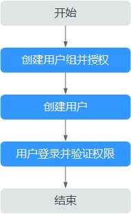

1.  创建用户组并授权

    在IAM控制台创建用户组，并授予容器镜像服务的管理员权限“APIG Administrator”。

2.  创建用户

    在IAM控制台创建用户，并将其加入[1](#li8135822590)中创建的用户组。

3.  用户登录并验证权限

    新创建的用户登录控制台，验证API网关服务的管理员权限。

## 背景信息

给用户组授权之前，请您了解用户组可以添加的API网关系统策略，如[表1](#table1494185617482)所示。若您需要对除API网关之外的其它服务授权，IAM支持服务的所有策略请参见[权限策略](https://support.huaweicloud.com/usermanual-permissions/zh-cn_topic_0063498930.html)。

**表 1**  API网关系统策略

<table><thead align="left"><tr id="zh-cn_topic_0172474100_row17131111218122"><th class="cellrowborder" valign="top" width="17.348265173482652%" id="mcps1.2.4.1.1">
策略名称

</th>
<th class="cellrowborder" valign="top" width="28.037196280371962%" id="mcps1.2.4.1.2">
描述

</th>
<th class="cellrowborder" valign="top" width="54.61453854614538%" id="mcps1.2.4.1.3">
操作

</th>
</tr>
</thead>
<tbody><tr id="zh-cn_topic_0172474100_row17132191291216"><td class="cellrowborder" valign="top" width="17.348265173482652%" headers="mcps1.2.4.1.1 ">
APIG Administrator

</td>
<td class="cellrowborder" valign="top" width="28.037196280371962%" headers="mcps1.2.4.1.2 ">
API网关服务的管理员权限。

</td>
<td class="cellrowborder" valign="top" width="54.61453854614538%" headers="mcps1.2.4.1.3 ">
创建API、发布API、删除API等

</td>
</tr>
</tbody>
</table>

## 步骤1：创建用户组并授权

用户组是用户的集合，IAM通过用户组功能实现用户的授权。您在IAM中创建的用户，需要加入特定用户组后，用户才具备用户组所拥有的权限。关于创建用户组并给用户组授权的方法，可以参考如下操作。

1.  使用注册的华为云账号登录华为云，登录时请选择“账号登录”。

    **图 2**  登录  
    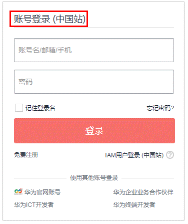

2.  进入华为云控制台， 控制台页面中单击右上角的用户名，选择“统一身份认证”。

    **图 3**  统一身份认证  
    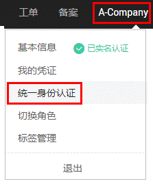

3.  在统一身份认证服务的左侧导航中，选择“用户组”\>“创建用户组”。

    **图 4**  创建用户组  
    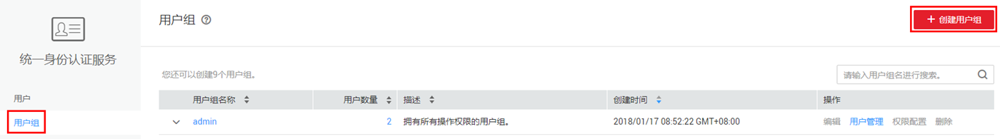

4.  在“创建用户组”界面，输入“用户组名称”，以“开发人员组”为例，单击“确定”。

    用户组创建完成，界面自动返回用户组列表，列表中显示新建的用户组。

5.  单击新建用户组右侧的“权限配置”，在“用户组权限”页签中，基于需要授权的区域，单击“设置策略”。

    API网关为项目级服务，请确认用户需要使用API网关资源的项目，然后在对应项目中设置权限，则用户仅能访问授权项目中的API网关资源，无法访问其他项目中的API网关资源。

    **图 5**  权限配置  
    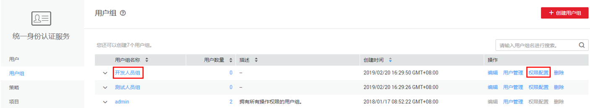

    **图 6**  设置策略  
    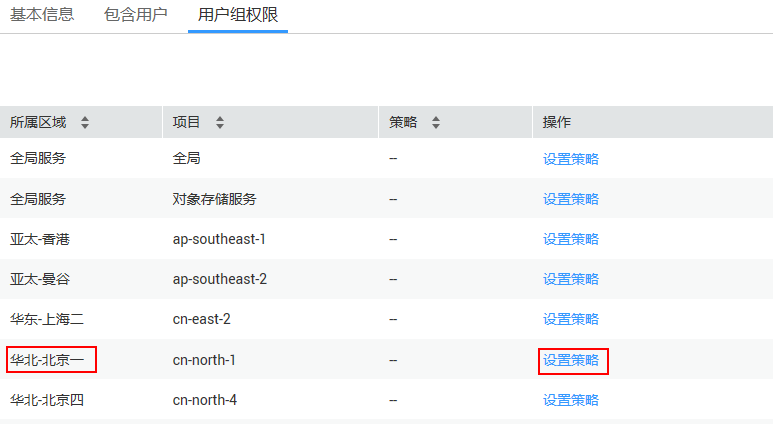

6.  在“设置策略”中搜索“apig”，选择“APIG Administrator”。

    **图 7**  设置策略-APIG Administrator  
    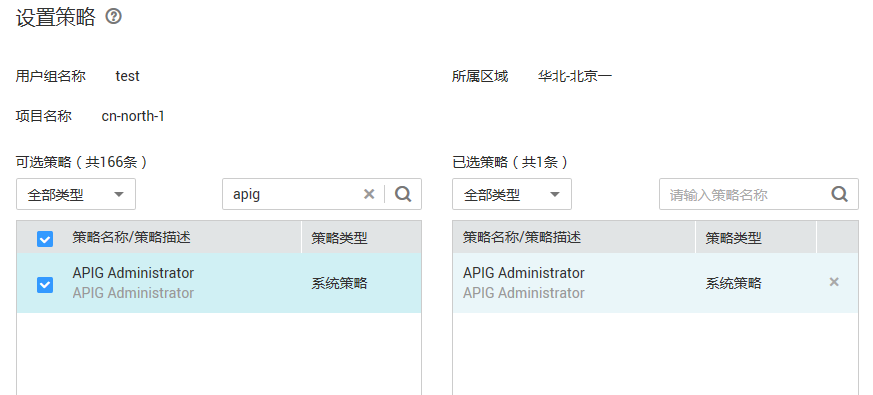

7.  单击“确定”，完成用户组授权。

    **图 8**  用户组授权成功  
    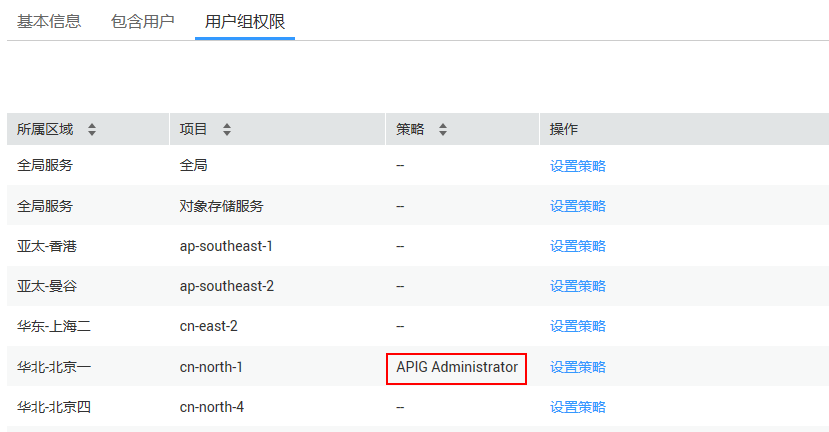

## 步骤2：创建IAM用户

IAM用户与企业中的实际员工或是应用程序相对应，有唯一的安全凭证，可以通过加入一个或多个用户组来获得用户组的权限。关于IAM用户的创建方式请参见如下步骤。

1.  在统一身份认证服务，左侧导航中，选择“用户 \> 创建用户”。
2.  在“创建用户”界面中填写参数信息，完成后单击“下一步”。

    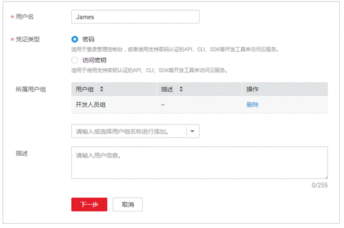

    -   用户名：用户登录华为云的用户名，以“James”为例。
    -   凭证类型：凭证是指用户系统认证的身份凭证，以选择“密码”为例。
        -   密码：用户需要同时登录界面以及通过开发工具（API、CLI、SDK）访问华为云。
        -   访问密钥：用户仅需要通过开发工具访问华为云，不需要登录界面，凭证类型建议选择访问密钥，更加安全。

    -   所属用户组（可选）：选择新创建的用户组“开发人员组”。将用户加入用户组，用户将具备用户组的权限，这一过程即给该用户授权。其中“admin”为系统缺省提供的用户组，具有管理人员以及所有云服务资源的操作权限。
    -   描述（可选）：对用户的描述信息。

3.  在界面中填写参数信息，单击“确定”，完成用户创建。

    密码生成方式：

    -   首次登录时设置：如果您不是当前新建用户的使用主体，建议您选择该方式。用户通过邮件中的一次性链接登录华为云，自行设置密码。
    -   自动生成：此用户是通过开发工具访问华为云，建议您选择该方式，华为云将自动生成随机的10位密码。
    -   自定义：如果您是用户James的使用主体，建议您选择该方式，设置自己的登录密码。

## 步骤3：用户登录并验证权限

用户创建完成后，可以使用新用户的用户名及身份凭证登录华为云验证权限，即“APIG Administrator”权限。更多用户登录方法请参见[用户登录华为云方法](https://support.huaweicloud.com/qs-iam/iam_01_0031.html#section2)。

1.  在华为云登录页面，单击右下角的“IAM用户登录”。

    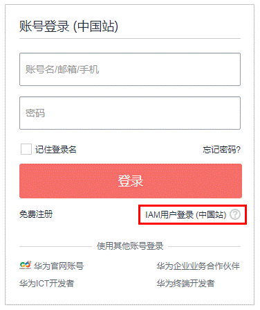

2.  在“IAM用户登录”页面，输入账号名、用户名及用户密码，使用新创建的用户登录。

    -   账号名为该IAM用户所属华为云账号的名称。
    -   用户名和密码为账号在IAM创建用户时输入的用户名和密码。

    如果登录失败，您可以联系您的账号主体，确认用户名及密码是否正确，或是重置用户名及密码，重置方法请参见：[忘记IAM用户密码](https://support.huaweicloud.com/iam_faq/iam_01_0314.html#section1)。

3.  登录成功后，进入华为云控制台，登录后默认区域为“华为-北京一”，请先切换至授权区域。

    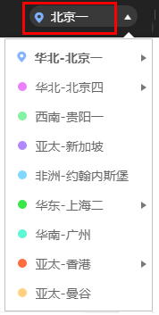

4.  在“服务列表”中选择“API网关”，进入API网关主界面，在左侧导航栏选择“开放API \> API分组”，单击“创建分组”如果可以创建成功，说明权限设置成功。

