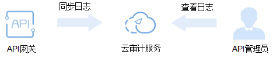

# 审计

## 开通云审计服务

如果您需要收集、记录或者查询API网关服务的操作日志，用于支撑安全分析、合规审计、资源跟踪和问题定位等常见应用场景时，那么需要先[开通云审计服务](https://support.huaweicloud.com/qs-cts/zh-cn_topic_0030598498.html#)。

云审计服务包含以下功能：

-   记录审计日志
-   审计日志查询
-   审计日志转储
-   事件文件加密
-   关键操作通知

## 查看审计日志

如果需要查看审计日志，具体步骤请参见[查看追踪事件](https://support.huaweicloud.com/qs-cts/zh-cn_topic_0030598499.html)。

**图 1**  查看日志  

## 查看关键操作列表

通过云审计服务，您可以记录与API网关相关的操作事件，便于日后的查询、审计和回溯。具体操作列表请参见[API网关的关键操作列表](https://support.huaweicloud.com/usermanual-cts/zh-cn_topic_0100498011.html#)。

## 关闭云审计服务

如果需要关闭云审计服务，具体步骤请参见[删除追踪器](https://support.huaweicloud.com/usermanual-cts/zh-cn_topic_0030628005.html)。

