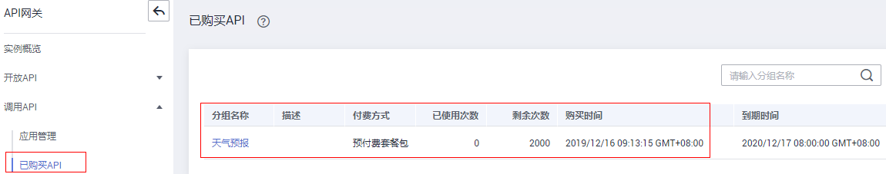
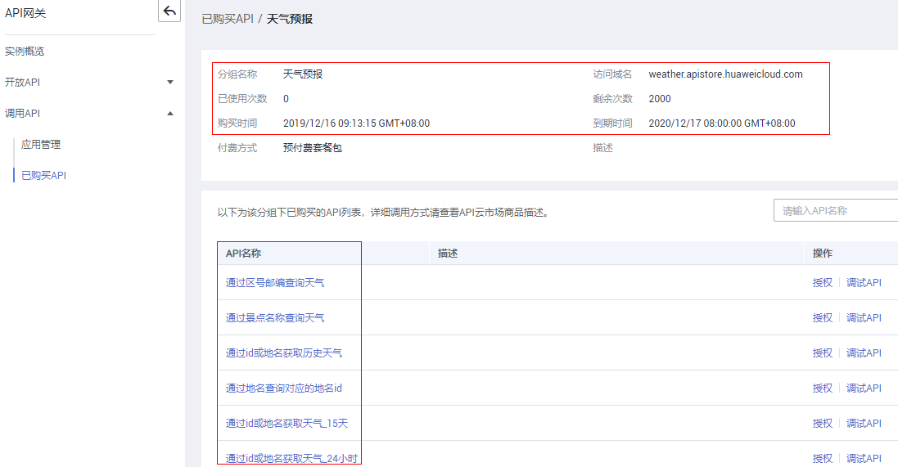
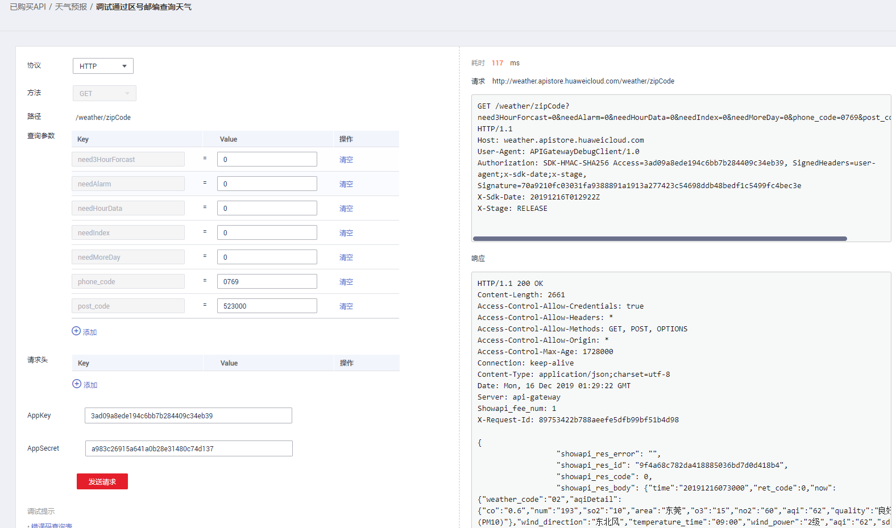

# 已购买API

## 操作场景

查看已购买的API，明确已购买服务的详情。并通过调试API，验证服务是否正常。

已购买的API，需要通过APP认证方式调用。

## 前提条件

已从云市场购买了API。

## 操作步骤

1.  登录管理控制台。
2.  在管理控制台左上角单击，选择区域。
3.  在服务列表中，选择“应用服务 \> API网关”，进入API网关服务管理页面。
4.  在左侧选择您的API版本，单击并进入到对应版本的API开发与调用管理页面。

    “共享版”指直接创建并管理API，如涉及到费用，以API调用次数计费。

    “专享版”指在API专享版实例中创建并管理API，如涉及到费用，按实例运行时间计费。

5.  单击“调用API \> 已购买API”，进入到已购买API分组信息页面。

    > **说明：**   
    >单击“前往购买”，进入API市场。您可以在API市场购买所需的API服务。  
    >以下以在云市场购买一组天气预报的API为例进行说明。  

    **图 1**  已购买API分组示例  
    

6.  单击待查看的API分组名称，进入此分组详情页面。

    查看此分组下已购买的API列表和此分组的详细信息。

    **图 2**  已购买API的分组详情示例  
    

7.  在待调试API所在行，单击“调试API”，跳转到“调试API”页面。
8.  左侧为API请求参数配置区域，参数说明如[表1](#table1699044810457)所示。右侧为API发送的请求信息和API请求调用后的返回结果回显。

    **表 1**  调试API

    
    <table><thead align="left"><tr id="row1699084815458"><th class="cellrowborder" valign="top" width="20%" id="mcps1.2.3.1.1">
参数名称

    </th>
    <th class="cellrowborder" valign="top" width="80%" id="mcps1.2.3.1.2">
说明

    </th>
    </tr>
    </thead>
    <tbody><tr id="row699013480453"><td class="cellrowborder" valign="top" width="20%" headers="mcps1.2.3.1.1 ">
协议

    </td>
    <td class="cellrowborder" valign="top" width="80%" headers="mcps1.2.3.1.2 ">
仅在“请求协议”为“HTTP&amp;HTTPS”时，支持修改。

    </td>
    </tr>
    <tr id="row1299115489454"><td class="cellrowborder" valign="top" width="20%" headers="mcps1.2.3.1.1 ">
方法

    </td>
    <td class="cellrowborder" valign="top" width="80%" headers="mcps1.2.3.1.2 ">
仅在“Method”为“ANY”时，支持修改。

    </td>
    </tr>
    <tr id="row159914483458"><td class="cellrowborder" valign="top" width="20%" headers="mcps1.2.3.1.1 ">
路径

    </td>
    <td class="cellrowborder" valign="top" width="80%" headers="mcps1.2.3.1.2 ">
仅在“匹配模式”为“前缀模式”时，支持自定义路径。

    </td>
    </tr>
    <tr id="row13534132210817"><td class="cellrowborder" valign="top" width="20%" headers="mcps1.2.3.1.1 ">
路径参数

    </td>
    <td class="cellrowborder" valign="top" width="80%" headers="mcps1.2.3.1.2 ">
仅在“Path”中存在“{}”时，支持修改。

    </td>
    </tr>
    <tr id="row10991184818452"><td class="cellrowborder" valign="top" width="20%" headers="mcps1.2.3.1.1 ">
请求头

    </td>
    <td class="cellrowborder" valign="top" width="80%" headers="mcps1.2.3.1.2 ">
HTTP Headers的参数与参数值。

    </td>
    </tr>
    <tr id="row14991164811452"><td class="cellrowborder" valign="top" width="20%" headers="mcps1.2.3.1.1 ">
查询参数

    </td>
    <td class="cellrowborder" valign="top" width="80%" headers="mcps1.2.3.1.2 ">
Query的参数与参数值。

    </td>
    </tr>
    <tr id="row12855103617473"><td class="cellrowborder" valign="top" width="20%" headers="mcps1.2.3.1.1 ">
Body

    </td>
    <td class="cellrowborder" valign="top" width="80%" headers="mcps1.2.3.1.2 ">
仅在“Method”为“ANY”/“PATCH”/“POST”/“PUT”时，支持修改。

    </td>
    </tr>
    </tbody>
    </table>

9.  添加请求参数后，单击“发送请求”。

    右侧返回结果回显区域打印API调用的Response信息。

    

10. 开发者可以通过调整请求参数与参数值，发送不同的请求，验证API服务。

