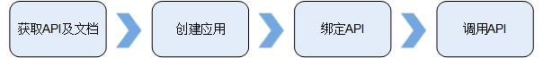
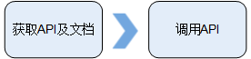

# 概述

## 调用前准备

API调用者实现一个API的调用，需要完成以下工作：

1.  获取API及文档
    -   获取API：从云市场购买，或者通过线下传递（如企业内部或者企业间合作）。
    -   获取文档：API的提供方会在云市场或者通过线下提供自己的参考文档，描述每个API的请求与响应参数详情、示例。华为云服务的API文档还可以从[华为云帮助中心](http://support.huaweicloud.com/index.html)获取。

2.  创建应用（可选）
    -   使用APP认证的API，需要在API网关中创建一个应用，以生成应用ID和密钥对（AppKey、AppSecret）。将创建的应用绑定API后，才可以使用APP认证调用API。在API调用过程中，把密钥对替换SDK中的密钥对，API网关服务根据密钥对进行身份核对，完成鉴权。关于使用APP认证的方法，具体请参考《[API网关开发指南](https://support.huaweicloud.com/devg-apig/apig-zh-dev-180307002.html)》。

        > **说明：**   
        >从云市场购买的API，系统自动创建一个应用，无需单独创建应用。  

    -   使用无认证/IAM认证的API，无需创建应用。

3.  获取授权（可选）
    -   对于已发布到应用市场的API，可以直接通过购买获得授权，购买后可以直接调用API。
    -   对于未发布到应用市场且使用APP认证的API，需要联系API提供方，提供您的应用信息，获得授权。
    -   使用无认证/IAM认证的API，无需授权。

4.  调用API

    API调用者完成以上准备工作后，可以参考[调用API](调用API.md#apig-zh-ug-180307011)进行调用。

> **说明：**   
>API网关默认传递请求报头中的用户IP地址给后端服务，如果用户IP地址为隐私或敏感信息，请API开发者提供隐私保护声明给API调用者。  

## 调用流程

使用APP认证的API，调用流程如下图：

**图 1**  调用API流程图（APP认证）  

> **说明：**   
>从云市场购买的API，系统自动创建一个应用，且已经绑定此API，可以直接调用。  

使用IAM认证/无认证的API，调用流程如下图：

**图 2**  调用API流程图（IAM认证/无认证）  

