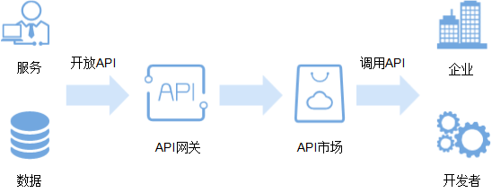

# 简介

API网关（API Gateway）是为开发者、合作伙伴提供的高性能、高可用、高安全的API托管服务，帮助用户轻松构建、管理和部署任意规模的API。借助API网关，可以简单、快速、低成本、低风险地实现系统集成、微服务聚合、Serverless架构。

API网关服务致力于打造一个多样化的API开放场景，将华为云自身的许多云服务能力开放出来，让您享受到安全、便捷、高效的API服务。同时，API网关服务还提供发布、维护、监控等全托管服务，让您可以专注业务开发，快速实现IT能力的商业化。

**图 1**  API网关服务简介  

本手册主要介绍企业或开发者如何获取并调用他人在API网关开放的API，减少开发时间与成本。

如果您希望通过API网关开放自身的服务、数据，实现业务能力变现，请参考《[API网关 用户指南\(开放API\)](https://support.huaweicloud.com/usermanual-apig/zh-cn_topic_0080101651.html)》。

