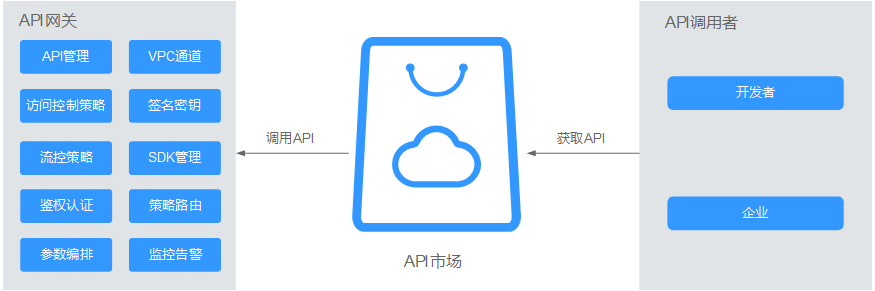

# 简介

API网关（API Gateway）是为您提供高性能、高可用、高安全的API托管服务，帮助您轻松构建、管理和部署任意规模的API。借助API网关，可以简单、快速、低成本、低风险地实现内部系统集成、业务能力开放及业务能力变现。

**图 1**  API网关服务调用API简介  

本手册主要介绍企业或开发者如何获取并调用他人在API网关开放的API，减少开发时间与成本。

如果您希望通过API网关开放自身的服务、数据，实现业务能力变现，请参考《[API网关 用户指南\(开放API\)](https://support.huaweicloud.com/usermanual-apig/zh-cn_topic_0080101651.html)》。

通过API网关调用API时，您可以实现以下功能：

-   在API网关中创建应用，并绑定到API，实现通过APP认证调用API
-   API网关提供基于多种语言的SDK，您可以直接下载使用

